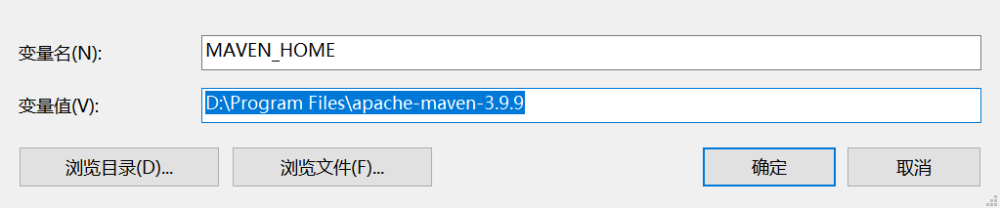
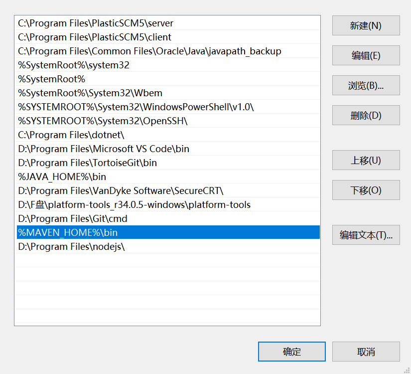
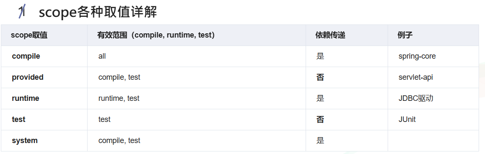

# Maven 快速入门

# Maven目录结构

```
${basedir}                  存放pom.xml和所有的子目录
${basedir}/src/main/java    项目的java源代码
${basedir}/src/main/resources    项目的资源，比如说property文件，springmvc.xml
${basedir}/src/test/java    项目的测试类，比如说Junit代码
${basedir}/src/test/resources    测试用的资源
${basedir}/src/main/webapp/WEB-INF    web应用文件目录，web项目的信息，比如存放web.xml、本地图片、jsp视图页面
${basedir}/target                 打包输出目录
${basedir}/target/classes         编译输出目录
${basedir}/target/test-classes    测试编译输出目录
Test.java    Maven只会自动运行符合该命名规则的测试类
~/.m2/repository    Maven默认的本地仓库目录位置
```

# 环境配置

下载：[apache-maven-3.8.5-bin.zip](https://dlcdn.apache.org/maven/maven-3/3.8.5/binaries/apache-maven-3.8.5-bin.zip)

安装：略

配置：





maven linux 环境变量配置

```shell
yum install -y java-17-openjdk

tar -zxvf apache-maven-3.9.9-bin.tar.gz
mv apache-maven-3.9.9 /usr/local/maven

vim /etc/profile

MAVEN_HOME=/usr/local/share/apache-maven-3.9.14/
PATH=$PATH:$MAVEN_HOME/bin

source /etc/profile

mvn --version
```

# POM，项目对象模型

pom文件是一个XML文件，包含了项目的基本信息，用于描述项目如何构建，声明项目依赖，等等。

执行任务或目标时，Maven 会在当前目录中查找 POM。它读取 POM，获取所需的配置信息，然后执行目标

```xml
<project xmlns = "http://maven.apache.org/POM/4.0.0"
    xmlns:xsi = "http://www.w3.org/2001/XMLSchema-instance"
    xsi:schemaLocation = "http://maven.apache.org/POM/4.0.0
    http://maven.apache.org/xsd/maven-4.0.0.xsd">
 
    <!-- 模型版本 -->
    <modelVersion>4.0.0</modelVersion>
    <!-- 公司或者组织的唯一标志，并且配置时生成的路径也是由此生成， 
    如com.companyname.project-group，maven会将该项目打成的jar包放本地路径：
     /com/companyname/project-group -->
    <groupId>com.companyname.project-group</groupId>
 
    <!-- 项目的唯一ID，一个groupId下面可能多个项目，就是靠artifactId来区分的 -->
    <artifactId>project</artifactId>
 
    <!-- 版本号 -->
    <version>1.0</version>
</project>
```

所有 POM 文件都需要以下标签：`project，groupId，artifactId，version`

| 节点           | 描述                                   |
| -------------- | -------------------------------------- |
| `project`      | 工程的根标签。                         |
| `modelVersion` | 模型版本                               |
| `groupId`      | 组ID，在一个组织或者项目中通常是唯一的 |
| `artifactId`   | 项目ID                                 |
| `version`      | 项目版本号                             |

## 项目依赖管理

引入项目依赖示例

```xml
<dependencies>
    <!-- spring boot -->
    <dependency>
        <groupId>org.springframework.boot</groupId>
        <artifactId>spring-boot-starter</artifactId>
        <version>3.2.9</version>
    </dependency>
</dependencies>
```

## 项目插件管理

使用项目插件示例

```xml
<build>
    <plugins>
        <plugin>
            <groupId>org.apache.maven.plugins</groupId>
            <artifactId>maven-compiler-plugin</artifactId>
            <version>3.8.1</version>
            <configuration>
                <source>1.8</source>
                <target>1.8</target>
            </configuration>
        </plugin>
    </plugins>
</build>
```

## 定义项目属性变量

```xml
<properties>
    <maven.compiler.source>1.8</maven.compiler.source>
    <maven.compiler.target>1.8</maven.compiler.target>
</properties>
```

## 定义项目的依赖库

```xml
<repositories>
    <repository>
        <id>central</id>
        <url>https://repo.maven.apache.org/maven2</url>
    </repository>
</repositories>
```

## 管理依赖的版本

尤其在多模块项目中，这里只声明版本号，不引入依赖

```xml
<dependencyManagement>
    <dependencies>
        <dependency>
            <groupId>org.springframework</groupId>
            <artifactId>spring-core</artifactId>
            <version>5.3.9</version>
        </dependency>
    </dependencies>
</dependencyManagement>
```

## 多环境构建配置

```xml
<profiles>
    <profile>
        <id>development</id> <!-- 开发环境 -->
        <properties>
            <environment>dev</environment>
        </properties>
    </profile>
    <profile>
        <id>production</id> <!-- 生产环境 -->
        <properties>
            <environment>prod</environment>
        </properties>
    </profile>
</profiles>
```

## 继承和聚合

继承：使用parent标签

```xml
<parent>
    <groupId>com.luruoyang</groupId>
    <artifactId>module-parent</artifactId>
    <version>0.0.1-SNAPSHOT</version>
    <!-- 指定父项目pom相对路径 -->
    <relativePath>../module-parent/pom.xml</relativePath>
</parent>
```

聚合：使用modules标签

```xml
<!-- 修改打包方式 -->
<packaging>pom</packaging>
<modules>
    <!-- 子模块c -->
    <module>../module-c</module>
    <!-- 子模块b -->
    <module>../module-b</module>
    <!-- 子模块a -->
    <module>../module-a</module>
</modules>
```


## 完整示例

```xml
<project xmlns="http://maven.apache.org/POM/4.0.0"
         xmlns:xsi="http://www.w3.org/2001/XMLSchema-instance"
         xsi:schemaLocation="http://maven.apache.org/POM/4.0.0 http://maven.apache.org/xsd/maven-4.0.0.xsd">
    
    <modelVersion>4.0.0</modelVersion>
    
    <groupId>com.example</groupId>
    <artifactId>my-app</artifactId>
    <version>1.0-SNAPSHOT</version>
    
    <properties>
        <maven.compiler.source>1.8</maven.compiler.source>
        <maven.compiler.target>1.8</maven.compiler.target>
    </properties>
    
    <dependencies>
        <dependency>
            <groupId>org.springframework</groupId>
            <artifactId>spring-core</artifactId>
            <version>5.3.9</version>
        </dependency>
    </dependencies>
    
    <build>
        <plugins>
            <plugin>
                <groupId>org.apache.maven.plugins</groupId>
                <artifactId>maven-compiler-plugin</artifactId>
                <version>3.8.1</version>
                <configuration>
                    <source>${maven.compiler.source}</source>
                    <target>${maven.compiler.target}</target>
                </configuration>
            </plugin>
        </plugins>
    </build>
    
    <profiles>
        <profile>
            <id>development</id>
            <properties>
                <environment>dev</environment>
            </properties>
        </profile>
        <profile>
            <id>production</id>
            <properties>
                <environment>prod</environment>
            </properties>
        </profile>
    </profiles>

</project>
```

## 执行目标

## 项目构建 profile

## 项目版本

## 项目开发者列表

## 相关邮件列表信息

# Maven生命周期

# Maven私服

代理仓库

宿主仓库

仓库组

本地仓库

私服仓库

# 依赖管理

# 解决依赖冲突

## 一级依赖

## 二级及以上依赖

## 依赖排除

# 生命周期

# 统一项目目录结构

# 资源推荐

## 官方资源


## 第三方资源

https://blog.csdn.net/qq_43410878/article/details/123812267

https://blog.csdn.net/binghuazheng/article/details/113732573

https://blog.csdn.net/q251932440/article/details/143164209

https://www.cnblogs.com/longan-wang/p/17822468.html

https://www.cnblogs.com/zhizhixiaoxia/p/14041697.html

[史上最全的Maven Pom文件标签详解_pom url标签-CSDN博客](https://blog.csdn.net/Mrs_haining/article/details/79293581)

[pom指定java编译版本和编码_pom properties java.version-CSDN博客](https://blog.csdn.net/xiang__liu/article/details/80855514)

[Maven之scope详解 - satire - 博客园](https://www.cnblogs.com/satire/p/15068971.html)

指定当前包的依赖范围和依赖的传递性



**compile** ：为**默认的**依赖有效范围

**provided** ：在编译、测试时有效，但是在运行时无效。

**runtime** ：在运行、测试时有效，但是在编译代码时无效。

**test** ：只在测试时有效，包括测试代码的编译，执行。

**system** ：在编译、测试时有效，但是在**运行时无效**。

## 书籍推荐