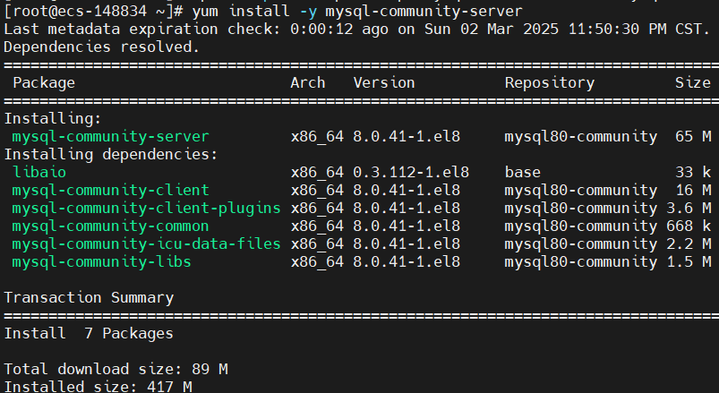

# MySQL快速入门

## 离线安装

安装包下载地址: 

[MySQL :: Download MySQL Community Server (Archived Versions)](https://downloads.mysql.com/archives/community/)

## 在线安装

步骤参考: 

[MySQL :: MySQL 8.0 Reference Manual :: 2.5.1 Installing MySQL on Linux Using the MySQL Yum Repository](https://dev.mysql.com/doc/refman/8.0/en/linux-installation-yum-repo.html)

```bash
# 关闭selinux
sed -i 's/SELINUX=enforcing/SELINUX=disabled/g' /etc/selinux/config

# 关闭防火墙
systemctl stop firewalld
systemctl disable firewalld

# 备份yum源
mkdir /etc/yum.repos.d/backup && mv /etc/yum.repos.d/*.repo /etc/yum.repos.d/backup/

# 下载阿里云 CentOS 8 软件源
wget -O /etc/yum.repos.d/CentOS-Base.repo https://mirrors.aliyun.com/repo/Centos-vault-8.5.2111.repo

# 生成缓存
yum clean all && yum makecache

yum install -y yum-utils
curl -O https://repo.mysql.com//mysql84-community-release-el8-2.noarch.rpm
yum install -y https://repo.mysql.com//mysql84-community-release-el8-2.noarch.rpm
yum repolist enabled | grep "mysql.*-community.*"

yum repolist enabled | grep mysql

yum module disable mysql

# rpm --import https://repo.mysql.com/RPM-GPG-KEY-mysql-2023

yum install -y mysql-community-server --nogpgcheck
```



```bash
systemctl enable mysqld --now

echo "MySQL默认用户root，临时密码："
cat /var/log/mysqld.log  |  grep 'temporary password' 

# 登录MySQL
mysql -uroot -p

# 修改 root 用户密码
mysql> ALTER USER 'root'@'localhost' IDENTIFIED BY 'MySQL123!';

# 开启远程登录
mysql> USE mysql;

# 对于 root 用户
mysql> UPDATE `user` SET host='%' WHERE `user`='root';
mysql> FLUSH PRIVILEGES;

# 对于普通用户, 新建普通用户
mysql> CREATE USER 'newuser'@'%' IDENTIFIED BY 'password'; 
mysql> GRANT ALL PRIVILEGES ON *.* TO 'newuser'@'%';
mysql> FLUSH PRIVILEGES;
```

### CentOS 9 安装 MySQL 8

```bash
#!/bin/bash

wget https://repo.mysql.com/RPM-GPG-KEY-mysql-2023
mv RPM-GPG-KEY-mysql-2023 /etc/pki/rpm-gpg/

cat > /etc/yum.repos.d/mysql-community.repo << EOF
[mysql80-community]
name=MySQL 8.0 Community Server
baseurl=http://repo.mysql.com/yum/mysql-8.0-community/el/9/\$basearch/
enabled=1
gpgcheck=1
gpgkey=file:///etc/pki/rpm-gpg/RPM-GPG-KEY-mysql-2023
EOF

yum makecache

yum install -y mysql-community-server

systemctl enable mysqld --now
echo "MySQL默认用户root，临时密码："
cat /var/log/mysqld.log  |  grep 'temporary password' 
```


MySQL常用配置(/etc/my.cnf)

```bash
[mysqld]
bind-address = 0.0.0.0

performance_schema_max_table_instances=400
table_definition_cache=400
performance_schema=off
table_open_cache=64
innodb_buffer_pool_chunk_size=64M
innodb_buffer_pool_size=64M
```

CentOS 9

```bash
cat > /etc/yum.repos.d/mysql-community.repo << EOF
[mysql80-community]
name=MySQL 8.0 Community Server
baseurl=http://repo.mysql.com/yum/mysql-8.0-community/el/9/\$basearch/
enabled=0
gpgcheck=1
gpgkey=file:///etc/pki/rpm-gpg/RPM-GPG-KEY-mysql-2023
EOF

yum clean all && yum makecache
yum install -y mysql-community-server --nogpgchekc
```

SQL注入

拼接参数的时候, 识别了参数中的关键字, 导致SQL的语义发生变化的现象

解决sql注入: 

# DDL

DATABASE,

定义/改变表的结构、数据类型、表之间的链接等操作。常用的语句关键字有 CREATE、DROP、ALTER 

```sql
-- 创建数据库
CREATE {DATABASE | SCHEMA} [IF NOT EXISTS] database_name;
[CHARACTER SET charset_name]    -- 字符集
[COLLATE collation_name]        -- 排序规则
[ENCRYPTION {'Y' | 'N'}]        -- 是否加密

-- 查看数据库信息
SHOW DATABASES;
SHOW CREATE DATABASE newdb;

-- 删除数据库
DROP {DATABASE | SCHEMA} [IF EXISTS] database_name;

-- 修改数据库
alter database db01 charset utf8mb4;

-- 切换数据库
USE testdb;
USE sakila;
SELECT DATABASE();
STATUS;
SHOW TABLES;
```

mysql -u root -p -D testdb

TABLE

```sql
-- 创建表
CREATE TABLE [IF NOT EXISTS] table_name (
   column_name data_type [NOT NULL | NULL] [DEFAULT expr] [AUTO_INCREMENT] [PRIMARY KEY ][COMMENT],
   column_name data_type [NOT NULL | NULL] [DEFAULT expr],
   ...,
   [table_constraints]    -- 表格约束
) [ENGINE=storage_engine];    -- 存储引擎

-- 删除表
drop table if exists student;

-- 创建表
create table if not exists student
(
    `id`         int primary key auto_increment comment '学号',
    `name`       varchar(20) not null comment '学生姓名',
    `age`        int comment '年龄',
    `sex`     char(1) comment '性别',
    `score`      double(5, 2) comment '成绩',
    `birthday`   date comment '出生年月',
    `entryDate`  date comment '入学时间',
    `createTime` datetime default now() comment '创建时间',
    `updateTime` datetime comment '更新时间',
    `status`     int comment '状态'
);

-- 添加列
alter table student add address varchar(50) null comment '学生住址';

-- 删除列
alter table student drop age;

-- 修改列
alter table student modify sex char(5);

-- 修改列
alter table student change sex gender char(10) default 'male';

-- 修改表名
alter table student rename table_student;
```

## 约束

主键约束:  primary key

外键约束:  foreign key

唯一约束:  unique

默认约束:  default

非空约束:  not null

# DML

Data Manipulation Language

## INSERT

```sql
INSERT INTO tb_name(col1,col2,...,coln) 
VALUES (val1,val2,...,valn);

INSERT INTO tb_name 
VALUES (val1,val2,...,valn);
```

## UPDATE

```sql
UPDATE tb_name
SET 
    col1 = val1, 
    col2 = val2,
    ...,
    coln = valn 
WHERE condition;
```

## DELETE

```sql
DELETE 
FROM tb_name 
WHERE condition;
```

## TRUNCATE

清空表数据, 重置id?

```sql
TRUNCATE tb_name;
```

# DQL

Data Query Language

对数据进行查询操作。常用关键字有 SELECT、FROM、WHERE 

语法格式

```sql
SELECT [DISTINCT]
FROM
JOIN ON
WHERE
GROUP BY
HAVING
ORDER BY
LIMIT offset count
```

## 查询列

所有列

部分列

**去重列**

`select distinct col1, col2, col3`, 当这三列都重复才算重复

## 条件查询

等值与非等值: >,<,>=,<=, =,!=(<>)

范围查询: between val1 and val2

逻辑条件: and, or, not, &&, ||, !,

模糊条件: like, %, _, 

正则条件: regexp, ^[]

null条件:  is null, is not null

## 聚合查询/分组查询

```sql
COUNT(列); 计算该列的个数
SUM(列); 求出该的类数据综合
MAX(列); 求出该列最大值
MIN(列); 求出该列最小值
AVG(列); 求出该列的平均值
```

注意:

​    1、如果只是聚合没有分组, 将所有的数据看成一组!!!

​    2、聚合函数都是排除null列计算的结果

​    3、ifnull(col, defaultValue)

4、COALESC(col, defaultValue)

## 分组查询

查询的列必须是聚合函数列或者分组列

分组前的条件用where,分组后的条件用having

```sql
SELECT column1[, column2, ...], aggregate_function(ci)
FROM tb_name
[WHERE condition]
GROUP BY column1[, column2, ...];
[HAVING condition]
ORDER BY ...
```

## 结果排序

```sql
 ORDER BY 
    col1 ASC/DESC, 
    col2 ASC/DESC
```

## 分页查询

分页计算, offset = (pageNo - 1) * pageSize

```sql
LIMIT offset count;
LIMIT count, offset;
```

## 常用函数

```sql
IF(condition, trueValue, falseValue)

CASE
    WHEN condition1 then value1
    WHEN condition2 then value2
    WHEN condition3 then value3
END

CONCAT(col1,col2,...,col3)

YEAR()

SUBSTR(col,startIndex, count) -- startIndex从1开始
```

# DCL

Data Control Language

设置/更改数据库用户权限。常用关键字有 GRANT、REVOKE

# 多表查询

表与表之间的关系:

1对1  1:1

1对多  1:N

多对多  M:N

## 连接查询

### 内连接 INNER JOIN

查询A、B两表交集部分的数据

内连接又分为**等值连接**和**非等值连接**

例题：查询每个员工的姓名及其所在的部门。

#### 隐式内连接

```sql
SELECT column_list
FROM tb1, tb2
WHERE join_condition
```

#### 显式内连接

```
SELECT column_list
FROM tb1 
[INNER] JOIN tb2 ON join_condition
```

### 外连接 OUTER JOIN

#### 左(外)连接 LEFT [OUTER] JOIN

返回左表中的所有记录，即使右表中没有匹配的记录。查询左表所有数据，以及两张表交集部分的数据

```sql
SELECT column_list
FROM tb1
LEFT [OUTER] JOIN tb2
ON 连接条件
```

#### 右(外)连接 RIGHT [OUTER] JOIN

返回右表中的所有记录，即使左表中没有匹配的记录。查询右表所有数据，以及两张表交集部分的数据

```sql
SELECT column_list
FROM tb1
RIGHT [OUTER] JOIN tb2
ON 连接条件
```

#### 全外连接 FULL [OUTER] JOIN

MySQL不支持全外连接, 使用 UNION 实现

```sql
SELECT column_list
FROM tb1
LEFT [OUTER] JOIN tb2
ON 连接条件
UNION
SELECT column_list
FROM tb1
RIGHT [OUTER] JOIN tb2
ON 连接条件
```

### 自连接

必须使用别名

```sql
SELECT column_list
FROM tb1 AS alias1
[INNER]JOIN tb1 AS alias2
ON 连接条件;

SELECT column_list
FROM tb1 AS alias1
LEFT [OUTER] JOIN tb1 AS alias2
ON 连接条件;

SELECT column_list
FROM tb1 AS alias1
RIGHT [OUTER] JOIN tb1 AS alias2
ON 连接条件;
```

### 自然连接

// TODO

### 交叉连接 CROSS JOIN

笛卡尔积, A表中的每行数据与B表中的每行数据进行组合

```sql
SELECT column_list
FROM tb1, tb2

SELECT column_list
FROM tb1
CROSS JOIN tb2
```

### 等值连接

### 非等值连接

# 子查询/嵌套查询

## 标量子查询

查询结果是常量

## 行子查询

查询结果是行

## 列子查询

查询结果是列

## 表子查询

查询结果是表

# 索引

## 存储引擎

创建表时指定存储引擎

```sql
create table tableName(
 -- ...
) ENGINE = INNODB
```

查看存储引擎:  show engines

### InnoDB

MySQL 5.5+ 的默认存储引擎

- 支持行级锁
- 支持外键约束

## 

## 创建索引

```sql
create [unique] index idx_name on table_name(columns);
```

- 主键约束会创建主键索引 
- 唯一约束会创建唯一索引

## 查看索引

```sql
show index from table_name;
```

## 删除索引

```sql
drop index inx_name on table_name;
```

## 索引分类

### 根据底层数据结构分类

B+Tree 索引：底层是B+树

Hash 索引,  底层是哈希表, 适用于精确匹配，不支持范围查询

R Tree 索引，空间索引，MyISAM 引擎独有的索引, 存储Geo类型

Full-text 索引, 倒排索引, 类似Lucene, ES,Solar

**不同引擎对索引的支持情况**

| **索引**    | **InnoDB** | **MyISAM** | **Memory** |
| ----------- | ---------- | ---------- | ---------- |
| B+tree索引  | ✅          |            |            |
| Hash 索引   | ❌          | ❌          | ✅          |
| R-tree 索引 | ❌          | ✅          | ❌          |
| Full-text   | 5.6+✅      | ✅          | ❌          |

二叉树作为索引的缺点：

- 大数据量下，树高较高，检索速度慢
- 有序数据插入会退化为链表， 查询性能下降

红黑树作为索引的缺点：

- 大数据量下，树高较高，检索速度慢

B树(B-树)作为索引的特点:

- 所有结点都会存储数据
- 5阶的B树, 每个结点最多存储4个key, 每个结点最多有5个子树
- 一旦节点存储的key数量到达5，就会裂变，中间元素向上分裂

B+树作为索引的特点: 

- 叶子结点存储数据和索引, 非叶子结点只存储索引
- 叶子结点形成单链表

MySQL中的B+树索引:

- 叶子结点形成双链表

Hashtable作为索引的特点:

- 只支持=, in, 不支持 between, <, >, ...
- 不支持按索引排序
- 只支持Memory存储引擎

### 根据功能分类

| **分类** | **含义**                                             | **特点**                 |
| -------- | ---------------------------------------------------- | ------------------------ |
| 主键索引 | 针对于表中主键创建的索引                             | 默认自动创建, 只能有一个 |
| 唯一索引 | 避免同一个表中某数据列中的值重复                     | 可以有多个               |
| 普通索引 | 快速定位特定数据                                     | 可以有多个               |
| 全文索引 | 全文索引查找的是文本中的关键词，而不是比较索引中的值 | 可以有多个               |
| 覆盖索引 | 一个索引包含（或者说覆盖）所有需要查询的字段的值     |                          |
| 联合索引 |                                                      |                          |
| 前缀索引 |                                                      |                          |

### 根据存储形式分类

| **分类**                  | **含义**                                                   | **特点**            |
| ------------------------- | ---------------------------------------------------------- | ------------------- |
| 聚集索引(Clustered Index) | 将数据存储与索引放到了一块，索引结构的叶子节点保存了行数据 | 必须有,而且只有一个 |
| 二级索引(Secondary Index) | 将数据与索引分开存储，索引结构的叶子节点关联的是对应的主键 | 可以存在多个        |

聚簇索引/聚集索引/主键索引

非聚簇索引/非聚集索引/辅助索引/二级索引

聚簇索引创建规则:

- 存在主键，主键索引就是聚集索引
- 不存在主键，将使用第一个唯一索引作为聚集索引
- 没有主键没有合适的唯一索引，自动生成一个rowid列作为隐藏的聚集索引

**回表查询:  级索引中查找数据，找到主键值，然后再到聚集索引中根据主键值获取数据**


### 单列索引

### 联合索引

#### 最左前缀匹配原则

### 索引失效分析

```sql
explain select * from tbl;
desc select * from tbl;
describe select * from tbl;
```

| id            |                                              |      |
| ------------- | -------------------------------------------- | ---- |
| select_type   | 查询类型                                     |      |
| table         | 用到的表名                                   |      |
| partitions    | 匹配的分区                                   |      |
| type          | 表的访问方法                                 |      |
| possible_keys | 可能用到的索引                               |      |
| key           | 实际用到的索引                               |      |
| key_len       | 所选索引的长度                               |      |
| ref           | 当使用索引等值查询时，与索引作比较的列或常量 |      |
| rows          | 预计要读取的行数                             |      |
| filtered      | 按表条件过滤后，留存的记录数的百分比         |      |
| extra         | 附加信息                                     |      |

type:

- system：查询系统中的表
- const：根据主键查询
- eq_ref：主键索引查询或唯一索引查询
- ref：索引查询
- range：范围查询
- index：索引树扫描
- all：全盘扫描

**system** > **const** > **eq_ref** > **ref** > fulltext > ref_or_null > index_merge > unique_subquery > index_subquery > **range** > **index** > **ALL**

possible_keys: 

key: 

key_len: 

extra:

Using filesort：在排序时使用了外部的索引排序，没有用到表内索引进行排序。Using temporary：MySQL 需要创建临时表来存储查询的结果，常见于 ORDER BY 和 GROUP BY。Using index：表明查询使用了覆盖索引，不用回表，查询效率非常高。Using index condition：表示查询优化器选择使用了索引条件下推这个特性。Using where：表明查询使用了 WHERE 子句进行条件过滤。一般在没有使用到索引的时候会出现。Using join buffer (Block Nested Loop)：连表查询的方式，表示当被驱动表的没有使用索引的时候，MySQL 会先将驱动表读出来放到 join buffer 中，再遍历被驱动表与驱动表进行查询。

# 资源推荐

## 官方资源

官方手册:  https://dev.mysql.com/doc/refman/8.0/en/

## 第三方资源

## [MySQL 中文网](https://mysql.net.cn/)

[MySQL 8.0 参考手册_MySQL 8.0 参考手册](https://mysql.net.cn/doc/refman/8.0/en/)

[MySQL 5.7 参考手册_MySQL 5.7 参考手册](https://mysql.net.cn/doc/refman/5.7/en/)

## 怎样才算精通MySQL

[2025年最值得收藏的MySQL学习路线（建议收藏🔥） | 二哥的Java进阶之路](https://javabetter.cn/xuexiluxian/mysql.html#付费课程)

实现业务，要懂基本的SQL语句；

性能优化，索引、InnoDB引擎；

分库分表，主从同步机制、读写分离；

数据安全，权限、备份、日志；

云数据库，

- **SQL语言**: 理解并能够熟练使用SQL语句进行数据查询、更新、插入和删除。
- **数据库设计**: 理解数据库规范化理论，能够设计出避免数据冗余和依赖问题的数据库结构。
- **索引**: 理解何时以及如何正确地创建索引以优化查询性能。
- **存储引擎**: 了解MySQL支持的不同存储引擎，如InnoDB和MyISAM，以及它们的使用场景和限制。
- **性能优化**: 学会使用EXPLAIN和其他工具分析查询性能，并能够根据分析结果进行SQL优化。
- **备份与恢复**: 理解不同的数据备份选项，能够设计并实施数据恢复策略。
- **安全**: 熟悉用户权限设置，能够实施必要的安全措施防止未授权访问。
- **复制**: 理解MySQL的复制机制，包括主从复制和读写分离的原理和配置方法。
- **事务管理**: 理解事务的ACID属性以及如何在MySQL中使用事务控制数据一致性。
- **存储过程和触发器**: 能够编写并使用存储过程、函数和触发器来封装复杂的业务逻辑。
- **监控和故障排除**: 学会使用SHOW STATUS等命令监控数据库状态，并能够对常见的数据库问题进行故障排除。

## 第三方资源

- [MySQL教程](https://www.begtut.com/mysql/mysql-tutorial.html)
- [SQL教程-廖雪峰](https://liaoxuefeng.com/books/sql/manipulation/index.html)
- [SQL教程](https://sqltutorial.cn/)
- [数据库教程](https://www.sjkjc.com/mysql/)
- [MySQL 教程 | 菜鸟教程](https://www.runoob.com/mysql/mysql-tutorial.html)
- [MySQL详细学习教程（建议收藏）-CSDN博客](https://blog.csdn.net/qq_45173404/article/details/115712758)

配置文件参数：

- [MySQL8配置文件详解-CSDN博客](https://blog.csdn.net/qq_44723773/article/details/131712839)
- [MySQL8.0配置文件详解 - NickCqila - 博客园](https://www.cnblogs.com/caiqilang/p/13356257.html)
- [mysql8.0配置文件详解 - 星火撩原 - 博客园](https://www.cnblogs.com/liujunjun/p/14126908.html)
- [Mysql快速入门（看完这篇能够满足80%的日常开发） - 一觉醒来写程序 - 博客园](https://www.cnblogs.com/realjimmy/p/12871014.html)
- [《SQL基础教程》+《SQL进阶教程》学习笔记 - 小蒋不素小蒋 - 博客园](https://www.cnblogs.com/xjnotxj/p/12372807.html)

## 书籍推荐

### SQL

- 《SQL 必知必会》第5版
- 《SQL基础教程》第2版
- 《SQL进阶教程》

### MySQL

- 《数据密集型应用系统设计》
- 《MySQL 实战 45 讲》极客课程
- 《MySQL 是怎样使用的 快速入门 MySQL》
- 《MySQL必知必会》第2版
- 《高性能MySQL》
- 《MySQL技术内幕:InnoDB存储引擎》
- 《MySQL是怎样运行的：从根儿上理解MySQL》
- 《MySQL排错指南》
- 《数据库索引设计与优化》
- 《深入理解MySQL核心技术》
- 《MySQL性能调优与架构设计》
- 《深入浅出MySQL-数据库开发、优化与管理维护》
- 《数据库系统实现》
- 《事务处理》
- 《MySQL从入门到精通（第2版）》

### 常见问题
1. 一条 **SQL** 是如何**执行**的？也就是说，从MySQL 客户端执行了一条 SQL 语句，MySQL 服务端会进行哪些处理。
2. **索引**相关：索引是如何实现的？MySQL 的索引采用的哪种数据结构？哈希索引和 B+ 树索引的区别是什么？
3. **事务**相关：事务的四大特性是什么？什么是幻读、脏读、不可重复读？、MVCC 了解吗？怎么实现的？
4. **锁**相关：表锁、行锁、意向锁、乐观锁、死锁，这些锁主要是用来解决什么问题的？
5. **日志**相关：MySQL 日志文件有哪些？binlog 和 redo log 有什么区别？redo log 是怎么刷入磁盘的呢？
6. **高可用/性能**相关：数据库读写分离了解吗？读写分离是如何实现的？主从复制的原理了解吗？分库分表了解吗？
7. **SQL 优化**相关：慢 SQL 如何定位？如何优化慢 SQL？

https://developer.aliyun.com/article/831250

【一文搞懂MySQL索引（清晰明了） - CSDN App】https://blog.csdn.net/wangfeijiu/article/details/113409719?sharetype=blog&shareId=113409719&sharerefer=APP&sharesource=qq_41143240&sharefrom=link

【MySQL索引有哪些分类，你真的清楚吗？ - CSDN App】https://blog.csdn.net/u013635487/article/details/122469255?sharetype=blog&shareId=122469255&sharerefer=APP&sharesource=qq_41143240&sharefrom=link

# MySQL练习网站

## 综合型练习平台
1. **SQLZoo**
   - **特点**：从基础查询到多表联查、子查询等高级操作均有覆盖，提供真实数据集和分步练习，适合零基础到进阶用户。
   - **示例**：如练习欧洲国家的人口筛选、复杂条件查询等235。
   - **网址**：[https://sqlzoo.net](https://sqlzoo.net/)
2. **LeetCode**
   - **特点**：除算法题外，提供大量数据库题目（如聚合分析、联表查询），题目与实际面试高度相关，适合求职准备。
   - **示例**：如统计部门员工数量、筛选特定条件的数据等345。
   - **网址**：[https://leetcode.com](https://leetcode.com/)
3. **HackerRank**
   - **特点**：按难度分级，涵盖基础语法到复杂数据处理，支持在线编写并即时验证代码，适合系统性提升。
   - **示例**：如筛选偶数长度城市名的数据等510。
   - **网址**：[https://www.hackerrank.com](https://www.hackerrank.com/)

## 教程与练习结合平台
1. **W3Schools**
   - **特点**：提供清晰的 SQL 语法教程和在线编辑器，可直接运行代码，适合边学边练。
   - **内容**：覆盖 SELECT、JOIN、子查询等基础到进阶知识123。
   - **网址**：https://www.w3schools.com/sql
2. **MySQL Tutorial**
   - **特点**：MySQL 官方教程平台，包含建库、建表、数据操作等实战示例，适合学习官方推荐的最佳实践。
   - **示例**：如创建用户表、插入数据等完整流程6。
   - **网址**：[https://www.mysqltutorial.org](https://www.mysqltutorial.org/)

## 面试与进阶挑战平台
1. **牛客网**
   - **特点**：聚焦国内面试题库，提供大量 MySQL 实战题和模拟面试场景，适合准备校招或社招。
   - **内容**：覆盖索引优化、事务处理等高频考点349。
   - **网址**：[https://www.nowcoder.com](https://www.nowcoder.com/)
2. **SQLBolt**
   - **特点**：交互式学习环境，通过关卡式练习掌握核心语法，适合快速上手。
   - **示例**：如基础查询、条件过滤等210。
   - **网址**：[https://sqlbolt.com](https://sqlbolt.com/)

## 项目实战与深度练习**

- **GitHub 开源项目**
  - 搜索「MySQL练习题」可找到大量实战项目（如问卷调查系统、电商数据库设计），通过完整项目练习表设计、复杂查询和优化8。
- **本地环境搭建**
  - 使用 **Navicat** 或 **MySQL Workbench** 管理工具，结合官方文档和练习题自主设计数据库，提升工程能力18。

## 优化与高级技巧资源

1. **《阿里巴巴Java开发手册》数据库章节**
   - **重点**：单表数据量控制、索引设计原则、SQL 性能优化（如避免全表扫描）9。
2. **技术博客与社区**
   - **推荐**：知乎专栏、腾讯云开发者社区等，分享慢 SQL 分析、分库分表实战经验89。

## **总结建议**

- **新手入门**：从 **SQLZoo** 或 **W3Schools** 开始，结合基础语法练习。
- **求职准备**：优先刷 **LeetCode** 和 **牛客网** 的数据库题库。
- **深度提升**：通过 **GitHub 项目** 和 **阿里开发手册** 学习优化技巧。

更多资源可参考：[MySQL 官方文档](https://dev.mysql.com/doc/) 和 [MDN Web Docs](https://developer.mozilla.org/zh-CN/docs/Glossary/SQL)。

# 怎样精通MySQL

## **一、夯实基础：从语法到数据库设计**

1. **核心SQL语法与操作**
   - 熟练掌握增删改查（CRUD）、多表关联（JOIN）、子查询、聚合函数等基础语法，并通过实战项目练习复杂查询逻辑48。
   - 学习数据类型选择（如`**VARCHAR**`与`**CHAR**`的区别）、约束条件（主键、外键、唯一性约束等）和表结构设计原则，避免冗余字段和过度范式化68。
2. **JDBC与连接池**
   - 熟悉JDBC驱动加载、连接管理（如`**DriverManager**`）、预编译语句（`**PreparedStatement**`）防止SQL注入，并通过连接池（如HikariCP、Druid）优化资源利用率210。
   - 示例代码中通过`**try-with-resources**`自动关闭连接，避免内存泄漏10。
3. **数据库设计与范式**
   - 根据业务需求设计合理的ER模型，平衡范式化与反范式化。例如，电商系统需考虑用户、订单、商品表的关系设计，高频查询字段可适当冗余以提升性能68。

------

## **二、进阶技能：索引、事务与锁机制**

1. **索引优化**
   - 理解B+树索引结构及其在InnoDB中的应用，掌握覆盖索引、最左前缀原则，避免索引失效（如函数操作、类型转换）59。
   - 通过`**EXPLAIN**`分析执行计划，关注`**type**`（访问类型）和`**key**`（使用索引），优化慢查询19。
2. **事务与隔离级别**
   - 掌握ACID特性，理解事务隔离级别（如脏读、幻读）及实现原理。例如，InnoDB通过MVCC（多版本并发控制）实现可重复读35。
   - 在Java中结合Spring事务管理（`**@Transactional**`），合理设置传播行为与回滚策略39。
3. **锁机制与死锁处理**
   - 区分行锁、间隙锁、临键锁的应用场景，通过`**SHOW ENGINE INNODB STATUS**`分析死锁日志，优化事务粒度与执行顺序59。

## **三、高级应用：高可用与扩展性**

1. **主从复制与读写分离**
   - 基于Binlog实现主从同步，使用ShardingSphere或MyCat实现读写分离，提升系统吞吐量59。
   - 注意主从延迟问题，通过半同步复制或ProxySQL优化一致性5。
2. **分库分表与分布式事务**
   - 垂直分库按业务拆分（如用户库、订单库），水平分表采用哈希或范围分片。结合Seata框架实现分布式事务（如TCC模式）9。
3. **存储过程与触发器**
   - 在复杂业务逻辑中合理使用存储过程（减少网络IO），但避免过度依赖导致维护困难8。

## **四、性能调优：从SQL到架构**

1. **SQL优化原则**
   - 避免全表扫描（`**SELECT \***`）、减少子查询嵌套，优先使用`**JOIN**`替代`**IN**`子查询。通过慢查询日志定位瓶颈，使用`**FORCE INDEX**`强制索引19。
2. **参数调优与硬件配置**
   - 调整`**innodb_buffer_pool_size**`（建议为内存的70%）、`**max_connections**`（避免连接风暴），结合SSD提升IO性能59。
3. **缓存与异步处理**
   - 集成Redis缓存热点数据，使用消息队列（如Kafka）异步处理批量写入，降低数据库压力9。


## **五、实战与持续学习**

1. **项目实战**
   - 参与高并发场景项目（如秒杀系统），设计数据库架构并解决热点更新、库存扣减等问题9。
   - 通过GitHub开源项目（如电商系统、博客平台）练习复杂查询与优化48。
2. **学习资源推荐**
   - **文档**：精读[MySQL官方文档](https://dev.mysql.com/doc/)和《高性能MySQL》39。
   - **课程**：参考动力节点、B站等平台的MySQL高级教程46。
   - **社区**：参与Stack Overflow、掘金等技术社区讨论，关注阿里云数据库团队的技术分享59。

## **总结**

精通MySQL需从基础语法到架构设计层层深入，尤其需结合Java生态（如Spring、MyBatis）解决实际问题。建议定期通过LeetCode SQL题库（如排名前300题）和公司内部Case Study巩固技能，同时关注MySQL 8.0新特性（如窗口函数、CTE）保持技术敏感度289

# 怎样精通MySQL 2

基础：

```
SQL 基础    SELECT、JOIN、GROUP BY、HAVING、LIMIT、子查询、UNION
数据类型    varchar vs char、int vs bigint、decimal、datetime、timestamp
索引基础    索引类型（普通、唯一、组合、前缀）、B+ 树结构
事务    ACID 特性、事务隔离级别（重点：repeatable read）、锁机制概念
常见函数    聚合函数、字符串函数、日期函数

推荐练习
使用 LeetCode 数据库题目练手。
自己搭建一个 demo 项目（如博客系统）练 CRUD 和查询优化。
```

性能优化

```
查询优化    EXPLAIN 分析执行计划，各字段含义；索引命中规则；避免全表扫描
索引优化    最左前缀原则、覆盖索引、索引下推、索引失效原因
SQL 优化    子查询转 JOIN、LIMIT 分页优化、批量更新/插入优化
表结构优化    合理字段类型、范式与反范式、冷热数据分表
```

原理与机制

```
模块    重点
InnoDB 存储引擎    页结构、B+ 树索引实现、聚簇索引与二级索引
日志系统    redo log、undo log、binlog（三者的作用与写入顺序）
事务与锁    行锁、间隙锁、Next-Key Lock；死锁检测与避免
一致性读    MVCC 原理（快照读、当前读）
执行引擎    优化器、执行器、连接器、缓存机制

推荐阅读
《MySQL 技术内幕：InnoDB 存储引擎》
《高性能 MySQL（第3版）》—— 重点看第4～9章。
```

运维与调优

```
模块    重点
慢查询分析    slow_query_log、pt-query-digest、performance_schema
参数调优    innodb_buffer_pool_size、query_cache、max_connections
分库分表    垂直/水平拆分策略、分布式 ID
主从复制    基本原理、延迟原因、半同步复制
高可用架构    MHA、ProxySQL、MySQL Group Replication
```

实战与工具

```
优化真实项目 SQL：从慢日志中挑出最慢的查询进行调优。
搭建主从复制环境：熟悉 binlog、relay log。
模拟高并发写入场景：学习锁冲突与死锁分析。
用可视化工具：Navicat、DBeaver、MySQL Workbench、pt 工具集。
```

突破点

```
阶段    提升方向    具体行动
① 实战经验    用 MySQL 处理真实业务问题    分析生产慢日志、调优索引、处理锁冲突
② 底层源码    研究部分源码（如 InnoDB 页管理、事务提交流程）    阅读 MySQL 8.0 源码或 Percona 注释版
③ 性能基准    做基准测试（Benchmark）    使用 sysbench 对不同参数、硬件做压测
④ 架构能力    设计大型数据库架构    主从 + 分库分表 + 读写分离 + 高可用架构演练
```

**看现象找根因，不猜。**

用 EXPLAIN、profiling、metrics 说话。

**每次问题都总结。**

建个 “MySQL 问题知识库”，记录你分析过的慢 SQL、死锁案例。

**持续学习 MySQL 新版本特性。**

MySQL 8.x 的性能优化器、窗口函数、CTE、资源组等特性变化巨大。

**站在架构视角思考。**

不只是“怎么写 SQL”，而是“数据怎么流动、系统怎么伸缩、怎么容灾”。


# 连接查询

- [MYSQL学习笔记(四)：多表关系、多表查询(交叉连接、内连接、外连接、自连接)、七种JSONS、集合_多表关联自连接-CSDN博客](https://blog.csdn.net/weixin_74085818/article/details/145291577)
- [连接查询（多表查询）——MySQL_数据库连接查询-CSDN博客](https://blog.csdn.net/mankeywang/article/details/124000347)

## 参考链接

- [MySQL基础——多表查询（各种join连接详解）_三个表join怎样关联-CSDN博客](https://blog.csdn.net/qq_36501591/article/details/116234694)
- [MySQL多表查询（联合查询、连接查询、子查询）-CSDN博客](https://blog.csdn.net/m0_49864110/article/details/131944306)
- [连接查询（多表查询）——MySQL_数据库连接查询-CSDN博客](https://blog.csdn.net/mankeywang/article/details/124000347)
- [Mysql中的七种常用查询连接详解_mysql连接查询-CSDN博客](https://blog.csdn.net/qq_41946216/article/details/124338044)
- [MySQL 连接的使用 | 菜鸟教程](https://www.runoob.com/mysql/mysql-join.html)

# 集合查询

union

union all

员工表

```
SET NAMES utf8mb4;
SET FOREIGN_KEY_CHECKS = 0;

-- ----------------------------
-- Table structure for tb_emp
-- ----------------------------
DROP TABLE IF EXISTS `tb_emp`;
CREATE TABLE `tb_emp`  (
  `emp_no` int NOT NULL,
  `emp_name` varchar(255) CHARACTER SET utf8mb4 COLLATE utf8mb4_0900_ai_ci NULL DEFAULT NULL,
  `job` varchar(255) CHARACTER SET utf8mb4 COLLATE utf8mb4_0900_ai_ci NULL DEFAULT NULL,
  `mgr` varchar(255) CHARACTER SET utf8mb4 COLLATE utf8mb4_0900_ai_ci NULL DEFAULT NULL,
  `entry_date` datetime NULL DEFAULT NULL,
  `sal` int NULL DEFAULT NULL,
  `comm` int UNSIGNED NULL DEFAULT NULL,
  `dept_no` int NULL DEFAULT NULL,
  PRIMARY KEY (`emp_no`) USING BTREE
) ENGINE = InnoDB CHARACTER SET = utf8mb4 COLLATE = utf8mb4_0900_ai_ci ROW_FORMAT = Dynamic;

-- ----------------------------
-- Records of tb_emp
-- ----------------------------
INSERT INTO `tb_emp` VALUES (7369, 'SMITH', 'CLERK', '7902', '1980-12-17 00:00:00', 800, NULL, 20);
INSERT INTO `tb_emp` VALUES (7499, 'ALLEN', 'SALESMAN', '7698', '1981-02-20 00:00:00', 1600, 300, 30);
INSERT INTO `tb_emp` VALUES (7521, 'WARD', 'SALESMAN', '7698', '1981-02-22 00:00:00', 1250, 500, 30);
INSERT INTO `tb_emp` VALUES (7566, 'JONES', 'MANAGER', '7839', '1981-04-02 00:00:00', 2975, NULL, 20);
INSERT INTO `tb_emp` VALUES (7654, 'MARTIN', 'SALESMAN', '7698', '1981-09-28 00:00:00', 1250, 1400, 30);
INSERT INTO `tb_emp` VALUES (7698, 'BLAKE', 'MANAGER', '7839', '1981-05-01 00:00:00', 2850, NULL, 30);
INSERT INTO `tb_emp` VALUES (7782, 'CLARK', 'MANAGER', '7839', '1981-06-09 00:00:00', 2450, NULL, 10);
INSERT INTO `tb_emp` VALUES (7788, 'SCOTT', 'ANALYST', '7566', '1987-04-19 00:00:00', 3000, NULL, 20);
INSERT INTO `tb_emp` VALUES (7839, 'KING', 'PRESIDENT', NULL, '1981-11-17 00:00:00', 5000, NULL, 10);
INSERT INTO `tb_emp` VALUES (7844, 'TURNER', 'SALESMAN', '7698', '1981-09-08 00:00:00', 1500, 0, 30);
INSERT INTO `tb_emp` VALUES (7876, 'ADAMS', 'CLERK', '7788', '1987-05-23 00:00:00', 1100, NULL, 20);
INSERT INTO `tb_emp` VALUES (7900, 'JAMES', 'CLERK', '7698', '1981-12-03 00:00:00', 950, NULL, 30);
INSERT INTO `tb_emp` VALUES (7902, 'FORD', 'ANALYST', '7566', '1981-12-03 00:00:00', 3000, NULL, 20);
INSERT INTO `tb_emp` VALUES (7934, 'MILLER', 'CLERK', '7782', '1982-01-23 00:00:00', 1300, NULL, 10);

SET FOREIGN_KEY_CHECKS = 1;
```

部门表

```
SET NAMES utf8mb4;
SET FOREIGN_KEY_CHECKS = 0;

-- ----------------------------
-- Table structure for tb_dept
-- ----------------------------
DROP TABLE IF EXISTS `tb_dept`;
CREATE TABLE `tb_dept`  (
  `dept_no` int NOT NULL,
  `dept_name` varchar(255) CHARACTER SET utf8mb4 COLLATE utf8mb4_0900_ai_ci NULL DEFAULT NULL,
  `dept_location` varchar(255) CHARACTER SET utf8mb4 COLLATE utf8mb4_0900_ai_ci NULL DEFAULT NULL,
  PRIMARY KEY (`dept_no`) USING BTREE
) ENGINE = InnoDB CHARACTER SET = utf8mb4 COLLATE = utf8mb4_0900_ai_ci ROW_FORMAT = Dynamic;

-- ----------------------------
-- Records of tb_dept
-- ----------------------------
INSERT INTO `tb_dept` VALUES (10, 'ACCOUNTING', 'NEW YORK');
INSERT INTO `tb_dept` VALUES (20, 'RESEARCH', 'DALLAS');
INSERT INTO `tb_dept` VALUES (30, 'SALES', 'CHICAGO');
INSERT INTO `tb_dept` VALUES (40, 'OPERATION', 'BOSTON');

SET FOREIGN_KEY_CHECKS = 1;
-- 交叉连接
SELECT e.emp_name, d.dept_name
FROM tb_emp AS e
CROSS JOIN tb_dept AS d;

-- 笛卡尔积
SELECT e.emp_name, d.dept_name
FROM tb_emp AS e, tb_dept as d;

--  隐式交叉连接
SELECT * FROM tb_emp,tb_dept;
--  显式交叉连接
SELECT * FROM tb_emp CROSS JOIN tb_dept;

-- 内连接 INNER JOIN
SELECT e.emp_name, d.dept_name
FROM tb_emp AS e
INNER JOIN tb_dept d
ON e.dept_no = d.dept_no;

-- 内连接 WHERE
SELECT e.emp_name, d.dept_name
FROM tb_emp AS e,tb_dept AS d
WHERE e.dept_no = d.dept_no;

-- 内连接 等值连接（USING）
SELECT e.emp_name, d.dept_name
FROM tb_emp e
INNER JOIN tb_dept d
-- ON e.dept_no = d.dept_no
USING(dept_no)

-- 内连接 非等值连接
SELECT e.emp_name, s.grade
FROM tb_emp AS e, tb_sal_grade AS s 
WHERE e.sal BETWEEN s.low_sal AND s.high_sal;

-- 内连接 非等值连接
SELECT e.emp_name, s.grade
FROM tb_emp AS e
INNER JOIN tb_sal_grade AS s
ON e.sal BETWEEN s.low_sal AND s.high_sal;

-- 左外连接, 查询所有员工的部门信息
-- SELECT e.emp_name, d.dept_name
SELECT e.*, d.*
FROM tb_emp AS e
LEFT JOIN tb_dept d
ON e.dept_no = d.dept_no;

-- 右外连接，查询所有部门的员工信息
SELECT e.*, d.*
FROM tb_emp AS e
RIGHT JOIN tb_dept AS d
ON e.dept_no = d.dept_no;

-- 全连接，MySQL不支持，通过 union 实现全连接
SELECT e.*,d.*
FROM tb_emp AS e
LEFT JOIN tb_dept AS d
ON e.dept_no = d.dept_no
UNION
SELECT e.*,d.*
FROM tb_emp AS e
RIGHT JOIN tb_dept AS d 
ON e.dept_no = d.dept_no

-- 自连接，必须使用别名
SELECT e.emp_name AS '员工', e.mgr, f.emp_name AS '领导'
FROM tb_emp AS e, tb_emp AS f
WHERE e.emp_no = f.mgr

SELECT e.emp_name AS '员工', e.mgr, f.emp_name AS '领导'
FROM tb_emp AS e
INNER JOIN tb_emp AS f
ON e.emp_no = f.mgr
```

# 连接查询

## 内连接（INNER JOIN）

- **作用**：返回两个表中**匹配条件**的行。
- **语法**：

SELECT 列名

FROM 表1INNERJOIN 表2ON 表1.列 = 表2.列;

- **等价隐式写法**（不推荐，可读性差）：

SELECT 列名 FROM 表1, 表2WHERE 表1.列 = 表2.列;

## 左连接（LEFT JOIN / LEFT OUTER JOIN）

- **作用**：返回左表的所有行，右表中无匹配的行用 `**NULL**` 填充。
- **语法**：


SELECT 列名

FROM 表1LEFTJOIN 表2ON 表1.列 = 表2.列;

## 右连接（RIGHT JOIN / RIGHT OUTER JOIN）

- **作用**：返回右表的所有行，左表中无匹配的行用 `**NULL**` 填充。
- **语法**：


SELECT 列名

FROM 表1RIGHTJOIN 表2ON 表1.列 = 表2.列;

## 全外连接（FULL OUTER JOIN）

- **作用**：返回左右表的所有行，无匹配的行用 `**NULL**` 填充。
- **注意**：MySQL **不直接支持**全外连接，可通过 `**UNION**` 模拟：


SELECT 列名 FROM 表1LEFTJOIN 表2ON 条件

UNIONSELECT 列名 FROM 表1RIGHTJOIN 表2ON 条件;

## 交叉连接（CROSS JOIN）

- **作用**：返回两表的笛卡尔积（所有可能的行组合）。
- **语法**：


SELECT 列名 FROM 表1CROSSJOIN 表2;

- **隐式写法**：

sql

复制

下载

SELECT 列名 FROM 表1, 表2;

## **6. 自连接（SELF JOIN）**

- **作用**：将表与自身连接，常用于处理层级数据（如员工与经理）。
- **语法**：


SELECT A.列, B.列

FROM 表 AS A

JOIN 表 AS B ON A.列 = B.列;

## **7. 自然连接（NATURAL JOIN）**

- **作用**：自动匹配两表中**同名且类型相同**的列进行连接。
- **风险**：依赖列名，易出错，不推荐生产环境使用。
- **语法**：


SELECT 列名 FROM 表1NATURALJOIN 表2;

## 示例场景

- **内连接**：查询订单及对应的客户信息。
- **左连接**：查询所有客户及其订单（包含未下单客户）。
- **自连接**：查询员工及其经理的姓名。
- **交叉连接**：生成所有产品与颜色的组合。

## 总结

| **连接类型** | **关键词**                 | **描述**      |
| ------------------------- | --------------------------------------- | -------------------------- |
| 内连接                    | `**INNER JOIN**`                  | 仅返回匹配的行             |
| 左连接                    | `**LEFT JOIN**`                   | 左表全保留，右表补NULL     |
| 右连接                    | `**RIGHT JOIN**`                  | 右表全保留，左表补NULL     |
| 全外连接                  | `**UNION**`模拟                   | 左右表全保留，无匹配补NULL |
| 交叉连接                  | `**CROSS JOIN**` 或 `**,**` | 笛卡尔积                   |
| 自连接                    | 别名+普通JOIN                           | 表与自身连接               |
| 自然连接                  | `**NATURAL JOIN**`                | 自动匹配同名同类型列       |

根据业务需求选择合适的连接类型，并注意性能优化（如索引）！