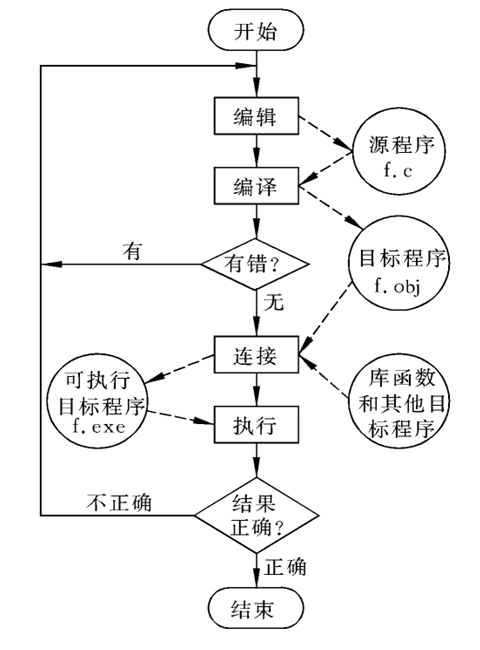

# 走近C语言

## 本章大纲

1. 基本数据类型
2. 语法结构
3. 数组
4. 指针
5. 结构体
6. 内存管理

#### 学习方法

- 多看
- 多敲
- 多改
- 多实践
- 有风格

#### 计算机系统层次关系

1. CodeBlocks
2. VC++
3. VS2010
4. VS Code
5. GCC、G++

#### 软件、语言与程序

计算机软件：由计算机程序及其数据文件组成。

计算机语言：人与计算机交流的工具，一套语法规则，语句（语法、语义）

计算机程序：完成特定功能的语句序列

程序设计：用计算机语言编写程序的过程

算法（Algorithm）：能够解决一类问题的过程和方法

#### 程序语言

- 机器语言（０１）
- 低级语言（汇编）
- 高级语言（C语言）

机器语言：由计算机硬件系统可以识别的**二进制指令**组成的语言

低级语言：接近机器语言的表示方法，使用人类比较容易记忆的单字形式来对应一连串的0、1组合。

汇编语言：将机器指令映射为一些可以被人读懂的**助记符，**如ADD，SUB。

汇编：汇编语言程序 --> 机器语言程序

高级语言：用类似于人类自然语言和数字语言的方式描述问题、编写程序。编译、链接。

1980年   贝尔实验室的 Bjarne Stroustrup博士及其同事对 C 语言进行了改进和扩充，并引入了类的概念。

1983年，由 Rick Mascitti 提议正式命名为C++（C Plus Plus）

####  C与C++

- 贝尔实验室于二十世纪八十年代在C语言的基础上开发的。
- C++是C语言的超集，包含了C语言的所有内容，同时增加了面向对象编程方面的内容。

####  C与Java

- Sun公司于1995年发布的面向对象编程语言
- Java也是基于C语言的

####  C与C Sharp

- 微软在2000年6月与.NET平台一同推出
- C#也是从C语言派生的一种面向对象语言

#### 程序开发过程基本术语

- 源程序：用源语言写的，有待翻译的程序
- 目标程序：源程序通过翻译程序加工以后所生成的程序
- 编译程序：把源程序翻译成等价的目标程序的程序

#### C语言程序的开发过程

1. 定义程序目标
1. 设计程序
1. 编写代码
1. 编译
1. - 编译器：源代码.c-->目标代码.obj
   - 链接器:（目标代码＋库函数文件）-->.exe
1. 运行
1. 测试
1. 调试程序

#### 1、定义程序目标
  在开始解决问题之前，程序的开发人员必须彻底了解问题的是什么，对即将要创建的程序要做的事情有个清晰的想法。这需要仔细考虑以下问题:
- 程序需要什么信息
- 程序需要执行哪些计算和操作
-     程序应该报告什么信息。 例如，计算任意一个圆环的面积
-     提出问题，明确目标
-     圆环是什么？如何计算？计算精度？

#### 2、设计程序
   决定程序如何去解决问题。  需要考虑：
- 如何给程序提供必要的数据
- 程序中如何表示数据
- 用什么方法来处理数据
- 程序如何组织
- 程序怎样报告结果
- 完成这个程序需要多长时间

应该用一般的概念考虑设计中的问题，而不是考虑具体的代码。

#### 3、编写代码

- 编写代码来实现前面的设计，即用某一门语言来表示程序设计。
- 需要开发人员熟练掌握该语言的知识。
- 可以在草稿纸上勾画自己的想法或书写代码，但最终必须将代码输入计算机。
- 输入代码所采用的机制则取决于具体的编程环境。
- 一般来说，需要使用文本编辑器（例如Windows的记事本程序）来创建一种文件，称为源文件
-  源文件包含程序设计的C语言表示形式（称为源程序或源代码）

#### 4、编译

   把C语言源程序转换成机器语言表示的程序。

- 这种程序可以直接被计算机理解和执行，所以称之为**可执行程序**，放在可执行文件中。
- 编译的具体细节取决于使用的编程环境。

C语言分两步完成这一工作：**编译**和**链接**。

- 编译器将源代码转换为**目标代码**，并存在目标文件中。

- 链接器将目标代码与其他代码结合起来生成可执行文件。

- 这种把编译和链接分开来做的方法便于程序的模块化。

- 可以分别编译程序的各个模块，然后用链接器把编译过的模块结合起来。

-  这样，如果需要改变一个模块，则不需要重新编译所有其他模块。

#### 5、6、7、运行、测试和调试程序

   运行包含可执行程序的文件，观察运行的结果。
- 在不同的系统中运行程序的方式可能不同。
- 例如，Windows的控制台和资源管理器。

   应该对程序进行仔细的检查，看程序是否在做该做的事。
- 比较好的做法是为验证程序的正确性设计一个测试计划。
- 越早做越好，因为它有助于理清程序员的思路。

 程序中的错误被称为bug，调试（Debug）就是要发现并修正错误。

