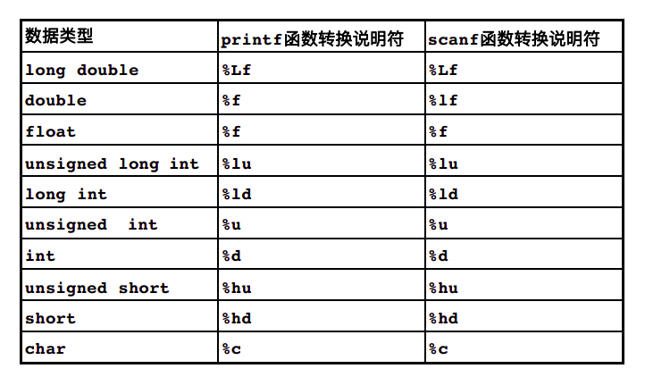
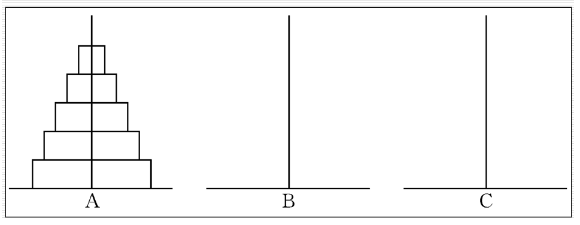
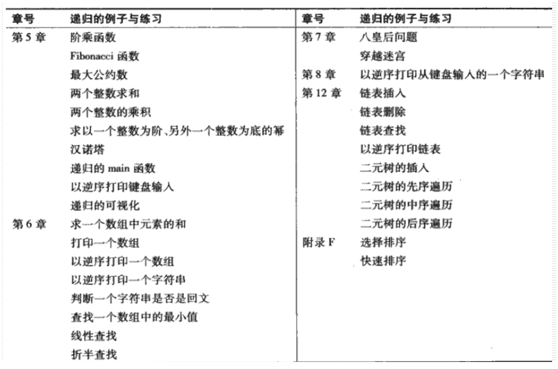

# C语言函数

## 本章大纲

- 用函数模块化地创建程序
- C标准库中的常用数学函数
- 创建自己的函数
- 函数的信息传递机制
- 函数调用方法
- 随机数的生成
- 存储类型
- 递归和迭代

## 引言

- 开发和维护大型程序的最佳方法就是从一些小的程序片段或模块来构建程序。
- 本章介绍C语言中支持大型程序设计、实现、操作和维护的功能

## C语言中的程序模块

- 函数 ：C语言中的程序模块称为函数
  - 库函数：他人编写的函数
  - 自己编写的函数 ：自定义函数。

- 函数是通过调用语句而被调用执行的。
  - 调用语句指明被调用的函数名，并提供调用函数执行指定任务所需的信息，即实参。
  - 例： `printf ("Hello !");`


## 数学库函数

- 功能：实现常用的数学计算。

  ```c
  printf( "%.2f", sqrt( 900.0) );
  double c1 = 13.0;
  double d = 3.0;
  double f = 4.0;
  printf( "%.2f", sqrt( c1 + d * f ) );
  ```


## 函数

- 函数有助于将一个程序模块化
  - 局部变量 ：在函数内部定义的变量。
  - 形式参数（形参） ：用于实现函数之间的信息通信的数据。形参也是局部变量。

- 程序 **函数化**的目的
  - 分治 : 以大化小
  - 软件重用 ：通过函数抽象技术（调用标准函数）实现。
  - 避免重复代码出现。


## 函数定义

函数定义的一般格式 ：函数头 + 函数体

```c
返回值类型 函数名（形参列表）{
   //变量定义
   //语句
 }
```

```cpp
int square( int y );
int main(){
    int x;
    for(x=1,x<=10;x++)
        printf("%d",square(x));
    return 0;
}
int square(int y){
    return y*y;
}
```

将控制由被调函数返回主调函数的方法

- 无返回值
  - return ;
  - 否则，执行到函数最后的右花括号`}`时返回

- 有返回值
  - return expression ;  


```cpp
#include <stdio.h>
int maximum( int x, int y, int z );

int main( void ) {
    int number1;  
    int number2;
    int number3;
    printf( "Enter three integers: ");
    scanf( "%d%d%d", &number1, &number2,&number3 );
    printf( "Maximus is: %d\n", maximum( numbers, number2, number3 ) );
    return 0;
}

int maximum( int x, int y, int z ) {  
    int max = x;
    if( y > max ) {            
        max = y;
    } 
    if( z > max ) {
        max = z;
    } 
    return max;
}
```

## 函数原型

- 功能：告诉编译器函数的名称、返回值类型，函数希望接收的形参个数、类型和顺序）；
  - 可以用#include编译预处理命令将相应的头文件包含进来，从而获得非自定义函数的原型。
  - 函数原型必须与函数定义相匹配。

- 函数实参类型的强制转换
  - 当实参的数据类型与函数原型不一致时，按照类型提升规则进行***隐式强制转换***。
  - - `printf( "%.3f\n", sqrt ( 4 );`

    - 也可进行显式强制转换
      - `printf( "%.3f\n", sqrt ( (double)4 );`

- 数据类型的提升规则
  - **低级别类型数自动转换成高级别类型数**（隐式转换）。

  - 可用于不同类型数据组成的混合表达式。

  - 注意；将一个高级别类型转换成一个低级别类型数据有时会得到一个错误的结果。

  - 常用数据类型的级别
    - double
    - float 
    - unsigned long int
    - long int
    - unsigned int
    - int
    - char




## 函数调用堆栈及活动记录

- 函数调用的实现
  - 堆栈 ：一种先入后出(`FILO`)的存储结构
  - 主调函数的返回地址必须压入堆栈。
  - 被调函数的局部变量也存入堆栈。
  - 活动记录 ：保存在堆栈中的这些数据称为活动记录。


## 头文件

- 头文件中包含了函数库中所有函数的***函数原型***、函数所需的各种***数据类型***和***常量***的定义。

- 可以创建自定义的头文件。
  - 格式： file.h
  - 使用方法： #include “file.h” 或者  #include <file.h>

- 一些常用的头文件
  - math.h : 数学库函数头文件
  - stdio.h : 标准输入/输出库函数头文件
  - stdlib.h : C标准库函数头文件
  - string.h : 字符串处理头文件
  - time.h : 处理时间和日期的函数头文件


## 函数调用参数传递方式

- **按值**传递调用函数 ：传递实参的一个副本。
  - 不影响主调函数中实参的原始值。

- **按引用**传递调用函数 ：传递实参的地址。
  - 可能改变主调函数中实参的原始值。
  - 数组的调用


## 随机数的生成

```cpp
//模拟一个六面体色子的投掷
#include <stdio.h>
#include <stdlib.h>
int main(int argc, char const *argv[]) {
  int i;
  for (i = 0; i < = 20; i++) {
    printf("%10d", 1 + (rand() % 6));
    if (i % 5 == 0) {
      printf("\n");
    }
  }
  return 0;
}

//掷六面体色子6000次
#include <stdio.h>
#include <stdlib.h>
int main(int argc, char const *argv[]) {
  int frequency1 = 0;
  int frequency2 = 0;
  int frequency3 = 0;
  int frequency4 = 0;
  int frequency5 = 0;
  int frequency6 = 0;

  int roll;
  int face;
  for (roll = 1; roll <= 6000; roll++) {
    face = 1 + rand() % 6;
  }
  switch (face) {
    case 1:
      ++frequency1;
      break;
    case 2:
      ++frequency2;
      break;
    case 3:
      ++frequency3;
      break;
    case 4:
      ++frequency4;
      break;
    case 5:
      ++frequency5;
      break;
    case 6:
      ++frequency6;
      break;
  }
  printf("%s%13s\n", "face", "frequency");
  printf("  1%13d\n", frequency1);
  printf("  2%13d\n", frequency2);
  printf("  3%13d\n", frequency3);
  printf("  4%13d\n", frequency4);
  printf("  5%13d\n", frequency5);
  printf("  6%13d\n", frequency6);
  return 0;
}

//将伪随机序列随机化
#include <stdio.h>
#include <stdlib.h>
int main(int argc, char const *argv[]) {
  int i;
  unsigned int seed;
  printf("enter seed: ");
  scanf("%u", &seed);

  srand(seed);

  for (i = ; i < = 10; i++) {
    printf("%d ", 1 + (rand() % 6));
    if (i % 5) {
      printf("\n");
    }
  }
  return 0;
}
```

**通用的随机数缩放和平移**

- 区间`[c, d]`之间的随机数：
  - ` a = c;  b = d – c +1;`
  - `n = a + rand() % b ;`   
  - `n = c + rand() % (d-c+1);`

- 例 ：区间[0, 6]  : `n = rand() % 7;`

- 例 ：区间[-1, 3]  : `n = -1 + rand() % 5;`

- `srand(time(NULL)) ; 或者srand((int)time(0));`

### 运气游戏：双骰子游戏

​     一个玩家要投掷两个骰子。每个骰子都有六个面，分别标有1，2，3，4，5，和6个点。当被投掷的骰子停下来后，要统计两个骰子向上的面上所标的点数之和作为判断输赢的依据。如果第一次投掷两个骰子，得到的点数之和等于7或11，则玩家获胜，游戏结束。如果第一次投掷两个骰子，得到的点数之和等于2，3或12（称为掷输），则玩家失利（即庄家赢），游戏结束。如果第一次投掷两个骰子，得到的点数之和等于4，5，6，8，9或10，则将这个数目作为玩家获胜需要掷出的“点数”，为了获胜，玩家必须继续投掷两个骰子，直至一次掷出的点数之和等于这个“点数”，这时游戏结束。但是如果在此过程中，掷出的点数之和等于7，则玩家失利，游戏结束。

```cpp
#include <stdio.h>
#include <stdlib.h>
#include <time.h>

enum Status { CONTINUE, WON, LOST };
int rollDice(void);

int main(int argc, char const *argv[]) {
  int sum;
  int myPoint;
  enum Status gameStatus;
  srand(time(NULL));
  sum = rollDice();
  switch (sum) {
    case 1:
    case 11:
      gameStatus = WON;
      break;
    case 2:
    case 3:
    case 12:
      gameStatus = LOST;
      break;
    default:
      gameStatus = CONTINUE;
      myPoint = sum;
      printf("Point is %d\n", myPoint);
      break;
  }
  while (gameStatus == CONTINUE) {
    sum = rollDice();
    if (sum == myPoint) {
      gameStatus = WON;
    } else {
      if (sum == 7) {
        gameStatus = LOST;
      }
    }
  }
  if (gameStatus == WON) {
    printf("Player wins\n");
  } else {
    printf("Player loses\n");
  }
  return 0;
}

int rollDice(void) {
  int die1;
  int di2;
  int workSum;
  die1 = 1 + (rand() % 6);
  die2 = 1 + (rand() % 6);
  workSum = die1 + die2;
  printf("Player rolled  %d + %d = %d\n", die1, die2, workSum);
  return workSum;
}
```

## 枚举类型：enum

- 用标识符表示常量 ： 枚举常量或符号常量 
- 从0开始，然后逐个增1

```cpp
enum Status { CONTINUE, WON, LOST};
enum Status gameStatus；
```

## 计算机辅助教学程序

在教育中应用计算机，被称为“计算机辅助教学”( Computer-assisted instruction ) CAI )。请编写一个程序来帮助小学生学习乘法。程序使用rand函数来产生两个一位的正整数，然后打印出一个问题，例如：How much is 6 times 7 ? 让学生输入他们的答案。程序将检查学生的答案是否正确。如果正确，打印”very good!”,* 然后问下一个问题；如果错误，打印”No. Please try again.“，然后让学生重新回答直至答对为止。请单独用一个函数来产生问题。每调用一次函数，只产生一个问题。一旦程序开始运行，就调用这个函数。然后，每当用户正确地回答了问题，就再调用一次。

```cpp
#include <stdio.h>
#include <stdlib.h>
#include <time.h>
int question();
int main(int argc, char const *argv[]) {
  int result;
  do {
    result = question();
  } while (result == 1);
  return 0;
}
int question() {
  int x;
  int y;
  int answer;
  srand(time(NULL));
  x = 1 + rand() % 9;
  y = 1 + rand() % 9;
  printf("How much is %d times %d\n", x, y);
  scanf("%d", &answer);
  if (answer == x * y) {
    printf("Very goon!\n");
    return 1;
  } else {
    do {
      printf("No. Please try again.\n");
      scanf("%d", &answer);
    } while (answer != x * y);
    return 0;
  }
```

## 存储类型

- 标识符的属性
  - 存储类型 : 决定其他属性。
  - 存储周期 ：标识符所代表的变量存在于内存中的时间。
  - 作用域 ：标识符所代表的变量在程序中能够被访问到的区域。
  - 链接 ：标识符能否被其他源文件访问。

- C语言标识符的存储类型
  - **auto** ：自动，自动存储周期 ：在执行到定义它的程序块时才被创建，并在程序块的活动期间一直存在于内存中，在退出程序块后将被删除（释放）；
  - **register** ：寄存器
  - **extern** ：外部
  - **static** ：静态


## 局部变量

- 函数的局部变量（在函数的形参列表或函数体中声明的变量）通常都属于自动存储周期
  - 显示定义 ： auto double x;
  - 隐式定义（默认） :  double x;


## 寄存器变量

- 储存在寄存器中的变量，只用于自动变量。
- 如： register int counter = 1 ;

## 具有静态存储周期的存储类

- 静态变量 ：它占用的存储单元是在程序运行的开始时刻进行分配和初始化的，而且只分配和初始化一次
  - static int count = 1;

- ***外部标识符 ：标识符从程序运行的开始时刻起就有效***
  - **全局变量** ：将其声明写在任何一个函数体之外

  - **函数名** ：将函数原型放在程序的最前面

  - 其他源文件中的**全局变量和函数名**：**extern**
    - 如：extern int a;
    - double Add( double x, double y);


## 标识符的作用域

标识符的作用域是指程序中能够访问到这个标识符的区域。

- **函数作用域** ：标号（标识符：）。如start:

- **文件作用域** ：在所有函数之外定义的标识符。

- **程序块作用域** ：在一个程序块内部定义的标识符。
  - 嵌套时重名被屏蔽

- **函数原型作用域** ：函数原型中的形参名。

```cpp
#include <stdio.h>
void useLocal(void);
void useStaticLocal(void);
void useGlobal(void);
int x = 1;
int main(int argc, char const *argv[]) {
  int x = 5;
  printf("local x in outer scope of main is %d\n", x);
  {
    int x = 7;
    printf("local x in inner scope of main is %d\n", x);
  }
  printf("local x in outer scope of main is %d\n", x);
  useLocal();
  useStaticLocal();
  useGlobal();
  useLocal();
  useStaticLocal();
  useGlobal();
  printf("\nlocal x in main is %d\n", x);
  return 0;
}
void useLocal(void) {
  int x = 25;
  printf("\nlocal x in useLocal is % d after entering useLocal\n", x);
  x++;
  printf("local x in useLocal is % d before exiting useLocal\n", x);
}
void useStaticLocal(void) {
  static int x = 50;
  printf("\nlocal static x is % d on entering useStaticLocal\n", x);
  x++;
  printf("\nlocal static x is % d on exiting useStaticLocal\n", x);
}
void UseGlobal(void) {
  printf("\nglocal x is % d on entering useGlobal\n", x);
  x *= 10;
  printf("\nglocal x is % d on exiting useGlobal\n", x);
} /* end useGlobal */
```

## 递归：函数调用自己

- 首先，调用递归函数的目的是为了求解一个复杂问题，但这个函数必须事先知道问题在最简单情况或基线条件下的解。
- 其次，将问题分解为一个与原问题类似，但规模较小的两个或多个问题，使问题得到简化。
- 然后，重复分解过程，直到问题成为最简单情况
- 最后，函数一步步地返回，从而得到复杂问题的解。

### 递归地计算阶乘

```cpp
#include <stdio.h>
long factorial(long number);

int main(int argc, char const *argv[]) {
  int i = 1;
  for (i = 0; i <= 10; i++)
    printf("%2d! = %ld\n", i, factorial(i));
  return 0;
}

long factorial(long number) {
  if (number <= 1) {
    return 1;
  } else {
    return number * factorial(number - 1);
  }
}
```

### 递归的可视化

```cpp
#include <stdio.h>
long factorial(long number, int space);

int main(int argc, char const *argv[]) {
  int i = 1;
  for (i = 0; i <= 10; i++) printf("%2d! = %ld\n", i, factorial(i, 0));
  return 0;
}
long factorial(long number, int space) {
  int i;
  long result;
  if (number <= 1) {
    for (i = 1; i <= space; i++) {
      printf(" ");
    }
    printf("return 1\n");
    return 1;
  } else {
    for (i = 1; i <= space; i++) {
      printf(" ");
    }
    printf("number = %ld ,factorial( %ld , %d)\n", number, number - 1, space);
    result = number * factorial(number - 1, space + 4);
    for (i = 1; i <= space; i++) printf(" ");
    printf("return %ld\n", result);
    return result;
  }
}
```

### 经典递归：Fibonacci

- Fibonacci数列 : 0, 1, 1, 2, 3, 5, 8, 13, 21, …

```cpp
#include <stdio.h>
long fibonacci(long number);
int main(int argc, char const *argv[]) {
  long result;
  long number;
  printf("Enter an integer: ");
  scanf("%ld", &number);
  result = fibonacci(number);
  printf("Fibonacci( %ld ) =  %ld\n", number, result);


  return 0;
}
long fibonacci(long n) {
  if (n == 0 || n == 1) {
    return n;
  } else {
    return fibonacci(n - 1) + fibonacci(n - 2);
  }
```

- 计算同一个运算符对应的不同操作数的顺序

  - 与（&&）， 或（¦¦）， 逗号（，），条件运算符（？=）： 从左到右
  - 其余C语言未规定

- 指数级计算复杂度

  - 计算第n个Fibonacci数需调用的函数次数近似为2^n数量级

  - 称作具有指数级计算复杂度

## 汉诺塔问题



由上面的分析可知：将ｎ个盘子从Ａ座移到Ｃ座可以分解为以下3个步骤：

1.将Ａ上ｎ－１个盘借助Ｃ座先移到Ｂ座上。

2.把Ａ座上剩下的一个盘移到Ｃ座上。

3.将ｎ－１个盘从Ｂ座借助于Ａ座移到Ｃ座上。


## 递归与迭代

- 递归与迭代的的异同点

- 都基于一种控制结构
  - 迭代基于循环结构，递归基于选择结构
  - 迭代显式地使用一个循环结构，递归重复地进行函数调用

- 都需要进行终止测试
  - 迭代是在条件为假时终止。
  - 递归是在达到基线条件时终止。

- 任何可以用递归方法解决的问题均可以用迭代方法解决
  - 减小函数调用的开销

- 递归方法能更自然地反映问题的本质，符合人脑解决问题的思考规律，因而比迭代反而更受到人们的欢迎
  - 有利于实现人工智能




## 本章小结

- C语言的程序模块是用函数实现的。
- 函数包括开发系统提供的库函数和程序员自编函数。
- 标识符的属性包括：类型、周期，作用域、链接等。
- 递归方法能更自然地反映问题的本质，符合人脑解决问题的思考规律。