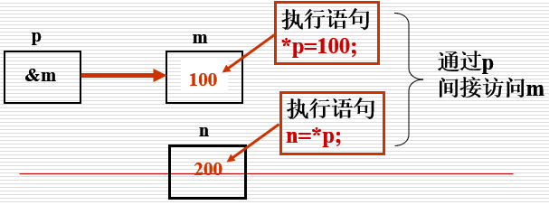

# C语言指针

## 本章大纲

- 指针和指针运算符
- 按引用方式使用指针向函数传递实参
- 指针与数组、字符串之间的关系
- 函数指针

## 变量的3种属性

- 位置
- 类型
- 值

```c
int a;//指出了值的类型和变量名，还让程序分配内存，并在内部将变量名与所分配的内存单元联系在一起
//假设为a分配的内存单元地址为2009~2012，则a的首地址为2009，a总是与2009地址联系在一起

a=123;//将123存储在首地址为2009的连续4个单元中
```

## 直接存取

按变量地址存取变量的值

```c
int a;
double b;
//对于任一变量，编译程序为其分配若干个字节（连续的）的内存单元，以便保存变量的取值
```


## 指针

指针是一种变量，具有变量的一切属性。

- 先定义后使用
- 能进行某些系统指定的运算
- 赋值的意义与其它变量一样

**指针：即地址。**

指针变量：用于存放地址的变量。在这种变量中存放的数值是**作为地址****使用**的，这个地址像是一个指针，指示存取数据的真正位置。**即间接访问。**

指针就是其值为内存单元地址的变量。变量名是直接引用一个值。指针是间接引用一个值。通过指针引用一个值，称为**间接寻址**。

### 指针的定义

数据类型 * 指针变量名; 

```c
int  *nPtr;
char *charPtr;
float * fPtr;
```

### 指针的初始化

①空指针

```c
int  *nPtr; //定义一个指向int型数据的指针变量
nPtr = NULL; //nPtr = 0;  将这个指针变量初始化为空指针
```

②非空指针

```c
int  *nPtr;//定义一个指向int型数据的指针变量
int  x = 6;//定义并初始化变量x值为6
nPtr = &x; //将变量x的地址赋值给指针变量nPtr
```

## 取地址和解引用

### 取地址

1、取地址运算符：&

  功能：返回变量的内存地址。

```c
int *p ,m ;  //定义 p 为指向 int 类型变量m的指针
m=200 ;
p=&m ;  //将整型变量 m 的地址值赋给指针变量 p
```

图示：


说明：

①一个指针变量只能指向同一数据类型的变量，该数据类型是在定义指针变量时明确给定的。

②C语言规定有效数据的指针不指向0单元(为非0值)，如果指针变量值为0，即NULL,表示空指针，即不指向任何变量。

③不要把地址值与整数类型值相混淆。例如：地址2000与整型量2000是两个不同的概念。

### 解引用

2、间接存取运算符（解引用运算符）：*****

  功能：访问指针指向的变量。

```c
int *p , m=200 , n ;
p=&m ;   // p 指向整型变量 m
n=*p ;   将p指向的值(即m的值)赋给 n
*p=100 ; 将 100 赋给指针变量 p 所指向的变量 m
```



辨析：

```c
int main()
{
    int age=25;
    int *pointer=&age;
    //问题：age，&age，pointer，&pointer，*pointer，*&age，&*pointer都是什么？
    printf("\nthe value of age is %d .",age); 
    printf("\nthe value of &age is %#X .",&age);
    printf("\nthe value of pointer is %#X .",pointer);
    printf("\nthe value of &pointer is %#X .",&pointer);
    printf("\nthe value of *pointer is %d .",*pointer);
    printf("\nthe value of *&age is %d .",*&age);
    printf("\nthe value of &*pointer is %#X .\n",&*pointer);
    return 0;
}
```


结论：

age，变量

&age，变量地址

pointer，变量地址

&pointer，指针变量地址

*pointer，变量

*&age，变量

&*pointer，变量地址

## 定义指针变量注意事项：

1、指针变量前面的“*”，表示该变量的类型为**指针型变量**

```c
float * pointer_1；

指针变量名是pointer_1 ，而不是 *pointer_1
```

2、在定义指针变量时**必须指定基类型。**需要特别注意的是，只有整型变量的地址才能放到指向整型变量的指针变量中。下面的赋值是错误的∶

```c
float a;

int * pointer_1;

pointer_1=&a;     
```


例：输入ａ和ｂ两个整数，按先大后小的顺序输出ａ和ｂ。

```c
#include <iostream>
using namespace std;
int  main()
{
    int *p1,*p2,*p,a,b;
    scanf("%d %d",&a,&b);
    p1=&a;
    p2=&b;
    if(a<b)
    {
        p=p1;
        p1=p2;
        p2=p;
    }
    printf("a=%d,b=%d\n\n",a,b);
    printf("max=%d,min=%d\n",*p1,*p2);
    return 0;
}
```


## 引用传参

**按引用向函数传递实参**

引用：变量或实参的别名。一块内存两个名字。

- 按引用向被调函数传递的实参，在被调函数中可以改变实参的值。（C++功能）
- C语言提供模拟按引用调用的功能。

- 使用指针和间接寻址运算符(*)实现
- 实际传递实参的地址。

```c
#include <iostream>
using namespace std;
void swap(int *,int*);
int  main()
{
    int *pointer_1,*pointer_2,a,b;
    scanf("%d %d",&a,&b);
    pointer_1=&a;
    pointer_2=&b;
    printf("a=%d,b=%d\n\n",a,b);
    if(a<b)
    {
        swap(pointer_1,pointer_2);
    }


    printf("max=%d,min=%d\n",*pointer_1,*pointer_2);
    return 0;
}
void swap(int *p1,int*p2)
{
    int temp;
    temp=*p1;
    *p1=*p2;
    *p2=temp;
}
```


实质：指针的指向并没有改变，只是改变了指向的变量的值。

思考：怎样改变指针的指向？而不是改变指针指向变量的值

## 指针和const

**1、const的作用**

   告诉编译器这个被const修饰的（指针）变量的值是不可改变的。向函数传递**指针型实参**时，若不允许改变实参的值(即指针的值、指针的指向)，应使用const限定符。

**2、分类**

- **非常量指针：**其值(地址)是可变化的，例 **int** ***** **p**

- 指向非常量数据

- int * nPtr;
- int x= 5, y = 8;
- nPtr = &x;   *nPtr = 2;
- nPtr = &y;   *nPtr = 10;

- 指向常量数据

- const int * nPtr;
- int x= 5, y = 8;
- nPtr = &x;  错误： *nPtr = 2;
- nPtr = &y;  错误： *nPtr = 10;

- **常量指针：**其值(地址)是不可变化的，例 **int** ***** **const** **cp**

- **指向非常量数据**

- int * const nPtr=&x;
- int x= 5, y = 8;
- *nPtr = 2;
- 错误：nPtr = &y;

- **指向常量数据**

- const int * const nPtr;
- int x= 5;
- nPtr = &x;  错误： *nPtr = 2;

## 指针和++、--、*

++、--、*优先级相同

```c
int a=3;
int* p;
p=&a;
```


```c
#include <stdio.h>
#include <ctype.h>   /*字符处理
            函数库头文件*/
void convertToUppercase (char *sPtr );
int main( void ){
    char string[ ] = "characters and $32.98";
    printf( "The string before conversion is : %s\n", string );
    convertToUppercase( string );
    printf( "The string after conversion is : %s\n", string );
    return 0;
}  /* end main */
/* convert string to uppercase
                letters  */
void convertToUppercase(char *sPtr ){
    while( *sPtr != '\0' ){
        if( islower( *sPtr )){
            *sPtr = toupper( *sPtr );
        }  /* end if  */
        ++sPtr;
    }  /* end while  */
}  /* end converToUppercase */
```

## 数组和指针

指向数组元素的指针

- 数组与变量一样，在内存中占据单元，有地址，一样可以用指针来表示。
- C语言规定：

- **数组名就是数组的起始地址；**
- **数组的指针就是数组的起始地址。**（==>数组指针就是数组名）
- 数组元素的指针就是数组元素的地址

```c
int main( void ){
    int arrayy[8];
    printf("数组名的地址：%#X \n",&arrayy);
    printf("数组名的地址：%#X \n",arrayy);
    printf("数组元素array[0]的地址：%#X \n\n",&arrayy[0]);
    for (int i=0;i<8;i++){
        printf("数组元素array[%d]的地址：%#X \n",i,&arrayy[i]);
    }
    return 0;
}
```


**指向数组元素的指针变量的定义和赋值**

```c
int   a[10], *p;
p=&a[0]; //数组第一个元素的地址
p=a; //直接用数组名赋值
//p是变量，a为常量

若数组元素为int型，则指向其的指针变量也应定义为int型

int  a[10];
int  *p=a;     //等价
int  *p=&a[0]; //等价
```


**怎样表示数组中的第i个元素？**

指针p，数组a，p的初值为a

***(a+i)**  数组名法  

***(p+i)**  指针法

**a[i]**   下标法

**p[i]**   下标法


**怎样表示数组中的第i个元素的地址？**

指针p，数组a，p的初值为a

**a+i**  数组名法  

**p+i**  指针法

**&a[i]** 下标法

**&p[i]** 下标法

**通过数组名和指针变量访问数组元素的区别：**

1.**指针变量是地址变量**，其指向由所赋值确定。

2.**数组名是地址常量（指针常量）**，恒定指向

数组的第1个元素。

 

**指针相减运算的意义？**

**指向相同数据类型**的指针变量可以相减，其结果为两指针所指向地址之间数据元素的个数。

```c
int *px; 
int *py;
int n;
int a[5];
px=&a[1];
py=&a[4];
n=py-px ; //结果：n 值为3
```


**指针比较运算的意义？**

==、!=、<、<=、>、>=

指针的关系运算是两个指针（指向相同数据类型）所指向的地址之间的比较运算，产生的结果为 0（假）和 1（真）。

**示例：**


```c
有定义：double a[5],*p1,*p2 ; p1,p2 的指向如图所示
计算：
p1==p2   判断p1,p2是否指向同一变量？      结果：0
p1<p2    判断p1的地址是否比p2的地址小？    结果：1
p1==NULL 判断p1是否为空指针？(NULL是系统定义的)      结果：0
p1!=0    判断 p1 是否不为空指针？      结果：1
```

冒泡排序：

```c
#include <stdio.h>
#define LEN 8

//冒泡排序——1
int main( void ){
    int arrayy[LEN]={38,49,65,97,76,13,27,52};
    for(int i=0;i<LEN-1;i++){ //总共比较LEN-1轮
        for(int j=0;j<LEN-1-i;j++){//每一轮需要比较LEN-1-i次
            if(arrayy[j]>=arrayy[j+1]){
                int temp=arrayy[j+1];
                arrayy[j+1]=arrayy[j];
                arrayy[j]=temp;
            }
            printf("第%d轮第%d次比较  ",i+1,j+1);
        }
        printf("\n");
    }
    for(int i=0;i<LEN;i++){
        printf("%d ",arrayy[i]);
    }
    return 0;
}
==============================================

#include <stdio.h>
#define LEN 8

void swapp(int *,int* );

//冒泡排序
int main( void ){
    int arrayy[LEN]={38,49,65,97,76,13,27,52};
    for(int i=0;i<LEN-1;i++){ //总共比较LEN-1轮
        for(int j=0;j<LEN-1-i;j++){//每一轮需要比较LEN-1-i次
            if(arrayy[j]>=arrayy[j+1]){
                swapp(&arrayy[j],&arrayy[j+1]);
            }
            printf("第%d轮第%d次比较  ",i+1,j+1);
        }
        printf("\n");
    }
    for(int i=0;i<LEN;i++){
        printf("%d ",arrayy[i]);
    }
    return 0;
}


void swapp(int *a,int *b){//传递数组元素的地址
    if(*a>=*b){
        int temp=*b;
        *b=*a;
        *a=temp;
    }
}

```

## sizeof运算符

在编译程序期间计算出数据类型（包括数组）的字节长度。注意字符数组末尾是一个'\0'字符

```c
int main( void ){
    char name[]="abcdefg";
    for(int i=0;i<sizeof(name);i++){
        printf("%d ",name[i]);
    }
    printf("\n字符数组name的长度是：%d \n",sizeof(name));
    return 0;
}
函数getSize : 也是返回类型的字节数.该函数在程序运行时才执行.返回值类型 ：size_t  (相当于unsigned int
    或者 unsigned long int)
```

## 字符指针变量VS字符数组

### **1、存储形式不同**

字符数组由若干个元素组成，每个元素中放一个字符。而字符指针变量中存放的是地址（字符串第1个字符的地址），决不是将字符串放到字符指针变量中。

### 2、赋值方式

对字符数组只能对各个元素赋值，不能用以下办法对字符数组赋值。

```c
char str［14］;
str＝″I love China！″;
```

而对字符指针变量，可以采用下面方法赋值：

```c
char *ａ；
ａ＝″I love China！″；
//以上两行等价于
char * ａ＝″I love Chian！″；
```

### 3、初始化方式

对字符指针变量赋初值：

```c
   char *ａ＝″Ｉ love China！″；等价于
   char *ａ；
  ａ＝″I love Chian！″；
```

对数组的初始化：

```c
char str［１４］＝｛″Ｉ love China！″｝;
  不能等价于
  char str［１４］；
  str［ ］＝″I love China！″；
```

**4、**定义了一个字符数组，在编译时为它分配内存单元，它有确定的地址。

而定义一个字符指针变量时，给指针变量分配内存单元，在其中可以放一个字符变量的地址。

```c
例如: char str［１０］；

​     scanf（″％ｓ″，str）；
```

5、指针变量的值是可以改变的，例如：

```c
int main( void )
  char *a="I love China!";
  a=a+7;
  printf("%s",a);
  return 0;
}
```

若定义了一个指针变量，并使它指向一个字符串，就可以用下标形式引用指针变量所指的字符串中的字符。例如:

```c
int main( void ){
  char *a="I love China!";
  int i;
  printf("the sixth character is %c\n",a[5]);
  for(i=0;a[i]!='\0';i++){
​    printf("%c",a[i]);
  }
  return 0;

}
```

## 多维数组和指针

用指针变量可以指向一维数组中的元素，也可以指向多维数组中的元素。

**多维数组元素的地址：****二维数组是“数组的数组”**

```c
 int a[3][4]={
        {1, 3,  5,  7},
        {9, 11, 13, 15 },
        {17,19, 21, 23 }
    };
```

二维数组a是由3个一维数组所组成的。设二维数组的首行的首地址为0X2000  ，则


```c
* #define FROMAT "%d,%d\n"
int main( void )
{
    int a[3][4]=
    {
        {1, 3,  5,  7},
        {9, 11, 13, 15 },
        {17,19, 21, 23 }
    };
    printf(FORMAT,a,*a);
    printf(FORMAT,a[0], *(a+0));
    printf(FORMAT,&a[0],&a[0][0]);
    printf(FORMAT,a[1],a+1);
    printf(FORMAT,&a[1][0],*(a+1)+0);
    printf(FORMAT,a[2],*(a+2));
    printf(FORMAT,&a[2],a+2);
    printf(FORMAT,a[1][0],*(*(a+1)+0));
    return 0;
}
```

## 指针数组

数组元素全部是指针

- 通常用来构造字符串数组，故指针数组又称为字符串数组。
- 字符串数组的每一个元素都是一个字符串（实质上是指向字符串的指针）。

```c
const char *suits[ 4 ] = { “Hearts”, “Diamonds”, “Clubs”, “Spades” }
```


## 洗牌发牌模拟

```c
#include <stdio.h>
#include <stdlib.h>
#include <time.h>


void shuffle( int wDeck[ ][ 13 ] );
void deal( const int wDeck[][ 13 ],
           const char *wFace[ ],
           const char *wSuit[] );


int main( void )
{
    const char *suit[ 4 ] = { "Hearts","Diamonds", "Clubs", "Spades"};
    const char *face[ 13 ] =
    {
        "Ace", "Deuce", "Three", "Four",
        "Five","Six", "Seven", "Eight",
        "Nine", "Ten", "Jack", "Queen",
        "King"
    };
    int deck[ 4 ][ 13 ] = { 0 };
    srand( time( NULL ) );
    shuffle( deck );
    deal( deck, face, suit );
    return 0;
}
void shuffle( int wDeck[][ 13 ] )
{
    int row;
    int column;
    int card;


    /* for each the 52 cards, choose slot of deck randomly  */
    for( card = 1; card <= 52;card++ ){
        /* choose new random location until unoccupied  slot  found */
        do{
            row = rand() % 4;
            column = rand() % 13;
        }
        while( wDeck[ row ][ column ] != 0 );
        /* place card number in chosen slot of deck */
        wDeck[ row ][ column ] = card;
    } /* end for  */
} /* end function shuffle  */
/* deal cards in deck */
void deal( const int wDeck[][ 13 ],
           const char * wFace[],
           const char *wSuit[] )
{
    int card;
    int row;
    int column;
    /* deal each of the 52 card */
    for( card = 1; card <= 52; card++ ){
        /* loop through rows of wDeck  */


        for( row = 0; row <= 3;row++ ){
            /* loop through column of wDeck for current row */
            for( column = 0; column <= 12;column++ ){
                /* if slot contains current card,display card */
                if( wDeck[ row ][ column ] == card ) {
                    printf("%5s of %-8s%c", wFace[ column ],wSuit[ row ],card % 2 == 0 ? '\n' : '\t' );
                } /* end if  */
            }  /* end inner for  */
        }    /* end middle for */
    }  /* end outer for */
} /* end function deal  */
```

## 函数指针

一个指向函数的指针包含的是一个函数在内存中的地址。函数名就是执行该函数功能的程序代码在内存中的起始地址

### 定义

```c
返回类型  ( *函数名 )( 形参列表)；
int (*f)( int a, int b );
double (*function)( double d );
```

### 调用

```c
(*函数名）（实参列表）；
int x = 4, y = 6;
( *f )( x, y );
( *function)( 4.0 );
```

**用函数指针实现冒泡法排序:**

```c
/* Fig. 7.26 : fing07_26.c Multipurpose sorting program using function pointer
*/
#include <stdio.h>
#define SIZE 10
/* prototypes */
void bubble(int work[], const int size, int (*compare)(int a, int b));
int ascending(int a, int b);
int descending(int a, int b);

int main(void) {
  int order;
  int counter;
  /* initialize array a */
  int a[SIZE] = {2, 6, 4, 8, 10, 12, 89, 68, 45, 37};
  printf(
      "Enter 1 to sort in ascending order,\n"
      "Enter 2 to sort in descending order,\n");
  scanf("%d", &order);
  printf("\nData items in original order\n");

  /* output original array */
  for (counter = 0; counter < SIZE; counter++) {
    printf("%5d", a[counter]);
  } /* end for */

  /* sort array in ascending order;pass function ascending as an argument to
   * specify ascenting sorting order  */
  if (order == 1) {
    bubble(a, SIZE, ascending);
    printf("\nData items in ascending order\n");
  }      /* end if */
  else { /* pass function descending */
    bubble(a, SIZE, descending);
    printf("\nData items in descending order\n");
  } /* end else */

  /* output sorted array */
  for (counter = 0; counter < SIZE; counter++) {
    printf("%5d", a[counter]);
  } /* end for */

  printf("\n");
  return 0;
} /* end main  */
/* multipurpose bubble sort;parameter compapare is a pinter to the comparison
* function function that determines sorting order */
void bubble(int work[], const int size, int (*compare)(int a, int b))
{
  int pass;
  int count;
  void swap(int *element1Ptr, int *element2Ptr);
  /* loop to control passes */
  for (pass = 1; pass < size; pass++) {
    /* loop to control number of comparisons per pass  */
    for (int counter = 0; counter < size - 1; counter++) {
      /* if adjacent elements iare out of order, swap them */
      if ((*compare)(work[count], work[count + 1])) {
        swap(&work[count], &work[count + 1]);
      } /* end if  */
    }   /* end inner for  */
  }     /* end outer for */
} /* end bubble  */

/* swap values at memory locations to which  element1Ptr and element2Ptr point
*/
void swap(int *element1Ptr, int *element2Ptr) {
  int hold;
  hold = *element1Ptr;
  *element1Ptr = *element2Ptr;
  *element2Ptr = hold;
} /* end swap  */
/* determine whether elements are out of order for an ascending order sort */
int ascending(int a, int b) { return b < a; } /* end ascending  */
/* determine whether elements are out of order for an descending order sort */
int descending(int a, int b) { return b > a; } /* end desending  */
```

练习：写出定义语句：int n=20;

p为指向整型数据的指针变量  int *p

定义整型数组a，它有n个元素  int a[n]

定义指针数组p，它由n个指向整型数据的指针元素组成  int *p[n]

p为指向含n个元素的一维数组的指针变量  int (*p)[n]

f为返回整型函数值的函数  int f();

p为指向函数的指针，该函数返回一个整型值  int (*p)()

P为一个数组，创建了n个指向函数的指针  int (*p[n]) ();

p是一个指向指针的指针变量，它指向一个指向整型数据的指针变量  int **p


## 本章小结

- 一个指针包含的是一个存放数值的变量的地址
- 使用指针可以模拟按引用向函数传递实参
- 同类指针可以进行某些算术运算
- 指针和数组可以互换使用
- 指针数组常用来表示字符串数组
- 函数指针包含的是一个函数在内存中的起始地址，常用于基于文本的菜单驱动系统

## 函数指针

- 数组名  != &数组名：`arr!=&arr;`
- 函数名 = &函数名：`func=&func;`

### 声明

```cpp
返回值类型 ( * 指针变量名) ( 形参列表 ); 
int func(int a,double b);//声明函数
int (*ptr) (int a,double b);//声明函数指针
```

#### 声明简化

```cpp
typedef int (*type_ptr) (int a,double b);
//声明函数指针数据类型，类型名为type_ptr
type_ptr ptr1,ptr2,ptrn;
ptr1=func;
ptr2=func
```

### 赋值

```cpp
ptr=func;//函数指针赋值方式1
ptr=&func;//函数指针赋值方式2
```

### 调用

```cpp
ptr(10,10.5);//函数指针调用
(*ptr)(10,10.5);//函数指针调用
```

### 应用场景

1. 回调函数
2. 线程

## 本章小结