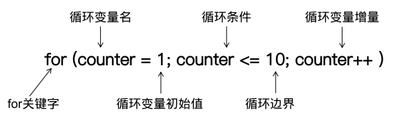
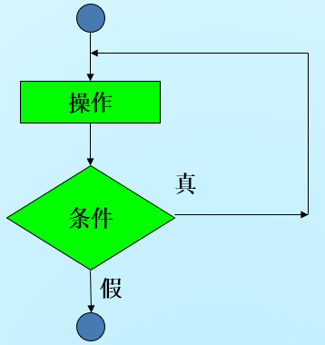
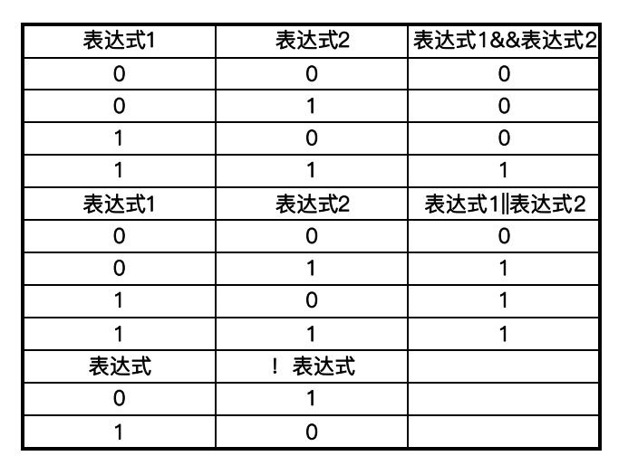
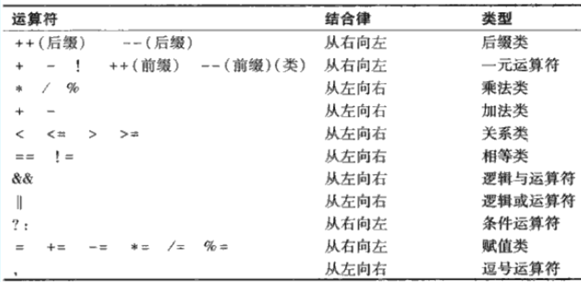

# C程序控制

## 本章大纲

- for循环和do…while循环
- switch选择语句
- 使用逻辑运算符构成复杂的条件表达式
- 结构化程序设计总结

## 循环的基本原理

循环：是指在循环继续条件为真时，计算机重复执行一组指令。

- 计数控制的循环 ：确定性循环

- - 控制变量记录循环次数

-  标记控制的循环 ：不确定性循环

- - 每次循环要输入数据，其个数事先未知
  - 输入标记值表示数据输入结束

## 计数控制的循环

- 实现计数控制循环的步骤

- - 定义控制变量（或称作循环计数器）的变量名
  - 给控制变量赋初值
  - 定义每次循环后控制变量的增量值或者减量值。
  - 测试控制变量是否满足循环终值条件，即判断循环是否还要继续。


```c
#include <stdio.h>
int main() {
  int counter = 1;
  while (counter <= 10) {
    printf("%d \n", counter);
    ++counter;
  }
  return 0;
}
```

计数循环的其他形式

```c
  while (counter++ <= 10)
    printf("%d\n", counter);
----------------------------------
  while (counter <= 10)
    printf("%d\n", counter++);
-----------------------------------
  int counter = 0;
  while (++counter <= 10)
    printf("% d\n", counter);
```

## for循环

```c
#include <stdio.h>
int main() {
  int counter;
  for (counter = 1; counter <= 10; counter++) {
    printf("%d\n", counter);
  }
  return 0;
}
```

### for循环首部结构



### for循环语句的标准格式

```c
单个语句
   for ( 表达式1；表达式2；表达式3; )
         语句
多个语句
   for ( 表达式1；表达式2；表达式3; ) {
         语句块
   }
```

### for循环等价的while循环形式

```c
  表达式1；
   while ( 表达式2 ) {
       语句
       表达式3;
   }
```

### for循环注意事项：

1、初始化、循环条件及增量操作可以包含**算术表达式**

2、增量值可以是负值，循环计数递减

3、如果循环条件被初始化为假，那么循环体将得不到执行

4、循环控制变量不必出现在循环体中

### for循环示例：

```c
#include <stdio.h>
int main() {
  int sum = 0;
  int number;
  for (number = 2; number <= 100; number += 2) {
    sum += number;
  }
  printf("sum is %d", sum);
  return 0;
}
```

用for语句计算银行复利：

年利率5%，本金1000元，利息存入本金，计算并打印每年年底本息金额。本息=本金+利息。

```c
#include <math.h>
#include <stdio.h>
int main() {
  double amount;
  double principal = 1000.0;
  double rate = 0.05;
  int year;
  printf("%s%21s", "Year", "Amount on deposit\n");
  for (year = 1; year <= 10; year++) {
    amount = principal * pow(1.0 + rate, year);
    printf("%4d%21.2f\n", year, amount);
  }
  return 0;
}
```

输出数据的格式及对齐

```c
右对齐
    printf("%s%21s", "Year", "Amount on deposit\n");
    printf("%4d%21.2f\n", year, amount);

左对齐
    printf("%-4s%-17s", "Year", "Amount on deposit\n");
    printf("%-4d%-17.2f\n", year, amount);
```

## switch选择语句

多重选择 ：通过测试某个变量或表达式的值与事先指定的一组整型常量中的一个是否相等，然后执行不同的操作，称作多重选择。

 

用switch语句实现

- 一系列case语句
- 一个可选的default语句

### 一般形式：

```c
  switch (表达式) {
    case 常量表达式1:
      语句1;
      break;
    case 常量表达式2:
      语句2;
      break;
    ...
    case 常量表达式n:
      语句n;
      break;
    default:
      语句n + 1;
  }
```

### 执行过程：

- 进入：先计算表达式之值,然后根据表达式的值找入口。

- - 如果表达式的值与某个case后面的常量表达式的值相同，则由该case进入，执行其后的语句；
  - 若所有的case语句中的常量的值都不能与之匹配，则执行 default后的语句n+1。

- 出来：遇到**break**语句或switch语句的结束标志“}”，则退出switch。接着做switch的后继语句。

示例：按照考试成绩的等级打印出百分制分数段

```c
#include <math.h>
#include <stdio.h>
int main() {
  char grade;
  printf("input a grade: ");
  scanf("%c", &grade);
  // grade=getchar();
  grade = (grade >= 'A' && grade <= 'Z') ? grade + 32 : grade;
  switch (grade) {
    case 'a':
      printf("90~100\n");
      break;
    case 'b':
      printf("80~89\n");
      break;
    case 'c':
      printf("70~79\n");
      break;
    case 'd':
      printf("60- 69\n");
      break;
    default:
      printf("<60\n");
  }
  return 0;
}
```

### switch使用说明：

- 每个case后面的表达式不能相同。
- 各个case和default语句的顺序可以改变。
- default子句可以省略不用
- 可以使多个case共用同一组执行语句。、
- 在一个case后面有多个语句时不用加花括号。
- case后面的表达式必须有确定的值不能是一个范围。

## do while循环语句

- 特点：首先执行循环体，然后再进行循环继续条件的测试，若结果为真则进入下一循环，否则结束循环。

```c
do{
    循环体
}while (循环条件)
```



 

## break和continue

### break

-  直接退出所在循环，或者跳过switch 多重选择结构中的剩余语句。

### continue

- 使控制流略过循环体中的剩余语句，重新开始下一轮循环。

## 逻辑运算符

功能：将简单条件组合在一起

- 逻辑与运算符 ：&&  二元运算符
- 逻辑或运算符 ：||  二元运算符
- 逻辑非运算符 ：!   一元运算符

### 真值表



## 运算符优先级



## 本章小结

- 循环可以采用计数和标记两种形式
- do…while循环与while循环的不同之处是其循环体至少会执行一次。
- for循环可以更简洁地实现计数循环
- 用逻辑运算符可以组合复杂的条件语句
- 只需要顺序、选择、循环三种控制结构就可以开发出任意复杂的程序。而且其组合方式只有堆叠和嵌套两种。