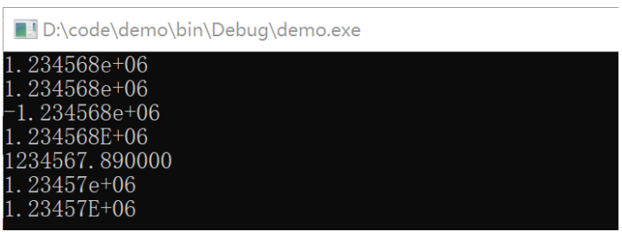
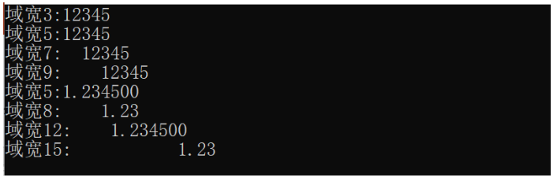
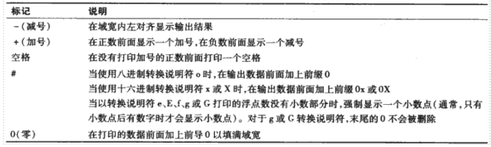
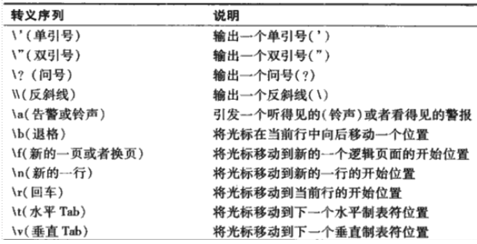
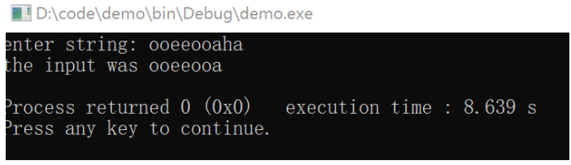
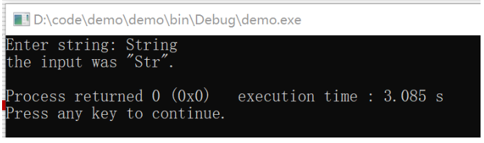
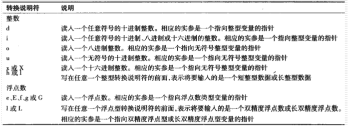
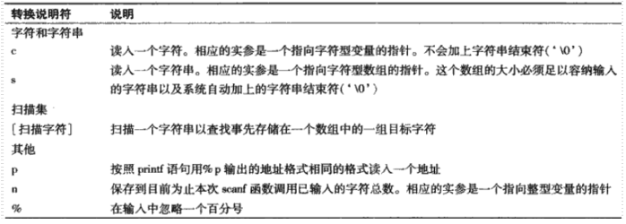

# 格式化输入和输出

## 本章大纲

- 流的概念
- 输入/输出流的使用
- 格式化输入/输出功能

## 流

概念：按行组织的字符的序列。每一行包含零个或多个字符并以一个换行符结束。

- 输入：外部设备-->内存
- 输出：内存-->外部设备

外部设备：键盘、硬盘、网卡、打印机、显示器

三个标准流：程序自动链接

1. 标准输入流：默认链接到键盘
2. 标准输出流：默认连接到显示器
3. 标准错误流：默认连接到显示器

**printf**

可以实现精确的格式化输出

- 将浮点数的小数部分按指定的位数输出
- 按小数点位置对齐输出一列浮点数
- 输出数据的左对齐和右对齐
- 在输出的一行中的指定位置插入文本字符
- 用指数形式表示浮点数
- 用八进制和十六进制表示无符号整数
- 用固定的域宽和精度来显示各种类型的数据。

用法：

printf(格式控制字符串，实参）；

- 格式控制字符串描述的是输出格式，由转换说明和文本字符组成。
- 转换说明由字符%开始，以一个转换说明符结束。二者之间可选择性地加上标记、域宽、精度等, 如：
  - printf(“产品单价是：%-4.2f”, 6.2754 );
- 一个格式字符串中可以有多个转换说明。其他实参诸个对应一个转换说明, 如：
  - printf(“%d%-4.2f”, 4, 6.2754 );

**整数**的各种转换说明符

- d : 按有符号十进制整数显示。
-  i ：按有符号十进制整数显示。
-  o ：按有符号八进制整数显示。
-  u ：按无符号十进制整数显示。
-  x或X ：按无符号的十六进制整数显示。
-  h或l ：位于任意一个整数转换说明符的前面，分别表示将要显示的是一个短整数或长整数。


**浮点数**的各种转换说明符

- e或E : 以指数形式显示一个浮点数。
  - 采用四舍五入方式. 小数点前仅仅打印一位数字
  - 默认状态（%e或%E）输出六位小数
  - e : 输出小写e. 如：1.24e+004
  - E : 输出大写E. 如：-3.450E-003
- f ：以小数点位置固定的形式显示一个浮点数。
  - 采用截断方式。小数点前至少有一位数字。
  - 默认状态（%f）输出六位小数
- g或G ：根据数据的绝对值大小，采用f浮点形式或者e(或E)指数形式显示一个浮点数。
  - 不带末尾0.
  - 采用四舍五入方式
  - 幂值小于-4或大于等于指定的精度（如大于等于6）时采用指数格式，否则采用f格式。
- L ：放置在任意一种浮点数转换说明符前面，表示要打印的是一个长双精度型(long double)的浮点数。

```c
int main()
{
    printf( "%e\n", 1234567.89 );
    printf( "%e\n", +1234567.89 );
    printf( "%e\n", -1234567.89 );
    printf( "%E\n", 1234567.89 );
    printf( "%f\n", 1234567.89 );
    printf( "%g\n", 1234567.89 );
    printf( "%G\n", 1234567.89 );
    return 0;
}
```



**字符**或字符串转换说明符

- c ：打印单个字符
- s ：打印一个字符串

**字符**或字符串转换说明符

- c ：打印单个字符
- s ：打印一个字符串

其他的转换说明符

- p : 显示一个指针的值（十六进制表示）
- %：显示一个百分号

**域宽和精度**

 数据打印区域的精确大小可以用域宽来说明。

- 域宽可以与所有的转换说明符一起使用。如： %3d
- 当数位小于域宽时，右对齐打印。若大于域宽，按实际位数打印。


printf函数允许指定打印数据的精度。

- 格式 ： .整型数 如 : .3d, .4f
- 与整数说明符一起使用时 ： 表示要打印的最小数字位数。
  - %3d : 最少输出3位数字，不足三位的前面添空格
  - %03d 或%.3d : 最少输出3位数字，不足三位的前面添0
- \* 与浮点型转换说明符e、E或f一起使用时 ： 表示小数点后面的数字位数。
- \* 与浮点型转换说明符g或G一起使用时 ： 表示有效数字的最大位数。
- \* 与字符串转换说明符s一起使用时 ：表示要从字符串中打印出来的最大字符个数。


printf函数允许指定打印数据的精度。

- 格式 ： .整型数 如 : .3d, .4f
- 与整数说明符一起使用时 ： 表示要打印的最小数字位数。
  - %3d : 最少输出3位数字，不足三位的前面添空格
  - %03d 或%.3d : 最少输出3位数字，不足三位的前面添0
- \* 与浮点型转换说明符e、E或f一起使用时 ： 表示小数点后面的数字位数。
- \* 与浮点型转换说明符g或G一起使用时 ： 表示有效数字的最大位数。
- \* 与字符串转换说明符s一起使用时 ：表示要从字符串中打印出来的最大字符个数。

\* 例：以不同的域宽打印数值

  \* 编写一个程序，测试分别以不同域宽来输出整数12345和浮点数1.2345的打印结果。当打印域宽小于数值的位数时，会有什么结果？

```c
int main(){
    int n  = 12345;
    float f = 1.2345;
    printf( "域宽3:%3d\n", n );
    printf( "域宽5:%5d\n", n );
    printf( "域宽7:%7d\n", n );
    printf( "域宽9:%9d\n", n );
    printf( "域宽5:%5f\n",  f );
    printf( "域宽8:%8.2f\n",  f );
    printf( "域宽12:%12f\n",  f );
    printf( "域宽15:%15.2f\n",  f );
    return 0;
}
```



在printf函数的格式控制字符串中使用标记

- 标记的作用 ：增加输出格式的控制功能
- 使用方法 ：在紧靠%的右侧写上标记
  - %-3d  %-4.2f
- 标记可以单独使用，也可以组合使用
- 标记分类
  - 标记' -' : 在域宽内左对齐地显示输出结果
  - 标记 '+' ：在整数前面显示一个加号，在负数前面显示一个减号
  - 标记'空格'：在没有打印加号的正数前面打印一个空格。
  - 标记'0'：* 在打印的数据前面加上前导0以填满域宽。



**转义序列**



**scanf**

读取格式化输入

- scanf语句的格式：scanf( 格式控制字符串，其余实参 ）；
- scanf函数的格式化输入功能
  - 输入任意一种类型的数据
  - 从一个输入流中输入指定的字符
  - 忽略一个输入流中的字符
- 扫描集输入：
  - 扫描集是位于格式控制字符串中以百分号开头、用方括号[ ]括起来的一组字符
  - 扫描集扫描输入流中的字符，寻找与字符集中的字符匹配的字符
  - 一旦遇到扫描集中没有的字符时，停止输入

例：寻找元音字母

```c
int main()
{
    char z[9];
    printf("enter string: ");
    scanf("%[aeiou]",z);
    printf("the input was %s \n",z);
    return 0;
}
```



**逆向扫描集输入**

- 通过逆向扫描集扫描那些没有出现在字符集中的字符。
- 一旦遇到扫描集中有的字符时，停止输入。
- 方法：在扫描字符的前面加一个脱字符号^
  - 如： `%[^aeiou] `

例子：查找辅音字母

```c
int main()
{
  char z[9];
  printf("Enter string: ");
  scanf("%[^aeiou]",z);
  printf("the input was \"%s\".\n",z);
  return 0;
}
```



**输入指定数目的字符**

- 通过指定域宽来从输入流中输入指定数目的字符。
  - 如： scanf( “%2d%d” ,&x, &y );
  - 若输入12345，则x = 12; y = 345;
- 忽略掉输入流中的特定字符
  - 为了去除不需要的字符，可以将它们写在scanf的格式控制字符串中。
    - 如： scand( "%d-%d-%d" , &month, &day, &year );
    -  若输入10-26-2015，则month = 10; day = 26; year = 2015;
  - 使用赋值抑制字符*去除不需要的字符。
    - \* 如： scand( “%d%*c%d %*c%d” ,&month, &day, &year );
    - \* 若输入10-26-2015，则month = 10; day = 26; year = 2015;
    - \* 若输入10/26/2015，则month = 10; day = 26; year = 2015;





**章小节**

- 所有的输入和输出都是针对流进行的。所谓流就是按行组织的字符的序列。
- 使用printf函数可以实现精确的格式化输出。
- 使用 scanf函数可以输入各种数据类型。
