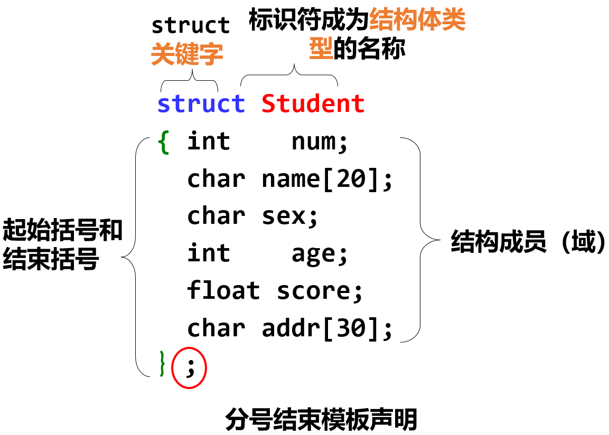
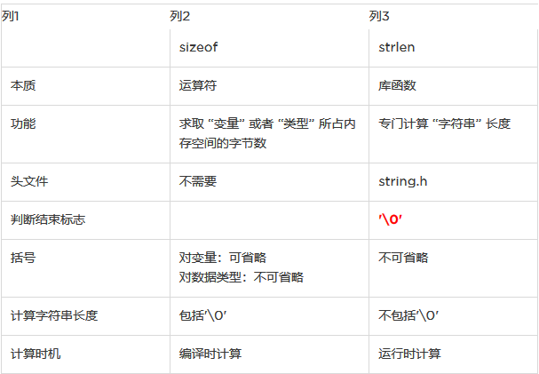
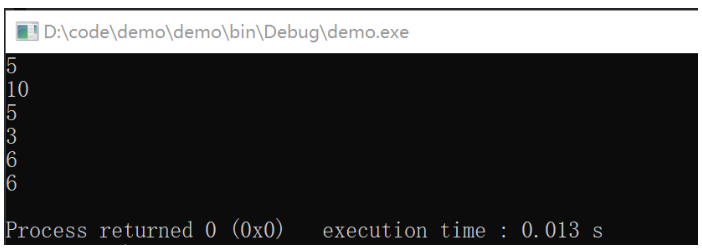
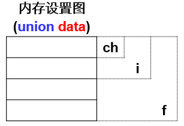
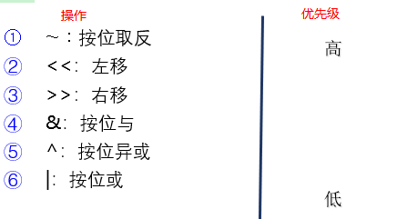

# 结构体、共用体、枚举、位域

## 本章大纲

- 结构体及其参数传递方法
- 共用体及其特点
- 枚举类型
- 位运算

## 结构体定义

定义一种新的数据类型，把不同类型的数据作为一个整体来处理，这种新的数据类型就叫做**结构体**。

1、结构体是多种数据类型组合的数据类型

2、同一个结构体可以储存多种类型的数据

3、比数组更加灵活

结构体是`C++`面向对象(类)的基石

数组：相同数据类型的数据集合

结构体：不同数据类型的数据集合

结构体属于派生数据类型，即：用其他数据类型来构造的。

定义结构体的语法

```c
struct 名称 {
  类型名1 变量名1;
  类型名2 变量名2;
};
struct Student {
  //结构声明     
  int num;  //一个int成员
  char name[20];    //一个char数组成员
  char sex;            //一个char成员
  int age;             //一个int成员
  float score;        //一个float成员
  char addr[30];    //一个char数组成员 
};
```



**说明**

1、结构体类型是一种构造数据类型，可以用来定义变量

2、结构体类型不分配任何存储空间，相应结构体类型的变量、数组及动态开辟的存储单元占存储空间

## 结构体变量的定义

### 方法一  

先定义结构体类型，再单独进行定义

结构体类型名 变量1，变量2；

```c
struct 结构体名 {
  // 成员列表
};
struct 结构体名 变量名列表;

// 示例
struct Student {  // 结构声明
  int num;        // 一个int成员
  char name[20];  // 一个char数组成员
  char sex;       // 一个char成员
  int age;        // 一个int成员
  float score;    // 一个float成员
  char addr[30];  // 一个char数组成员
};

struct Student stu1, stu2, stus[50], *p_stu;
```

### 方法二

  在定义结构体的同时定义变量

紧接着定义变量

```c
struct 结构体名 {
  // 成员列表
} 变量名列表;

struct Student {  // 结构声明
  int num;        // 一个int成员
  char name[20];  // 一个char数组成员
  char sex;       // 一个char成员
  int age;        // 一个int成员
  float score;    // 一个float成员
  char addr[30];  // 一个char数组成员
} stu1, stu2, stus[50], *p_stu;
```

### 方法三  

直接定义结构体类型变量

不出现结构体名

```c
struct {
  // 成员列表
} 变量名列表;

struct {          // 结构声明
  int num;        // 一个int成员
  char name[20];  // 一个char数组成员
  char sex;       // 一个char成员
  int age;        // 一个int成员
  float score;    // 一个float成员
  char addr[30];  // 一个char数组成员
} stu1, stu2, stus[50], *p_stu;
```

**关于结构体类型的几点说明**

1、类型与变量是完全不同的概念

先定义结构体类型，再定义该类型的变量。

类型：不可赋值、存贮、运算；系统不分配空间

变量：可赋值、存贮、运算；系统要分配空间

2、结构体中的成员可以像变量一样使用

结构体的成员可以是另一个结构体类型变量

```c
struct Date { /*声明一个结构体类型strcut date*/
  int month;
  int day;
  int year;
};

struct Student { /*声明一个结构体类型strcut student*/
  int num;
  char name[20];
  char sex;
  int age;
  char addr[30];
  struct Date birthday; /*birthday是struct date类型*/
};
// 或者
struct Student { /*声明一个结构体类型strcut student*/
  int num;
  char name[20];
  char sex;
  int age;
  char addr[30];
  struct {
    int year;
    int month;
    int day;
  } birthday; /*birthday是匿名struct类型*/
  struct Student *stu;
};
```

3、结构体类型的变量在内存按成员的顺序排列，所占空间是其全体成员所占空间的总和

4、对结构体中各个成员可以单独引用、赋值，其作用与普通变量等同

格式：变量名.成员名  stu1.name;    ‘.’——成员运算符（优先级最高）

5、成员名可与程序中的变量名相同，但二者无关。

6、结构体的成员可以是另一个结构体类型变量

## **内部声明和外部声明**

内部声明：放在main ( )函数内部，**外部声明可以被其后面的任何函数使用**

外部声明：放在main( )函数外部，**内部声明只能被该声明所属的函数使用**

通常应使用外部声明，这样所有函数都可以使用这种类型的结构。

## **结构体类型变量初始化**

```c
struct student {
  int num;
  char name[12];
  char sex;
} stu1 = {10001, "LiMing", 'M'};

/* 对应赋初值，不允许跳跃赋值。可只给前面的成员赋值,可以从后面缺省 */
struct student stu2 = {10002, "LiSi", 'F'};  

```

## 结构体变量的引用

1、不能将一个结构体变量作为一个整体进行输入和输出。

**结构体变量数组**

**一维数组**

```c
struct BookCard {
  char num[5];
  float price;
};
struct BookCard bc[3] = {
  {"NO.1", 35.5}, 
  {"NO.2", 25.5}, 
  {"NO.3", 15.5}
};
```

**二维数组**

```c
struct BookCard {
  char num[6];
  float price;
};
struct BookCard bc[3][4] = {
  {
    {"NO.11", 35.5}, {"NO.12", 25.5}, {"NO.13", 15.5}, {"NO.14", 15.5}
  },
  {
    {"NO.21", 35.5}, {"NO.22", 25.5}, {"NO.23", 15.5}, {"NO.24", 15.5}
  },
  {
    {"NO.31", 35.5}, {"NO.32", 25.5}, {"NO.33", 15.5}, {"NO.34", 15.5}
  }
};
```

**使用结构体中的成员**

①结构体变量．成员名

②（*ｐ）．成员名

③ ｐ->成员名

结构体变量的成员可以像普通变量一样进行各种运算

```c
struct date {
  int month;
  int day;
  int year;
};
struct student {
  char name[20];
  char sex;
  struct date birthday;
  int sc[4];
} std1, arr[5],
    *p;  // （1）使用成员sex   std1.sex;//通过结构体变量引用   arr[0].sex;//
         // arr.sex;//错误的方法   p->sex;   (*p).sex;
         // //（2）使用数组sc中的元素   std1.sc[1];//通过结构体变量引用
         // //（3）使用字符串类型成员name   std1.name;//通过结构体变量引用
         // //（4）使用内嵌结构体类型的成员date的成员   std1.birthday.year;
```

**操作结构体变量中的成员**

对结构体变量中的每个成员，可对它进行同类变量所允许的任何操作。

## 结构体传参

1、传递结构体的某个成员：值传递

2、传递整个结构体：值传递

若结构体包含数组，该数组为值传递

3、传递指向结构体的指针：引用

typedef类型别名

用法：typedef datatype alias

**链表**

结构体的不足：只能静态存储数据：①定长②连续存放

链表：

- 不定长
- 链表的每一个元素称为结点，其组成：
  - 若干数据成员;
  - 指向下一个结点的指针成员;
- 按需分配结点存放数据,不用时随时释放;
- 头结点;
  - 头指针: head;
- 尾结点;
  - 空指针: NULL
  - \#define NULL 0

定义：

```c
struct student {
  int num;
  float score;
  struct student *next;
};
struct student *head;
```

建立链表的过程

生成头结点；//head指向头结点

将其余结点逐个加入链表；

生成尾结点；//尾结点指针域为ＮＵＬＬ

## 动态分配内存

### malloc

```c
#include <stdlib.h>        
void *malloc(size_t size);       
 void free(void *ptr); 
 返回值：a pointer to  the  allocated memory  that  is  suitably aligned for any kind of variable.  On error, these functions return NULL.   
 参数：size，要分配内存的大小 
 示例：   int *arr;   arr= (int*)malloc(10*sizeof(int));
```

要点：

1、必须进行指针类型转换

2、void* 存在的意义（通用指针）

3、sizeof和strlen的区别



```c
int main() {
  char ch[] = "hello";
  char str1[] = {'w', 'o', 'r', 'l', 'd'};
  char str2[] = {'w', 'o', 'r', 'l', 'd', '\0'};
  char str3[] = {'w', 'o', 'r', '\0', 'l', 'd'};
  printf("%d\n", strlen(ch));
  printf("%d\n", strlen(str1));
  printf("%d\n", strlen(str2));
  printf("%d\n", strlen(str3));
  printf("%d\n", sizeof(str2));
  printf("%d\n", sizeof(str3));
  return 0;
}
```



### free

free函数的参数必须是动态内存分配出来的（使用malloc函数分配的内存）

**动态内存分配特点**

- 内存空间大小可以是一个变量，其值在运行时确定
- 内存空间在运行时分配，在程序结束时收回；内存的分配由操作系统参与完成
- 动态分配的内存空间在未释放之前均可以被引用，保证其生命期

示例：设计一个学生链表，其每个结点是一个学生信息的集合。每个结点包含如下信息：学生姓名、学号、C语言成绩三项。初始时拥有3个学生，添加一个学生(使用一个函数实现此操作)，再删除一个学生(使用另一个函数实现此操作)，并打印该学生的信息。

### calloc

The memory is set to zero.

```c
int main() {
  int i;
  int* pn = (int*)calloc(10, sizeof(int));
  for (i = 0; i < 10; i++) printf("%d", pn[i]);
  printf("\n");
  free(pn);
  return 0;
}  // 输出结果为  0000000000
```

### realloc

```c
#include <stdlib.h> 
void* realloc(void* memblock, size_t size); 
返回值：   成功：   失败： 
参数：   memlock，由malloc或calloc申请的内存块   size，调整后的字节数
```

假设有一个p指针指向一个数组空间，想在想要使这个数组的空间变为原来的2倍，realloc函数就会在p指向的这个数组空间后面申请一段空间，

若申请成功：函数执行完成。

若没有申请成功：则realloc函数会调用[malloc](https://so.csdn.net/so/search?q=malloc&spm=1001.2101.3001.7020)函数另外开辟一个数组空间B。

若开辟新的数组空间B成功：将原数组中的数据拷贝到新的数组中，释放掉原数组，并放回一个数组首地址，需要用一个指针来接。

若开辟新的数组空间B失败：不会释放掉原数组，会返回一个空地址，表示开辟新数组失败，原来的数组空间没动。

## 共用体union

几种不同类型的变量存放到同一段内存单元中。这种使几个不同的变量共占同一段内存的结构，称为共用体(union)类型的结构。

- 共用体能够存储不同的数据类型，但每次只能存储其中的一种类型；
- 共用体的长度为其最大成员的长度

语法：

```c
union 共用体类型名 {  成员表列 ｝；
```

变量声明：共用体类型名 共用体变量名;

```c
union data {
  char ch;
  short int i;
  float f;
};
union data a, b, *p;
```



共用体数据类型的特点：

- 使用共用体变量的目的是希望用同一个内存段存放几种不同类型的数据。但请注意： 在每一瞬时只能存放其中一种，而不是同时存放几种
- 能够访问的是共用体变量中最后一次被赋值的成员，在对一个新的成员赋值后原有的成员就失去作用。
- 共用体变量的地址和它的各成员的地址都是同一地址
- 不能对共用体变量名赋值；不能企图引用变量名来得到一个值；不能在定义共用体变量时对它初始化；不能用共用体变量名作为函数参数。

## 位操作

位运算符：位运算符用于处理整型操作数的各个二进制数位。将各类数据当作**无符号整型**数处理

- 按位与 ：& ,  按位或 ：| ,  按位异或 ：^
- 左移 ：<<, 右移 ：>>
- 按位取反 ：~

优先级



1、位运算符中除～以外，均为二目（元）运算符，即要求两侧各有一个运算量。

2、运算量只能是**整型或字符型的**数据，不能为实型数据。

## 位域

- 当结构体中有**整型**成员时，可以指定其存储位数。
-

```c
struct bitCard {
  unsigned face : 4;  /* 1-13 */
  unsigned suit : 2;  /* 0-4 */
  unsigned color : 1; /* 0-1 */
};
```

## 枚举类型

- 若一个变量只能取几种可能的整数值，而这些整数值又有特定的含义，则可为每个特定的整数值起一个英文名字。这类变量的类型叫枚举类型。

```c
enum 枚举类型名 {
  标识符[= 整型常数],
  标识符[= 整型常数],
  ...,
  标识符[= 整型常数]
};
enum color { 
  red, 
  yellow, 
  blue, 
  white, 
  black 
};
enum weekday { 
  sun, 
  mon, 
  tue, 
  wed, 
  thu, 
  fri, 
  sat 
};
```

- 枚举成员之间用逗号隔开，方括号中的"整型常数"是枚举成员的初值。
- 如果不给枚举成员赋初值，即省掉了标识符后的"=整型常数"时，则编译器为每一个枚举成员给一个不同的整型值，第一个成员为0，第二个为1，等等。当枚举类型中的某个成员赋值后，其后的成员则按依次加1的规则确定其值。
- 由于枚举元素是常量，所以我们在程序中不能对它们进行赋值，如"sun = 0；mon= 1；"将产生错误。

枚举存在的意义：

1、增加了程序的可读性

2、限制了变量取值的范围

```c
enum color { red, yellow, blue, white, black };
enum color
    a;  // 定义color型变量a     a=red; //合法，将枚举量赋给枚举变量     //a=0;
        // //不合法，不能将整数赋予枚举变量     int  n=a;            //
        // 将枚举量赋值给整型变量，合法     a=color(0);
        // //合法，a=枚举值0，即red     a=color(15);    //a=枚举值12
```

## 章小节

- 结构体是在一个名字下的一组相关变量的集合，它可能会包含不同数据类型的变量。
- 对结构体成员的访问可以使用成员运算符和指针运算符
- 共用体的成员可以共享一个存储空间
- 位运算是按照二进制位对整型数进行操作的
- 枚举类型用一个用标识符表示的整型常量的集合。
