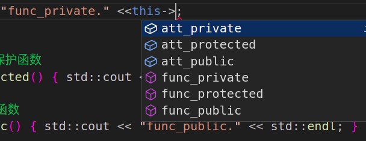
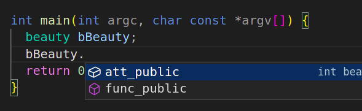
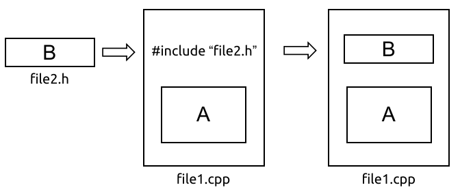

# 类与对象简介

## 本章大纲

- 类及其数据成员、成员函数的定义 

- 对象的成员函数的调用

- 构造函数的使用

- 类的接口

## 面向对象方法中的-类

- 具有相同属性和服务的一组对象的集合
- 为属于该类的全部对象提供了抽象的描述，包括属性和行为两个主要部分。

## 面向对象方法中的-对象

- 是系统中用来描述客观事物的一个实体，它是用来构成系统的一个基本单位。对象由一组属性和一组行为构成。 
- 属性：用来描述对象静态特征的数据项。
- 行为：用来描述对象动态特征的操作序列。

类是对现实世界中的客观事物的抽象，将具有相同属性的一类事物称作类，类的实例称为对象。

## 继承

特殊类的对象拥有其一般类的全部属性与服务，称作特殊类对一般类的继承

## 多态

多态是指在一般类中定义的属性或行为，被特殊类继承之后，可以具有不同的数据类型或表现出不同的行为。这使得同一个属性或行为在一般类及其各个特殊类中具有不同的语义。

## 类的定义

```cpp
class <类名> {
    [private:]  //私有成员，默认缺省存取权限
      <数据成员及成员函数 > ]
    [public:   //公有成员
      <数据成员及成员函数 > ]
    [protected:  //保护成员
      <数据成员及成员函数 > ]
}；
```

示例：

```cpp
class Person {
 private:         // 此处，private可缺省
  char Name[20];  // 姓名
  char Sex;       // 性别，三个数据成员
  int Age;        // 年龄
 public:          // 以下定义了四个成员函数
  void SetData(char n[], char s, int a) {
    strcpy(Name, n);  // 直接访问Name
    Sex = s;          // 直接访问Sex        访问特性
    Age = a;          // 直接访问Age
  }
  void GetName(char *n) {  // 成员函数
    strcpy(n, Name);
  }
  char GetSex() {  // 成员函数
    return Sex;
  }
  int GetAge() {  // 成员函数
    return Age;
  }
};  // 注意：类定义结束处的分号不能少
```


### public 

- 类与外部的接口
- 任何外部函数都可以访问公有类型数据和函数
- 可以在类内或类外自由使用

### private
- 只允许**本类中的函数或友元函数**才可以访问
- 类外部的任何函数都不能访问
- 限定在该类的内部使用
- 通常将数据成员定义为私有成员

### protected 
- 只允许在类内及该类的派生类中使用保护的数据或函数
- **保护成员的作用域是该类及该类的派生类**

|              | 私有成员                                    | 保护成员                                    | 公有成员     |
| ------------ | ------------------------------------------- | ------------------------------------------- | ------------ |
| **类内函数** | 可以调用                                    | 可以调用                                    | 可以调用     |
| **类外函数** | <strong style="color:red">不可调用</strong> | <strong style="color:red">不可调用</strong> | 可以调用     |
|              |                                             |                                             |              |
|              | **私有成员**                                | **保护成员**                                | **公有成员** |
| **类内函数** | 可以调用                                    | 可以调用                                    | 可以调用     |
| **类外函数** | <strong style="color:red">不可调用</strong> | <strong style="color:red">不可调用</strong> | 可以调用     |

```cpp
#include <iostream>

class beauty {
 private:  // 私有成员
  int att_private;

 protected:  // 保护成员
  int att_protected;

 public:  // 公有成员
  int att_public;

 private:  // 私有函数
  void func_private() { std::cout << "func_private." << std::endl; }

 protected:  // 保护函数
  void func_protected() { std::cout << "func_protected." << std::endl; }

 public:  // 共有函数
  void func_public() { std::cout << "func_public." << std::endl; }
};

int main(int argc, char const *argv[]) {
  beauty bBeauty;

  return 0;
}
```





**注意：**

- 每一个限制词(private等)在类体中可使用多次。一旦使用了限制词，该限制词一直有效，直到下一个限制词开始为止。 
- 如果未加说明，类中成员**默认的访问权限是private**，即私有的
- 在C++中，类和对象的关系实际上是<strong style="color:blue">数据类型</strong>和<strong style="color:blue">具体变量</strong>的关系

## 对象的定义

对象是类的实例，任何一个对象都是属于某个已知类的(?匿名对象?、?临时对象?)

```cpp
// <类名> <对象名表>;
class Location {
  //...
} Location obj_a, obj_b, objs[10], *ptr_obj;
// 其中:obj_a, obj_b 为一般对象；
// objs[10]是对象数组；
// ptr_obj是指向类Location 对象的指针。
// 创建对象时，每个对象的数据成员具有不同的存储空间，以存放不同的数据，但成员函数的代码为每个对象所共享
```

## 定义对象的三种方法
- 类的定义完成后，使用`类名  对象名;`定义对象
- 在定义类的同时定义对象
- 定义无类名的对象(匿名对象)
  - 只能定义一次该类对象，如果以后需要再次定义该类对象就不可以了。

```cpp
class A {  // A类的定义
  int x;
  float y;

 public:
  //......
};
A a1, a2, a3;  // 方法1,定义A类对象

class A {  // A类的定义
  int x;
  float y;

 public:
  //......
} a1, a2, a3;  // 方法2,定义A类对象

class {        // 无类名
  int x;
  float y;

 public:
  //......
} a1, a2, a3;  // 方法3,定义该类对象（匿名类对象）

```

## 访问对象成员

1. 访问一般对象的成员

   - `对象名.数据成员名`

   - `对象名.成员函数名 (参数表)`

2. 访问指向对象的指针的成员

   - `对象指针名 -> 数据成员名`

   - `对象指针名 -> 成员函数名 (参数表)`

## 类成员的访问特性

|           | 类内访问特性 | 类外访问特性                                    |
| --------- | ------------ | ----------------------------------------------- |
| private   | 可直接访问   | <strong style="color:red">不可直接访问</strong> |
| protected | 可直接访问   | <strong style="color:red">不可直接访问</strong> |
| public    | 可直接访问   | 可直接访问                                      |

## 对象的存储空间

- 定义对象后，对象数据成员占用不同的存储空间
- 该类的所有对象的同一成员函数，共享同一代码空间

### 定义类和对象的有关说明

- 类中数据成员的类型可以是任意的，但<strong style="color:red">自身类的对象不可以作为成员</strong>
- 若类的使用在前，定义在后，则需**引用性说明**

```cpp
class B;   // B类说明
class A {  // A类的定义

 private:
  B *pb;  // B类对象的指针pb是A类的数据成员
 public:
  //......
};

class B {  // B类的定义
  //......
};
```

## 类和结构体的区别

- 结构体(struct)成员缺省的存取权限是public，	
- 类(class)中成员缺省的存取权限是private
- 结构体是类的特例

## 构造函数

- 分类
  - 无参构造函数

  - 带参构造函数

  - 带默认值参数的构造函数

- 注意事项
  - 类内部定义的私有成员、保护成员，在对象创建时，只能由其成员函数（即构造函数）对它们进行初始化
  - <strong style="color:red">private、protected数据成员只能由构造函数初始化,</strong>
  - 在对象被创建时使用特定的值构造对象，将对象初始化为一个特定的状态
  - 在对象创建时由系统自动调用
  - <strong style="color:red">系统提供默认构造函数：ClassName(){}，除非程序员定义构造函数</strong>
  - 不存在返回值（`void`也不行）、不可通过对象来调用
  - 允许为**内联**函数、**重载**函数、**带默认形参值**的函数

### 隐含的构造函数

- 在没有显式定义的构造函数时，C++提供隐含的默认构造函数，但只是空函数	
- 一旦有<strong style="color:red">显式定义</strong>的构造函数，C++系统<strong style="color:red">不再产生</strong>默认构造函数	
- 若定义了构造函数，一般显式地定义一个所有参数都有缺省值的构造函数，保证所有对象都能顺利构造

### 构造函数参数初始化表

[C++构造函数的参数初始化表_m0_69957190的博客-CSDN博客](https://blog.csdn.net/m0_69957190/article/details/126846581)

https://blog.csdn.net/zx3517288/article/details/48806785

## 可重用性，接口与实现分离

实现方式：
1. 成员函数的定义及实现**在类体中完成**
2. 成员函数的定义及实现**在类体外完成**
3. 成员函数的定义及实现与类体**在不同的文件中完成**

### 在类体中完成

```cpp
// 成员函数的定义及实现**在类体中完成**
class Date {
 private:
  int month;
  int day;
  int year;

 public:
  void set(int m, int d, int y);
  int Isleapyear();
  void print();

  void set(int m, int d, int y) {
    month = m;
    day = d;
    year = y;
  }
  int Isleapyear() {
    return (year % 4 == 0 && year % 100 != 0) || (year % 400 == 0);
  }
  void print() { cout << month << "/" << day << " /" << year << endl; }
};
```

### 在类体外完成

语法格式：

```    
//（作用域运算符(Scope Resolution)“::”是用来标识某个成员函数是属于哪个类的）
<返回值类型> <类名>::<成员函数名>(<参数表>)
{
    <函数体>
} 
```

```cpp
class Date {
 public:
  // 声明部分
  void set(int m, int d, int y);
  int Isleapyear();
  void print();

 private:
  int month;
  int day;
  int year;
};
// 实现部分
void Date::set(int m, int d, int y) {
  month = m;
  day = d;
  year = y;
}
int Date::Isleapyear() {
  return (year % 4 == 0 && year % 100 != 0) || (year % 400 == 0);
}
void Date::print() { cout << month << "/" << day << "/" << year << endl; }
```

### 在不同的文件中完成

date.h

```cpp
cclass Tdate {
 public:
  // 声明部分
  void set(int, int, int);
  int Isleapyear();
  void print();

 private:
  int month;
  int day;
  int year;
};
```

date.cpp

```cpp
#include <iostream>

#include "date.h "
using namespace std;
void Date::set(int m, int d, int y) {
  month = m;
  day = d;
  year = y;
}
int Date::Isleapyear() {
  return (year % 4 == 0 && year % 100 != 0) || (year % 400 == 0);
}
void Date::print() { cout << month << "/" << day << "/" << year << endl; }
```

### 接口与实现的分离

- **将类体**(包含程序的声明，包括类里的数据成员和成员函数的声明)**和类成员函数的实现分开定义**，是开发大型程序通常采用的方法
- 类的定义可以分成两个文件：**头文件(.h)**和**源代码文件(.cpp)**


- 在类体外定义成员函数必须使用作用域操作符，在成员函数名前和`::`前加上类名，如果无类名，编译器会认为是普通函数
- 在类体内定义成员函数时，实际上是省略了类名
- 成员函数也可以重载，但由于类名是成员函数名的一部分，所以一个类的成员函数与另一个类的成员函数即使同名，也不认为是重载
- `#include`自定义的头文件用`"xxx.h"`并非 `<xxx.h>`

## 头文件的作用

1. 调用库函数。源代码不能公布，只需提供**头文件**和**二进制的库**
2. 加强类型安全检查
3. 提高程序的可读性

## 文件包含 include

- 功能：通过`#include`源文件`file1.cpp`可将头文件`file2.h`的内容全部包含进`file1.cpp`

- 一般形式：`#include "file.h" 或  #include <file.h>`
  - `< >`  , 直接按系统指定目录搜索；
  - `" "`  , 先在当前目录搜索，再搜索标准目录，**可指定路径**

- 处理过程：预编译时，用被包含文件的内容取代该预处理命令，再对“包含”后的文件作一个源文件编译

* 
用 `#include "filename.h"` 格式来引用非标准库的头文件时，编译器将从用户的**工作目录**开始搜索，没找到后继续查找C++**标准库**头文件所在的**目录**



## 条件编译

- 概念：按条件对C++程序的一部分进行编译，其它部分不编译 
- 目的：使源代码能更迅速、更容易地进行修改，并使目标代码缩短，程序在不同系统上编译、在同一系统不同编译器上编译或进行不同目的的编译时，减少对程序语句的修改

### 形式一

```cpp
#ifdef 标识符
    程序段1
#else
    程序段2
#endif
意义：若该标识符已被#define命令定义，则编译程序段1，否则编译程序段
```

### 形式二

```cpp
#ifndef 标识符
    程序段1
#else
    程序段2
#endif
意义：若该标识符没有被#define命令定义，则编译程序段1，否则编译程序段2
```

### 形式三

```cpp
#if 表达式
  程序段1
#else
  程序段2
#endif
意义：若该表达式的值为真（非0值），则编译程序段1，否则编译程序段2
```

注意：以上各种形式中，`#else 程序段2` 可以没有
`#ifdef` 等价于 `#if defined`
`#ifndef `等价于 `#if !defined`

## 预处理器封套

- 在头文件中使用"预处理器封套，从而**防止将头文件中的代码多次包含到同一个源代码文件中**
- 由于一个类只能被定义一次，所以使用这样的预处理器指令避免重复定义的错误

### #ifndef

```cpp
#ifndef  标识符
#define  标识符
// ......
#endif
```

在头文件预处理命令#ifndef和#define中，使用大写字母，并用下划线代替圆点
例如：`tdate.h`写成 `TDATE_H`；`time.h`写成`TIME_H`

### #pragma once

```cpp
#pragma once
// 一些声明语句   
```

### 对比

`#ifndef`移植性好，`#pragma once`可避免名字冲突

- `#ifndef`的方式依赖于宏名字不能冲突，可以保证同一个文件不会被包含多次，也能保证内容完全相同的两个文件不会被不小心同时包含
- `#ifndef`的方式 如果不同头文件的宏名不小心“撞车”，可能就会导致头文件明明存在，编译器却硬说找不到声明的状况
- `#pragma once`则由编译器提供保证：同一个文件不会被包含多次。“同一个文件”是**指物理上**的一个文件，而不是指内容相同的两个文件
- `#pragma once` 缺点是如果某个头文件有多份拷贝，本方法不能保证他们不被重复包含

# 本章总结

- 类中的数据成员和成员函数对用户隐藏了其属性和所执行的任务细节
- 使用类之前需创建该类的对象
- 可以使用构造函数初始化类的对象
- 将类放在单独的文件中可以增强其重用性
- 将接口与类的实现分离使得程序易于修改和维护。
