# C++继承

## 本章大纲

- 继承简介
- 基类和派生类
- 派生类的定义格式
- 基类和派生类之间的关系
- 派生类的构造函数与析构函数
- 多继承
- 多继承中的二义性
- 虚基类

> 要搞清楚类`A`和类`A`的对象的访问属性。
> 要搞清楚派生类`B::A`和派生类`B`的访问属性。不同继承方式访问属性不同。

## 1、继承简介

根据已知类生成新的类。已知类A，对类A增加一些属性和行为，构成新类B，称类B继承了类A，或类A派生了类B。

## 2、基类和派生类

基类：类A，又称父类，BaseClass
派生类：类B，又称子类，DerivedClass
派生类是基类的具体化，而基类则是派生类的抽象。

C++继承方式：
单继承：派生类只有一个直接基类的继承方式。
多继承：派生类有一个以上直接基类的继承方式。

直接基类：父类被称为子类的直接基类。
间接基类：父类的父类或更高层次的父类被称为该子类的间接基类。

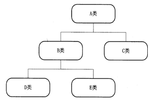

## 3、派生类的定义格式

```cpp
class <派生类名> : [继承方式] <基类名>
{
  派生类成员声明；
};
```

### 继承方式

public
private（默认继承方式）
protected
继承方式指定**派生类成员**以及**类外对象对继承来的成员**的访问权限。

### 不同继承方式的影响主要体现在：
1、派生类成员对基类成员的访问控制。
2、派生类对象对基类成员的访问控制
派生类成员指除了从基类继承来的所有成员之外，新增加的数据和函数成员。这些新增的成员正是派生类不同于基类的关键所在，是派生类对基类的发展。当重用和扩充已有的代码时，就是通过在派生类中新增成员来添加新的属性和功能。可以说，这就是类在继承基础上的进化和发展。

派生和继承的实例：

- 人员编号在生成人员信息时同时生成，每输入一个人员信息编号顺序加1。

- 程序能够对不同人员按不同方法提升级别，月薪的计算方法是：
- 经理拿固定月薪;
- 兼职技术人员按工作小时数领取月薪;
- 兼职推销员的报酬按该推销员当月销售额提成;
- 销售经理既拿固定月薪也领取销售提成。

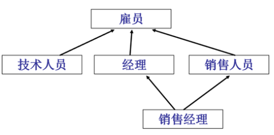

```cpp
class employee {
 private:
  char *name;             // 姓名
  int individualEmpNo;    // 个人编号
  int grade;              // 级别
  float accumPay;         // 月薪总额
  static int employeeNo;  // 本公司职员编号目前最大值
 public:
  employee();            // 构造函数
  ~employee();           // 析构函数
  void pay();            // 计算月薪函数
  void promote(int);     // 升级函数
  void displayStatus();  // 显示人员信息
};
class technician : public employee  // 兼职技术人员类
{
 private:
  float hourlyRate;  // 每小时酬金
  int workHours;     // 当月工作时数
 public:
  technician();          // 构造函数
  void pay();            // 计算月薪函数
  void displayStatus();  // 显示人员信息
};
```

### 派生类的成员:

   1. 从基类继承的成员;
   2. 改造基类成员;
   3. 添加派生类新成员.

### 同名覆盖：

- 派生类修改基类的成员，是在派生类中声明了一个与基类成员同名的新成员。在派生类作用域内或者在类外通过派生类的对象直接使用这个成员名，只能访问到派生类中声明的同名新成员，这个新成员覆盖了从基类继承的同名成员，这种情况称为**同名覆盖**。

```cpp
#include <iostream>
class Base {
 public:
  void func1() {
    std::cout << "Base func1" << std::endl;
    this->attr1 = 1;
  }
  void func2() {
    std::cout << "Base func2" << std::endl;
    this->attr2 = 2;
  }
 public:
  int attr1;
  int attr2;
};

class Derived : public Base {
 public:
  void func1() {
    std::cout << "Derived func1" << std::endl;
    this->attr1 = 10;  // 基类成员函数被派生类隐藏
  }
  void func2() {
    std::cout << "Derived func2" << std::endl;
    this->attr2 = 20;  ////基类成员函数被派生类隐藏
  }
 public:
  int attr1;
  int attr2;
};
int main() {
  Derived derived;
  derived.func1();
  derived.func2();
  std::cout << derived.attr1 << std::endl;
  std::cout << derived.attr2 << std::endl;
  derived.Base::func1();
  derived.Base::func2();
  std::cout << derived.Base::attr1 << std::endl;
  std::cout << derived.Base::attr2 << std::endl;
  return 0;
}

//==================output:
Derived func1
Derived func2
10
20
Base func1
Base func2
1
2
```

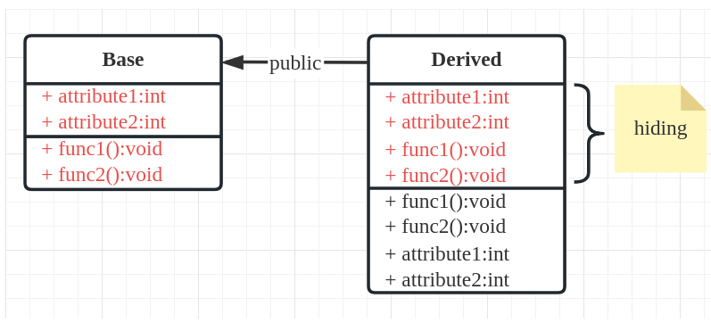

### 类内类外访问属性

|          | 私有成员                          | 公有成员     | 保护成员                          |
| -------- | --------------------------------- | ------------ | --------------------------------- |
| 类内函数 | 可以调用                          | 可以调用     | 可以调用                          |
| 类外函数 | <font color="red">不可调用</font> | 可以调用     | <font color="red">不可调用</font> |
|          |                                   |              |                                   |
|          | **私有函数**                      | **公有函数** | **保护函数**                      |
| 类内函数 | 可以调用                          | 可以调用     | 可以调用                          |
| 类外函数 | <font color="red">不可调用</font> | 可以调用     | <font color="red">不可调用</font> |

①类内可以调用本类的任何成员属性和成员函数
②类外可以调用本类的公有成员，不可调用私有成员属性和成员函数

## 4、基类和派生类之间的关系

类成员的访问属性：
public        公有
private       私有
protected     保护

### **再次强调**：

在基类内部，自身成员可以对任何一个其它成员进行访问，但是通过基类的对象，就只能访问基类的公有成员（属性和函数）。

```cpp
class Base {
 public:
  void pub_func() { std::cout << "Base pulic func" << std::endl; }
  int pub_attr;

 protected:
  void protected_func() { std::cout << "Base protected func" << std::endl; }
  int protected_attr;

 private:
  void private_func() { std::cout << "Base private func" << std::endl; }
  int private_attr;
};
```

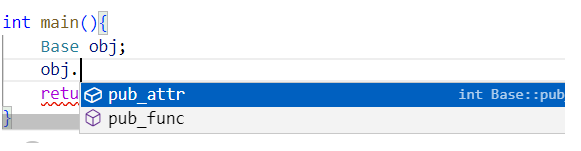

派生类继承了**<font color="red">基类的全部数据成员</font>**和除了**<font color="red">构造函数、析构函数</font>**之外的全部函数成员，但是这些成员的访问属性在派生的过程中是可以调整的。从基类继承的成员，其访问属性由**继承方式**控制。

**继承方式**：

- public继承
- protected继承
- private继承

### public：公有继承
- 基类的public和protected成员的访问属性在派生类中保持不变，但**<font color="red">基类的private成员不可访问。</font>**
- **派生类中的成员函数**可以直接访问基类中的public和protected成员，但不能访问基类的private成员。（派生类--类内任意）
- **派生类的对象**只能访问基类的public成员。（派生类--类外public）
- **基类的私有数据成员，不能在派生类中直接访问，但派生类对象建立私有数据空间**


```cpp
#include <iostream>
using namespace std;
class A {
 public:
  void get_XY() {
    cout << "Enter two numbers of x, y : ";
    cin >> x >> y;
  }
  void put_XY() { cout << "x = " << x << ", y = " << y << '\n'; }
 protected:
  int x, y;
};

class B : public A {
 public:
  int get_S() { return s; };
  void make_S() {
    s = x * y;  // 使用基类数据成员x，y
  };
 protected:
  int s;
};

class C : public B {
 public:
  void get_H() {
    cout << "Enter a number of h : ";
    cin >> h;
  }
  int get_V() { return v; }
  void make_V() {  // 使用基类成员函数
    make_S();
    v = get_S() * h;
  }
 protected:
  int h, v;
};
```

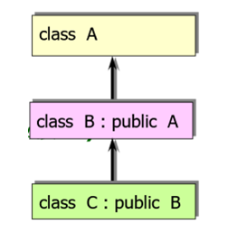

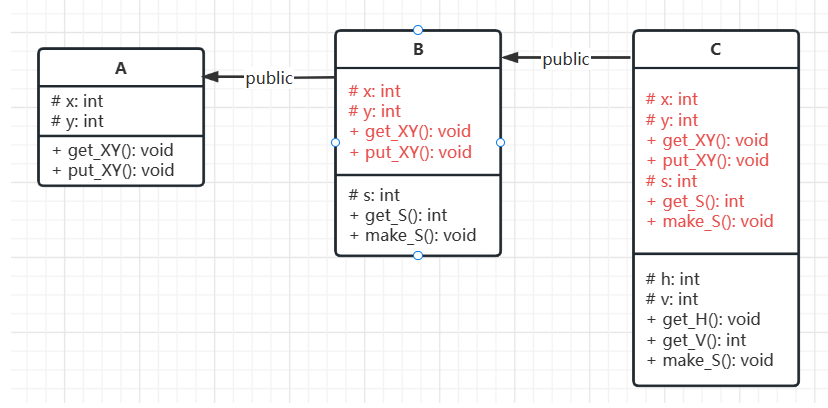


### private，私有继承

- 基类的public和protected成员都以private身份出现在派生类中，但**基类的private成员不可直接访问。**
- 派生类中的成员函数可以直接访问基类中的public和protected成员，但不能访问基类的private成员。
- 派生类的对象不能访问基类中的任何成员。

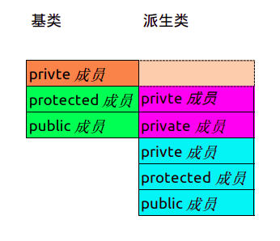

```cpp
#include <iostream>
using namespace std;
class A {
 public:
  void get_XY() {
    cout << "Enter two numbers of x, y : ";
    cin >> x >> y;
  }
  void put_XY() { cout << "x = " << x << ", y = " << y << '\n'; }

 protected:
  int x, y;
};
class B : private A {
 public:
  int get_S() { return s; }
  void make_S() { s = x * y; }

 protected:
  int s;
};

class C : public B {
 public:
  void get_H() {
    cout << "Enter a number of h : ";
    cin >> h;
  }
  int get_V() { return v; }
  void make_V() {
    make_S();
    v = get_S() * h;
  }

 protected:
  int h, v;
};
```


### protected，保护继承

- 基类的public和protected成员都以protected身份出现在派生类中，但**基类的private成员不可访问。**
- 派生类中的成员函数可以直接访问基类中的public和protected成员，但不能访问基类的private成员。
- 派生类的对象不能访问基类中的任何成员.


- 对建立其所在类对象的模块来说，它与 private 成员的性质相同。
- 对于其派生类来说，它与 public 成员的性质相同。
- 既实现了数据隐藏，又方便继承，实现代码重用。


**private成员与protected成员的区别**

- $\textcolor{red}{无论何种继承方式，private成员是无法在派生类中被直接访问的。}$

- 对于protected成员，根据不同的派生方式，protected成员的直接访问特性可以被（或不被）传递到派生类的派生类中。

### 派生类中的静态成员

- 基类中定义的静态成员，将被所有派生类共享
- 根据静态成员自身的访问属性和派生类的继承方式，在类层次体系中具有不同的访问性质
- 派生类中访问静态成员，用以下形式显式说明：
  - 类名::静态成员
  - 对象名.静态成员


```cpp
#include <iostream>
using namespace std;
class B {
 public:
  static void Add() { i++; }  // 静态成员函数
  static int i;               // 静态数据成员
  void out() { cout << "static i=" << i << endl; }
};
int B::i = 0;

class D : private B {
 public:
  void f() {
    i = 5;     // i 是类D的私有静态数据成员类中可见
    Add();     // Add()是类D的私有静态成员函数类中可调用
    B::i++;    // 访问B类的静态成员
    B::Add();  // 访问B类的静态成员
  }
};
```

## 5、派生类构造函数与析构函数

C++中的类<font color="red">不能继承基类的**构造函数**、**析构函数**</font>，C++中的派生类需要声明自己的构造函数、析构函数。
- 声明构造函数时，只需要**对本类中新增成员进行初始化**，对继承来的基类成员的初始化，自动调用基类构造函数完成
- 派生类的构造函数需要**给基类的构造函数传递参数**
- 不需要显式地调用基类的析构函数，系统会自动隐式调用
- 析构函数的调用次序与构造函数相反

### 简单派生类的构造函数

- 简单的派生类只有一个基类，而且只有一级派生(只有直接派生类，没有间接派生类)，在派生类的数据成员中不包含基类的对象 
- 简单派生类的构造函数的一般形式为：
- 派生类构造函数名（总参数列表）: 基类构造函数名（参数列表）{　
      派生类中新增数据成员初始化语句(可替换为参数初始化表)
  }

```cpp
#include <iostream>
#include <string>
using namespace std;
class Student {  // 声明基类Student
 public:
  Student(int n, string nam, char s) {  // 基类构造函数
    num = n;
    name = nam;
    sex = s;
  }
  ~Student() {}  // 基类析构函数
 protected:
  int num;
  string name;
  char sex;
};
class Student1 : public Student  // 声明派生类Student1
{
 public:  // 派生类的公用部分
  Student1(int n, string nam, char s, int a, string ad)
      : Student(n, nam, s) {  // 派生类构造函数
    age = a;  // 在函数体中只对派生类新增的数据成员初始化
    addr = ad;
  }
  void show() {
    cout <<″num :″<< num << endl;
    cout <<″name :″<< name << endl;
    cout <<″sex :″<< sex << endl;
    cout <<″age :″<< age << endl;
    cout <<″address :″<< addr << endl << endl;
  }
  ~Student1() {}  // 派生类析构函数
 private:         // 派生类的私有部分
  int age;
  string addr;
};
```

派生类在建立对象时调用构造函数，其实参传递给形参的形式如下：

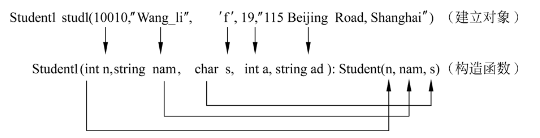

派生类的构造函数也可以只在类体中声明，而在类外定义：

```cpp
// 类内声明的形式如下：
Student1(int n, string nam, char s, int a, string ad);

// 类外定义派生类构造函数:
Student1∷Student1(int n, string nam, char s, int a, string ad)
    : Student(n, nam, s) {
  age = a;
  addr = ad;
}
// 注意：派生类采用“类中声明、类外定义构造函数”时，在类中对派生类构造函数作声明，不能包括基类构造函数名及其参数表列。只在类外定义函数时才将它列出。
```

在调用派生类构造函数时，基类构造函数的实参也可以不从派生类构造函数的总参数表中传递过来，而直接使用常量或全局变量：

```cpp
Student1(int n, string nam, char s, int a, string ad) : Student(10010, nam, s)
```

派生类构造函数的定义也可以采用**参数初始化表**的形式：

```cpp
Student1(int n, string nam, char s, int a, string ad)
    : Student(n, nam, s), age(a), addr(ad) {}
```
- 在建立派生类对象时，执行构造函数的顺序是: ① **先调用基类构造函数；②再执行派生类构造函数本身**(即派生类构造函数的函数体)。
- 在派生类对象释放时，先执行派生类析构函数，再执行其基类析构函数。
- 构造时，先基后派；释放时，先派后基

### 有子对象的派生类的构造函数

子对象：对象中的对象。类的数据成员中可以包含其他类的对象。
派生类构造函数的任务应该包括3个部分:
① 对基类数据成员初始化；
② 对子对象数据成员初始化；
③ 对派生类数据成员初始化。

定义有子对象的派生类构造函数的一般形式为：

**派生类构造函数名（总参数表列）: 基类构造函数名（参数表列），子对象名(参数表列)**
**{**
    **派生类中新增数成员据成员初始化语句**
**}**

```cpp
#include <iostream>
#include <string>
using namespace std;
class Student {  // 声明基类
 public:
  Student(int n, string nam) {  // 基类构造函数
    num = n;
    name = nam;
  }
  void display() {  // 成员函数，输出基类数据成员
    cout <<″num :″<< num << endl <<″name :″<< name << endl;
  }

 protected:
  int num;
  string name;
};

class Student1 : public Student {  // 声明公用派生类Student1
 public:
  Student1(int n, string nam, int n1, string nam1, int a, string ad)
      : Student(n, nam), monitor(n1, nam1) {  // 派生类构造函数
    age = a;
    addr = ad;
  }
  void show() {
    cout << "This student is:" << endl;
    display();                                   // 输出num和name
    cout << "age:" << age << endl;               // 输出age
    cout << "address:" << addr << endl << endl;  // 输出addr
  }
  void show_monitor() {  // 成员函数，输出子对象
    cout << endl << "Class monitor is:" << endl;
    monitor.display();  // 调用基类成员函数
  }

 private:           // 派生类的私有数据
  Student monitor;  // 定义子对象(班长)
  int age;
  string addr;
};
```

派生类构造函数中的**基类构造函数和子对象的参数列表的次序可以是任意的**，编译系统会根据参数名来确立它们的传递关系的。
执行派生类构造函数的顺序是:
        ① 调用基类构造函数，对基类数据成员初始化；
        ② 调用子对象构造函数，对子对象数据成员初始化；
        ③ 再执行派生类构造函数本身，对派生类数据成员初始化。    

### 多层派生时的构造函数

一个类不仅可以派生出一个派生类，派生类还可以继续派生，形成派生的层次结构。

```cpp
#include <iostream>
#include <string>
using namespace std;

class Student {  // 声明基类
 public:
  Student(int n, string nam) {  // 基类构造函数
    num = n;
    name = nam;
  }
  void display() {  // 输出基类数据成员
    cout << "num:" << num << endl;
    cout << "name:" << name << endl;
  }

 protected:
  int num;  // 基类有两个数据成员
  string name;
};

class Student1 : public Student {  // 声明公用派生类Student1
 public:
  Student1(int n, char nam[10], int a) : Student(n, nam) {  // 派生类构造函数
    age = a;  // 在此处只对派生类新增的数据成员初始化
  }
  void show() {  // 输出num，name和age
    display();   // 输出num和name
    cout << "age:" << age << endl;
  }

 private:   // 派生类的私有数据
  int age;  // 增加一个数据成员
};

class Student2 : public Student1 {  // 声明间接公用派生类Student2
 public:
  Student2(int n, string nam, int a, int s) : Student1(n, nam, a) { score = s; }
  void show_all() {                     // 输出全部数据成员
    show();                             // 输出num和name
    cout << "score:" << score << endl;  // 输出age
  }

 private:
  int score;  // 增加一个数据成员
};
```

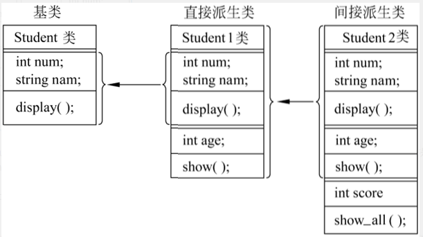

在执行Student2构造函数时，先调用Student1构造函数；在执行Student1构造函数时，先调用基类Student构造函数。初始化的顺序是:
① 先初始化基类的数据成员num和name
② 再初始化Student1的数据成员age
③ 最后再初始化Student2的数据成员score

### 派生类构造函数的特殊形式

① 当不需要对派生类新增的成员进行任何初始化操作时，派生类构造函数的函数体可以为空。即构造函数是空函数。此派生类构造函数的作用只是为了将参数传递给基类构造函数和子对象，并在执行派生类构造函数时调用基类构造函数和子对象构造函数。

```cpp
class A {
 public:
  A(int x) { n = x; }

 private:
  int n;
};
class B : public A {
 public:
  B(int x) : A(x) {}
};
```

② 如果在基类中没有定义构造函数，或定义了没有参数的构造函数，那么在定义派生类构造函数时可不写基类构造函数。调用派生类构造函数时系统会自动首先调用基类的默认构造函数。

```cpp
#include <iostream>
#include <string>
using namespace std;
class A {
 public:
  A() { cout << "调用基类A无参构造函数" << endl; }

 private:
  int n;
};
class B : public A {
 public:
  B(int param) {
    memb = param;
    cout << "调用派生类B构造函数" << endl;
  }

 private:
  int memb;
};
int main() { B objb(5); }
/* 输出
调用基类A的无参构造函数
调用派生类B的构造函数
*/
```

③如果在基类中既定义无参的构造函数，又定义了有参的构造函数，则在定义派生类构造函数时，既可以包含基类构造函数及其参数，也可以不包含基类构造函数。在调用派生类构造函数时，根据构造函数的内容决定调用基类的有参的构造函数还是无参的构造函数。

## 6、多继承

多个基类共同派生出一个派生类；一个派生类继承多个基类。

```cpp
class <派生类名>: 　<继承方式1> <基类名1>,
                 　<继承方式2> <基类名2>,
{                     //以下定义派生类新成员
private:  // 私有成员说明
      ...
public:   // 公有成员说明
      ...
protected: // 保护成员说明
      ...
} ;
```

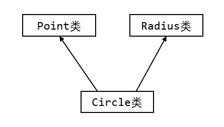

```cpp
#include <iostream>
#include <string>
using namespace std;
#define PI 3.14159
class Point {  // 类：点
 protected:
  int x;
  int y;

 public:
  Point() { cout << "调用Point类的无参构造函数" << endl; }
  Point(int _x, int _y) {
    x = _x;
    y = _y;
    cout << "调用Point类的有参构造函数" << endl;
  }
  void show_point() {
    cout << x << endl;
    cout << y << endl;
  }
  int getx() { return x; }
  int gety() { return y; }
  void set_x_y(int paramx, int paramy) {
    x = paramx;
    y = paramy;
  }
};

class Radius {  // 类：半径
 protected:
  int r;

 public:
  Radius() { cout << "调用Radius类的无参构造函数" << endl; }
  Radius(int param_r) {
    r = param_r;
    cout << "调用Radius类的有参构造函数" << endl;
  }
  void set_r(int _r) { r = _r; }
  int get_r() { return r; }
};

class Circle : public Point,
               public Radius {  // 类：圆 继承顺序决定构造函数调用顺序
 public:
  Circle() { cout << "调用Circle类的无参构造函数" << endl; }
  Circle(int x, int y, int r)
      : Point(x, y), Radius(r) {  // 此处顺序更改不会影响构造函数调用顺序
    cout << "调用Circle类的有参构造函数" << endl;
  }
  double area() { return PI * r * r; }
  void move(int offset_x, int offset_y) {
    x += offset_x;
    y += offset_y;
  }
  void show_circle() {
    show_point();
    cout << "Radius: " << r << endl;
    cout << "Area: " << area() << endl;
  }
};
int main() {
  Circle c(1, 1, 1);
  c.show_circle();
  c.move(1, 2);
  c.show_circle();
  c.set_x_y(4, 5);
  c.set_r(2);
  c.show_circle();
  return 0;
}
//输出：
调用Point类的有参构造函数
调用Radius类的有参构造函数
调用Circle类的有参构造函数
1
1
Radius: 1
Area: 3.14159
2
3
Radius: 1
Area: 3.14159
4
5
Radius: 2
Area: 12.5664
```

class Circle :public **Point**,public **Radius** **继承顺序决定构造函数调用顺序**

Circle(int x,int y,int r):Point(x,y),Radius(r) {//**此处顺序更改不会影响构造函数调用顺序**

说明：

1. 构造函数调用的顺序是**先执行基类的构造函数**，**再执行派生类自己的构造函数**的函数体。
2. 析构函数顺序和构造函数调用顺序相反

## 7、多继承二义性

分类：

1. **不同基类成员名相同**
2. **共同基类成员名相同**

### 不同基类成员名相同

访问不同基类的具有相同名字成员时可能出现二义性

```cpp
#include <iostream>
using namespace std;

class A {
 public:
  void f() { cout << "A::f()" << endl; }
};

class B {
 public:
  void f() { cout << "B::f()" << endl; }
  void g() { cout << "B::g()" << endl; }
};

class C : public A, public B {
 public:
  void g() { cout << "C::g()" << endl; }
  void h() { cout << "C::h()" << endl; }
};

int main() {
  C C1;
  // C1.f();  // 出现二义性 C1.A::f();  或者 C1.B::f();  //指定类名
  C1.A::f();
  C1.B::f();
  C1.B::g();
  C1.g();
  C1.h();
}
```

编译报错：

```shell
ubuntu@localhost:~$ g++ demo.cpp -o test
demo.cpp: In function ‘int main()’:
demo.cpp:23:6: error: request for member ‘f’ is ambiguous
   23 |   C1.f();
      |      ^
demo.cpp:11:8: note: candidates are: ‘void B::f()’
   11 |   void f() { cout << "B::f()" << endl; }
      |        ^
demo.cpp:6:8: note:                 ‘void A::f()’
    6 |   void f() { cout << "A::f()" << endl; }
      |        ^

```

类图：

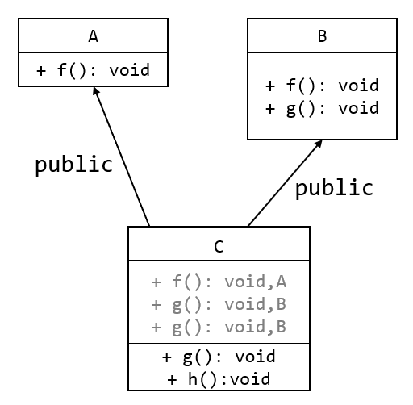

### 共同基类成员名相同

当一个派生类有多个基类，而这些基类又有一个共同的基类，对这个共同基类中成员的访问可能出现二义性。

```cpp
#include <iostream>
using namespace std;
class A {
 public:
  int a;
};
class B1 : public A {
 private:
  int b1;
};

class B2 : public A {
 private:
  int b2;
};

Class C : public B1, public B2 {
 public:
  int f();

 private:
  int c;
};
int main() {
  C Cobj;
  Cobj.a;         // 有二义性
  Cobj.A::a;      // 有二义性
  Cobj.B1::A::a;  // 有二义性
  Cobj.B1::a;     // 无二义性
  Cobj.B2::a;     // 无二义性
}
```

类图：

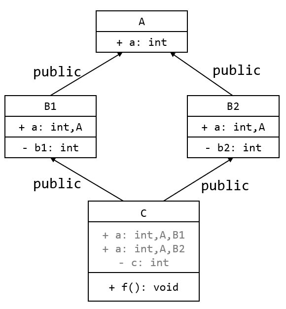

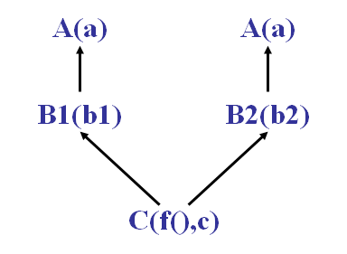

- 类A 是派生类C 两条继承路径上的一个公共基类，因此这个公共基类会在派生类对象中产生两个基类子对象。
- ==如果要<strong style="color:red">使这个公共基类在派生类中只产生一个基类子对象</strong>，则需要将这个基类设置为<strong style="color:red">虚基类</strong>==

在“Cobj.a;”中是对B1 继承的基类A 的成员a，还是对B2继承基类A 的成员a 进行访问呢？故有二义性。消除二义性的方法可改写为：

```cpp
Cobj.B1::a;
Cobj.B2::a;
```

## 8、虚基类

为解决二义性问题，将<strong style="color:red">共同基类设置为虚基类</strong>，创建派生类对象时，**虚基类的构造函数只会调用一次**，虚基类的成员在第三层派生类对象中就只有一份拷贝，不会再引起二义性问题。

```cpp
class 派生类名: virtual 继承方式 基类名 {
     //……
}
```

```cpp
class A {
 public:
  void f();

 private:
  int a;
};

class B : virtual public A {
 protected:
  int b;
};

class C : virtual public A {
 protected:
  int c;
};

class D : public B, public C {
 public:
  int g();

 private:
  int d;
};
```

类A 是类D 的虚基类。类A，类B，类C 和类D 之间的关系用DAG图示如下：

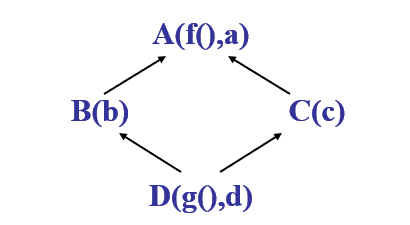

虚基类子对象被合并成一个子对象，这种“合并”作用，使得可能出现的二义性被消除。

- 在多继承情况下，虚基类关键字的作用范围和继承方式关键字相同，只对紧随其后的基类起作用。
- 在多继承类结构中，说明虚基类之后，虚基类的成员在派生类中将不会因继承关系对虚基类的多次继承而形成多份拷贝，只为最远的派生类提供唯一的基类成员，消除了多继承结构中的二义性问题。
- 需要注意的是在第一级继承时就要将共同基类设计为虚基类。
