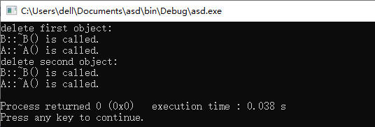

# C++多态

## 本章大纲

- 复制兼容
- 多态概念
- 虚函数
- 虚析构函数
- 抽象类和纯虚函数
- 强制转换

## 赋值兼容

赋值兼容规则：可以将<strong style="color:red">公有</strong>派生类对象赋值给基类对象，反之是不允许的。


结果：将派生类对象中从基类继承来的成员赋给基类对象。

```cpp
#include <iostream>
using namespace std;
class Point {
 protected:
  int x, y;  // 保护成员
 public:
  Point(int a = 0, int b = 0) {
    x = a;
    y = b;
  }
  void Show() { cout << "point(" << x << "," << y << ")\n"; }
};
class Line : public Point  // 公有继承
{
 protected:
  int x1, y1;

 public:
  Line(int a, int b, int c, int d)
      : Point(a, b)  // 调用基类构造函数
  {
    x1 = c;
    y1 = d;
  }
};
int main() {
  Line line(2, 2, 6, 6);
  Point p;
  p = line;  // A
  p.Show();
  return 0;
}
//输出：
point(2,2)
```

赋值兼容要点：

1. 派生类对象可以赋值给基类对象，系统将派生类对象中从基类继承来的成员赋给基类对象
2. 不能将基类对象赋值给派生类对象
3. **私有或保护继承**的派生类对象，不可以赋值给基类对象。
4. 可将派生类对象的地址赋给基类指针变量。例 `Point *ptr = &line;`

5. **派生类对象可初始化基类的引用**。例如 `Point &refp = line;`
6. 在后两种情况下，使用基类指针或引用时，只能访问<strong style="color:red">从相应基类中继承</strong>来的成员，而不允许访问<strong style="color:red">其他基类成员或派生类中增加</strong>的成员。

## 多态概念

多态性是指发出<strong style="color:red">同样的消息</strong>被<strong style="color:red">不同</strong>类型的<strong style="color:red">对象</strong>接收时有可能导致完全<strong style="color:red">不同的行为</strong>。

### 多态的实现

在C++程序设计中， 多态的实现

- **函数重载**
- **运算符重载**
- **虚函数**

### 多态分类

#### 编译时多态

在程序编译时系统就能决定调用的是哪个函数。

- 函数重载

- 运算符重载

#### 运行时多态

- **通过继承关系和虚函数来实现。**

- 在程序执行前，无法根据函数名和参数来确定该调用哪一个函数，必须在程序执行过程中，根据执行的具体情况来动态地确定。

## 类继承层次中指针和对象之间的关系

基类指针、派生类指针、基类对象、派生类对象 之间的4种关系：

- 直接用基类指针指向基类对象
- 直接用派生类指针指向派生类对象
- 派生类对象给基类指针赋值（基指针指向派对象）
- 基类对象给派生类指针赋值。(编译会出错）


## virtual函数（虚函数)

```cpp
#include <iostream>
using namespace std;
class B0  // 基类B0声明
{
 public:
  // 外部接口
  void display() { cout << "B0::display()" << endl; }
};
class B1 : public B0  // 公有派生
{
 public:
  void display() { cout << "B1::display()" << endl; }
};
class D1 : public B1  // 公有派生
{
 public:
  void display() { cout << "D1::display()" << endl; }
};
void fun(B0 *ptr)  // 普通函数
{
  ptr->display();
}
int main()  // 主函数
{
  B0 b0, *p;
  // 声明基类对象和指针
  B1 b1, *q;
  // 声明派生类对象
  D1 d1;
  // 声明派生类对象
  p = &b0;
  q = &b1;
  fun(q);
  fun(p);
  p = &b1;
  fun(p);
  p = &d1;
  fun(p);#include <iostream>
using namespace std;
class Base {  // 基类Base声明

 public:
  // 外部接口
  void display() { cout << "Base::display()" << endl; }
};
class B1 : public Base {  // 公有派生

 public:
  void display() { cout << "B1::display()" << endl; }
};
class D1 : public B1 {  // 公有派生

 public:
  void display() { cout << "D1::display()" << endl; }
};
void fun(Base *ptr) {  // 普通函数

  ptr->display();
}
int main() {
  // 声明基类对象和指针
  Base base, *ptr_base;
  // 声明派生类对象
  B1 b1, *ptr_b1;
  // 声明派生类对象
  D1 d1;
  ptr_base = &base;
  ptr_b1 = &b1;
  fun(ptr_b1);    // Base::display()
  fun(ptr_base);  // Base::display()
  ptr_base = &b1;
  fun(ptr_base);  // Base::display()
  ptr_base = &d1;
  fun(ptr_base);  // Base::display()
}
```

- 若将**派生类对象的地址**赋给指向**基类的指针（基指派）**，则用**该指针**仅能访问**派生类中从基类继承**来的公有成员，<strong style="color:red">通过指针引起的普通成员函数调用，仅仅与指针的类型有关，而与指针正指向什么对象无关。</strong>在这种情况下，必须采用**显式的方式**调用派生类的函数成员。
- （虚函数引入背景）本来使用对象指针是为了表达一种动态的性质，即<strong style="color:red">当指针指向不同对象时执行不同的操作</strong>，现在看来并没有起到这种作用。要实现这种功能，就**需要引入虚函数的概念**。

C++ 类中使用关键字**virtual** 修饰的成员函数

```cpp
virtual <数据类型> <函数名> (形参表)
{  
 函数体 
}

virtual <函数返回值> <函数名>(形参表);
```

- 本质：**是覆盖(override)**而不是重载(overload)声明。
- 虚函数是动态绑定的基础。是非静态的成员函数。
- 在类的声明中，在函数原型之前写virtual。**virtual 只用来说明类声明中的原型，不能用在函数实现时。**
- 一个函数一经说明为虚函数，则无论说明它的类被继承了多少层，在每一层派生类中该函数将永远保持其 virtual 特性。
- 具有继承性，基类中声明了虚函数，派生类中无论是否说明，同原型函数都自动为虚函数。
- 当基类中的某个成员函数被声明为虚函数后，此虚函数就可以在一个或多个派生类中被重新定义，在派生类中重新定义时，其**函数原型**，包括**返回类型、函数名、参数个数、参数类型以及参数的顺序**都必须与基类中的原型完全相同。

### 定义虚函数的目的

**为了让派生类覆盖（Overriding）它。**覆盖不同于重载，它要求重新定义的函数在参数和返回值方面与原函数完全相同。否则将属于重载（参数不同）或导致一个编译错误（返回值类型不同）。与函数重载相同，虚函数也体现了 OOP 技术的多态性。


- 一组虚函数中，两个虚函数**仅返回值不同**，参数和名字相同，**编译报错**。

### 虚函数调用方式

通过**基类指针或引用**，执行时会**根据指针指向的对象的类**，决定调用哪个函数。

```cpp
#include <iostream>
using namespace std;
class B0  // 基类B0声明
{
 public:                  // 外部接口
  virtual void display()  // 虚成员函数
  {
    cout << "B0::display()" << endl;
  }
};
class B1 : public B0  // 公有派生
{
 public:
  void display() { cout << "B1::display()" << endl; }
};
class D1 : public B1  // 公有派生
{
 public:
  void display() { cout << "D1::display()" << endl; }
};
void fun(B0 *ptr)  // 普通函数
{
  ptr->display();
}
int main()  // 主函数
{
  B0 b0, *p;  // 声明基类对象和指针
  B1 b1, *q;  // 声明派生类对象
  D1 d1;      // 声明派生类对象
  p = &b0;
  q = &b1;
  fun(q);
  fun(p);  // 调用基类B0函数成员
  p = &b1;
  fun(p);  // 调用派生类B1函数成员
  p = &d1;
  fun(p);  // 调用派生类D1函数成员
}
```

```cpp
#include <iostream>
using namespace std;
class base
{
public:
    virtual void fun1()
    {
        cout<<"base fun1"<<endl;
    }
    virtual void fun2()
    {
        cout<<"base fun2"<<endl;
    }
    void fun3()
    {
        cout<<"base fun3"<<endl;
    }
    void fun4()
    {
        cout<<"base fun4"<<endl;
    }
};
class derived:public base
{
    virtual void fun1()
    {
        cout<<"derived fun1"<<endl;
    }
    void fun2()
    {
        cout<<"derived fun2"<<endl;
    }
    virtual void fun3()
    {
        cout<<"derived fun3"<<endl;
    }
    void fun4()
    {
        cout<<"derived fun4"<<endl;
    }
};
void main()
{
    base *pb;
    derived d;
    pb=&d;
    pb->fun1();
    pb->fun2();
    pb->fun3();
    pb->fun4();
}
```

基类与派生类中有同名函数：

```cpp
#include <iostream>
#include <string>
using namespace std;
// 声明基类Student
class Student {
 public:
  Student(int, string, float);  // 声明构造函数
  virtual void display();       // 声明输出函数
 protected:                     // 受保护成员，派生类可以访问
  int num;
  string name;
  float score;
};
// Student类成员函数的实现
Student::Student(int n, string nam, float s)  // 定义构造函数
{
  num = n;
  name = nam;
  score = s;
}
void Student::display()  // 定义输出函数
{
  cout << "num:" << num << "\nname:" << name << "\nscore:" << score << "\n\n";
}

// 声明公用派生类Graduate
class Graduate : public Student {
 public:
  Graduate(int, string, float, float);  // 声明构造函数
  void display();                       // 声明输出函数
 private:
  float pay;
};
// Graduate类成员函数的实现
void Graduate::display()  // 定义输出函数
{
  cout << "num:" << num << "\nname:" << name << "\nscore:" << score
       << "\npay=" << pay << endl;
}
Graduate::Graduate(int n, string nam, float s, float p)
    : Student(n, nam, s), pay(p){};  // 主函数
int main() {
  Student stud1(1001, "Li", 87.5);
  Graduate grad1(2001, "Wang", 98.5, 563.5);
  Student *pt = &stud1;  // 定义指向基类对象的指针变量pt
  pt->display();
  pt = &grad1;
  pt->display();
  return 0;
}
```

由虚函数实现的动态多态性：**同一类族中不同类的对象，对同一函数调用作出不同的响应。**

### 虚函数的使用方法

1. 在基类用virtual声明成员函数为虚函数。在类外定义虚函数时，不能加virtual，会报错。
2. 在派生类中重新定义此函数。要求函数名、函数类型、函数参数个数和返回类型全部与基类的虚函数相同，并根据派生类的需要重新定义函数体。
3. 定义一个指向基类对象的指针变量，并使它指向同一类族中需要调用该函数的对象。
4. 通过该指针变量调用此虚函数，此时调用的就是指针变量指向的对象的同名函数。

- C++规定，**当一个成员函数被声明为虚函数后，其派生类中的同名函数都自动成为虚函数**。<strong style="color:red">因此在派生类重新声明该虚函数时，可以加virtual，也可以不加</strong>，一般在每一层声明该函数时都加virtual，使程序更加清晰。
- 如果在派生类中没有对基类的虚函数重新定义，则派生类简单地继承其直接基类的虚函数。
- 通过<strong style="color:red">虚函数</strong>和<strong style="color:red">指向基类对象的指针变量</strong>，能够方便地调用同一类族中不同类的同名函数，只要先用基类指针指向对应的派生类即可。

说明：

- 函数重载处理的是**同一层次**上的同名函数问题，而虚函数处理的是**不同派生层次**上的同名函数问题，前者是**横向重载**，后者可以理解为**纵向重载**。
- 与重载不同的是: **同一类族的虚函数的首部是相同的**，而**函数重载时函数的首部是不同**的(参数个数或类型不同)。

## 虚析构函数

### 使用场景

1. 通过**基类指针**删除**派生类对象**时
2. 如果允许通过**基类指针**调用对象的析构函数（即delete 基类指针），并且被析构的对象是有析构函数的派生类的对象，就需要将基类的析构函数成为虚析构函数。

### When

派生类含有指针类型数据成员。

### Why

避免内存泄漏：**delete** 指向派生类对象的**基类指针**时自动**调用子类**的**析构函数**释放派生类对象已申请的**堆内存**，从而防止内存泄露。

语法：`virtual ~ ClassName(){}`

```cpp
#include <iostream>
using namespace std;
class A {
 public:
  ~A() { cout << "A::~A() is called.\n"; }
};
class B : public A {
 public:
  ~B() { cout << "B::~B() is called.\n"; }
};
int main() {
  A *Ap = new B;
  B *Bp2 = new B;
  cout << "delete first object:\n";
  delete Ap;
  cout << "delete second object:\n";
  delete Bp2;
}
```


```cpp
#include <iostream>
using namespace std;
class A {
 public:
  virtual ~A() { cout << "A::~A() is called.\n"; }
};
class B : public A {
 public:
  ~B() { cout << "B::~B() is called.\n"; }
};
int main() {
  A *Ap = new B;
  B *Bp2 = new B;
  cout << "delete first object:\n";
  delete Ap;
  cout << "delete second object:\n";
  delete Bp2;
}
```



- 定义了基类虚析构函数，**基类指针指向的派生类动态对象也可以正确地用delete析构**
- 设计类层次结构时，提供一个虚析构函数，能够使派生类对象在不同状态下正确调用析构函数

## 虚函数的限制

如果将所有的成员函数都设置为虚函数，当然是很有益的。它除了会**增加一些额外的资源开销**，没有什么坏处。但设置虚函数须注意以下几点：

1. 只有<font style="color:red">成员函数</font>才能声明为虚函数。因为虚函数仅适用于**有继承关系的类对象**，所以普通函数不能声明为虚函数。
2. 虚函数必须是<font style="color:red">非静态成员函数</font>。这是因为静态成员函数不受限于某个对象
3. <font style="color:red">内联函数不能</font>声明为虚函数。因为内联函数不能在运行中动态确定其位置
4. <font style="color:red">构造函数不能</font>声明为虚函数。多态是指不同的对象对同一消息有不同的行为特性。**虚函数作为运行过程中多态的基础，主要是针对对象的，而构造函数是在对象产生之前运行的**，因此，虚构造函数是没有意义的。
5. <font style="color:blue">析构函数可以</font>声明为虚函数。析构函数的功能是在该类对象消亡之前进行一些必要的清理工作。析构函数没有类型，也没有参数，和普通成员函数相比，虚析构函数情况略为简单些。

```cpp
#include <cstring>
#include <iostream>
using namespace std;
class base {
  char *baseptr;

 public:
  base() {
    baseptr = new char[100];
    strcpy(baseptr, "In class base");
    fc();
  }
  virtual void fc()  // D
  {
    cout << baseptr << endl;
  }
  virtual ~base()  // E
  {
    delete[] baseptr;
    cout << "Delete [ ]baseptr" << endl;
  }
};
class A : public base {
  char *Aptr;

 public:
  A() {
    Aptr = new char[100];
    strcpy(Aptr, "In class A");
    fc();  // F
  }
  void f() {
    fc();  // G
  }
  ~A() {
    delete[] Aptr;
    cout << "Delete [ ]Aptr" << endl;
  }
};
class B : public A {
  char *Bptr;

 public:
  B() {
    Bptr = new char[100];
    strcpy(Bptr, "In class B");
  }
  void fc() { cout << Bptr << endl; }
  ~B() {
    delete[] Bptr;
    cout << "Delete [ ]Bptr" << endl;
  }
};
void main(void) {
  B b;              // H
  b.f();            // K
  base *p = new B;  // M
  delete p;         // N
}
```

## 抽象类和纯虚函数

- 带有**纯虚函数**的类称为**抽象类**。

- 虚函数为一个类体系中所有类提供了一个统一的接口。然而在有些情况下，**定义基类时**虽然**知道其子孙类应当具有某一接口**，**但**其自身由于某种原因却**无法实现该接口**，换句话：
  - 它**在该基类中没有定义具体的操作内容**。这里就应将该接口说明成一个<strong style="color:red">纯虚函数</strong>，其具体操作由各子孙类来定义

纯虚函数：

```cpp
class 类名 {
  virtual 类型 函数名(参数表) = 0;  // 纯虚函数
  //...
}
//纯虚函数与一般虚函数在书写形式上的不同在于其后面加了"=0"，
//表明在基类中不用定义该函数，它的实现部分——函数体留给派生类去做。
```

### 抽象类的作用

- 抽象类为抽象和设计的目的而声明，将有关的**数据和行为组织在一个继承层次结构**中，保证派生类具有要求的行为。
- 对于**暂时无法实现的函数，可以声明为纯虚函数**，留给派生类去实现。

### 抽象类的注意事项

- 抽象类只能作为基类来使用，不能声明抽象类的对象。
- 抽象类不能用作**参数类型**、**函数返回值**或**显式转换的类型**。
- 可以**声明一个抽象类的指针和引用**。通过指针或引用，可以指向并访问派生类对象，以访问派生类的成员。
- 抽象类派生类
  - 若派生类**给出所有**纯虚函数的函数实现，这个派生类就可以声明自己的对象，因而不再是抽象类
  - 若派生类没有给出全部纯虚函数的实现，这时的派生类仍然是一个抽象类

```cpp
#include <iostream>
using namespace std;
const double PI = 3.14159;
class Shapes  // 抽象基类Shapes声明
{
 protected:
  int x, y;

 public:
  void setvalue(int xx, int yy = 0) {
    x = xx;
    y = yy;
  }
  virtual void display() = 0;  // 纯虚函数成员
};
class Rectangle : public Shapes  // 派生类Rectangle声明
{
 public:  // 虚成员函数
  void display() { cout << "The area of rectangle is: " << x * y << endl; }
};
class Circle : public Shapes  // 派生类Circle声明
{
 public:  // 虚成员函数
  void display() { cout << "The area of circle is: " << PI * x * x << endl; }
};
int main() {
  Shapes *ptr[2];  // 声明抽象基类指针
  Rectangle rect1;
  Circle cir1;
  ptr[0] = &rect1;  // 指针指向Rectangle类对象
  ptr[0]->setvalue(5, 8);
  ptr[0]->display();
  ptr[1] = &cir1;  // 指针指向Circle类对象
  ptr[1]->setvalue(10);
  ptr[1]->display();
}
```

应用实例：虚函数和抽象基类的应用。介绍了以Point为基类的点—圆—圆柱体类的层次结构。

```cpp
#include <iostream>
using namespace std;

class Shape  // 声明抽象基类Shape
{
 public:
  virtual float area() const {
    return 0.0;  // 虚函数
  }
  virtual float volume() const {
    return 0.0;  // 虚函数
  }
  virtual void shapeName() const = 0;  // 纯虚函数
};
// 声明Point类
class Point : public Shape  // Point是Shape的公用派生类
{
 public:
  Point(float = 0, float = 0);
  void setPoint(float, float);
  float getX() const { return x; }
  float getY() const { return y; }
  virtual void shapeName() const  // 对虚函数进行再定义
  {
    cout << "Point:";
  }
  friend ostream &operator<<(ostream &, const Point &);

 protected:
  float x, y;
};
// 定义Point类成员函数
Point::Point(float a, float b) {
  x = a;
  y = b;
}
void Point::setPoint(float a, float b) {
  x = a;
  y = b;
}
ostream &operator<<(ostream &output, const Point &p) {
  output << "[" << p.x << "," << p.y << "]";
  return output;
}

// 声明Circle类
class Circle : public Point {
 public:
  Circle(float x = 0, float y = 0, float r = 0);
  void setRadius(float);
  float getRadius() const;
  virtual float area() const;
  virtual void shapeName() const {
    cout << "Circle:";  // 对虚函数进行定义
  }
  friend ostream &operator<<(ostream &, const Circle &);

 protected:
  float radius;
};
// 声明Circle类成员函数
Circle::Circle(float a, float b, float r) : Point(a, b), radius(r) {}

void Circle::setRadius(float r) : radius(r) {}

float Circle::getRadius() const { return radius; }

float Circle::area() const { return 3.14159 * radius * radius; }

ostream &operator<<(ostream &output, const Circle &c) {
  output << "[" << c.x << "," << c.y << "], r=" << c.radius;
  return output;
}
// 声明Cylinder类
class Cylinder : public Circle {
 public:
  Cylinder(float x = 0, float y = 0, float r = 0, float h = 0);
  void setHeight(float);
  virtual float area() const;
  virtual float volume() const;

  virtual void shapeName() const  // 对虚函数进行再定义
  {
    cout << "Cylinder:";
  }
  friend ostream &operator<<(ostream &, const Cylinder &);

 protected:
  float height;
};
// 定义Cylinder类成员函数
Cylinder::Cylinder(float a, float b, float r, float h)
    : Circle(a, b, r), height(h) {}

void Cylinder::setHeight(float h) { height = h; }

float Cylinder::area() const {
  return 2 * Circle::area() + 2 * 3.14159 * radius * height;
}

float Cylinder::volume() const { return Circle::area() * height; }

ostream &operator<<(ostream &output, const Cylinder &cy) {
  output << "[" << cy.x << "," << cy.y << "], r=" << cy.radius
         << ", h=" << cy.height;
  return output;
}
// main函数
int main() {
  Point point(3.2, 4.5);                   // 建立Point类对象point
  Circle circle(2.4, 1.2, 5.6);            // 建立Circle类对象circle
  Cylinder cylinder(3.5, 6.4, 5.2, 10.5);  // 建立Cylinder类对象cylinder
  point.shapeName();                       // 静态关联
  cout << point << endl;

  circle.shapeName();  // 静态关联
  cout << circle << endl;

  cylinder.shapeName();  // 静态关联
  cout << cylinder << endl << endl;

  Shape *pt;  // 定义基类指针

  pt = &point;      // 指针指向Point类对象
  pt->shapeName();  // 动态关联
  cout << "x=" << point.getX() << ",y=" << point.getY()
       << "\\narea=" << pt->area() << "\\nvolume=" << pt->volume() << "\\n\\n";

  pt = &circle;     // 指针指向Circle类对象
  pt->shapeName();  // 动态关联
  cout << "x=" << circle.getX() << ",y=" << circle.getY()
       << "\\narea=" << pt->area() << "\\nvolume=" << pt->volume() << "\\n\\n";

  pt = &cylinder;   // 指针指向Cylinder类对象
  pt->shapeName();  // 动态关联
  cout << "x=" << cylinder.getX() << ",y=" << cylinder.getY()
       << "\\narea=" << pt->area() << "\\nvolume=" << pt->volume() << "\\n\\n";
  return 0;
}
```

一些结论：

1. 含有1个及以上**纯虚(成员)函数**的基类是抽象基类，抽象基类不能且没必要定义对象；
2. 抽象基类一般并不是现实存在的对象的抽象(如圆形是千千万万个实际的圆的抽象)，它可以没有任何物理上的或其他实际意义方面的含义；
3. 在类的层次结构中，顶层或最上面的几层可以是抽象基类。抽象基类体现了本类族中各类的共性，把各类中**共有的成员函数**集中在抽象基类中声明；
4. 抽象基类是本类族的公共接口。或者说，从同一基类派生出的多个类有同一接口；
5. 如果在**基类**声明了**虚函数**，则在**派生类**中凡是与该函数有相同的**函数名**、**函数返回类型**、**参数个数和类型**的函数，均为虚函数(不论在派生类中是否用virtual声明)；
6. 区别静态关联和动态关联。

## 强制转换

### dynamic_cast

关键字dynamic_cast（动态强制转换）：操作符dynamic_cast将一个指向基类的指针转换为一个指向派生类的指针（如果不能正确转换，则返回0——空指针）。


```cpp
class Shape {
    public: virtual ~Shape();
    virtual void draw() const = 0;
};
class Rollable {
    public: virtual ~Rollable();
    virtual void roll() = 0;
};
class Circle : public Shape, public Rollable {
    void draw() const;
    void roll();
};
class Square : public Shape {
    void draw() const;
};

//横向转型失败
Shape *pShape1 = new Square();
Rollable *pRollable1 = dynamic_cast<Rollable*>(pShape1);
//pRollable为NULL

//横向转型成功
Shape *pShape2 = new Circle();
Rollable *pRollable2 = dynamic_cast<Rollable*>(pShape2);
//pRollable不为NULL
```

例子：设计shape类层次结构。每个TwoDShape类都包含成员函数getArea，用于计算二维形状的面积。每个ThreeDShape类都包含成员函数getArea和getVolume，分别用于计算三维形状的表面积和体积。编写一个程序，使用一个Shape指针的vector对象，他的元素指向类层次总每个具体类的对象。
程序打印输出该vector对象的所有形状循环中，程序应判断每个形状是二维形状还是三维形状，如果是二维形状，显示面积，如果是三维形状，显示表面积和体积。