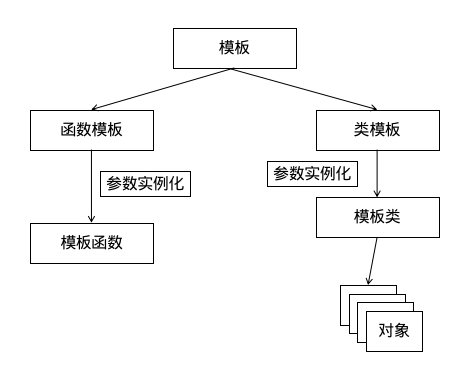

# C++模板

## 本章大纲

## 模板

- 函数模板
- 类模板

模板（Template）是 C++ 语言**代码重用**和**多态性**的一个集中表现。

模板是提供这样一个转换机制：由程序员定义一种操作或一个类，而该操作或类却可以适应几乎所有的数据类型。在一定意义上，模板类似宏定义或函数重载，但它书定更为简洁，使用更加灵活，适应性更强。

模板分为**函数模板**和**类模板**。 函数模板为程序员编写**通用函数**提供了 一种手段；类模板则为程序员设计**通用类**奠定了基础。



- 类模板实际上是函数模板的推广。
- 类模板用于实现类 所需数据的类型参数化。类模板主要用于**数据存储（容器）类**。 
- 类模板在表示数据结构如数组、表、图等显得特别重要， 他们表示和算法不受所包含的元素类型的影响。

## 函数模板

### 函数模板声明和定义

```cpp
template <类型形式参数表> //class T 或typename T
返回类型 函数名(形参表) {
  //函数体
}

template <typename T>
void foo(T t) {
  std::cout << t << '\n';
}

template <class T>
void bar(T t) {
  std::cout << t << '\n';
}
```

### 函数模板的调用

#### 显示类型调用

```cpp
foo<int>(5);		//foo<>(5);
foo<double>(5.5);	//foo<>(5.5);
foo<char>('a');		//foo<>('a');
```

#### 隐式类型推导

```cpp
foo(5);
foo(5.5);
foo('a');
```

### 函数模板和普通函数的区别

- 普通函数只可以有一种数据类型相匹配。函数模板有多种类型
- **隐式推导优先使用普通函数，只有普通函数不匹配才使用函数模板**
- 函数模板只有在调用时，才会构建函数，而普通函数是在编译时
- **普通函数调用时候可以发生自动类型转换，而函数模板不行** 

### 函数模板和普通函数的调用顺序

- 若函数模板和普通函数都可以实现，优先调用普通函数
- 可以通过空模板参数列表来强制调用函数模板
- 函数模板可以重载
- 如果函数模板可以产生更好的匹配，优先调用函数模板
## 类模板语法

```cpp
template <类型形式参数表>
class 类名 {
  //类声明体
}；
```

模板参数表中的内容可以为：

- `class 标识符`
- `类型说明符  标识符`

## 类模板成员函数语法

```cpp
template <类型形式参数表>
返回类型  类名<类型名表>::函数名（形参表）
{
  //成员函数定义体
}
```

## 对象创建语法

```cpp
类名<类型实际参数表>  对象名；
```

```cpp
#include <iostream>
using namespace std;
template <class T>  // template<typename T>
class Max           // 声明类模板Max
{
 private:
  T item1, item2, item3;  // 类型为T,T在该类的对象生成时具体化
 public:
  Max() {}
  Max(T thefirst, T thesecond, T thethird);
  T GetMaxItem();  // 求得3个元素中的最大值并按类型T返回
  void SetItem(T thefirst, T thesecond, T thethird);  // 设置类中的3个元素的值
};

// 类模板的实现
template <class T>
Max<T>::Max(T thefirst, T thesecond, T thethird)
    : item1(thefirst), item2(thesecond), item3(thethird) {
  return;
}
template <class T>
void Max<T>::SetItem(T thefirst, T thesecond, T thethird) {
  item1 = thefirst;
  item2 = thesecond;
  item3 = thethird;
}
template <class T>
T Max<T>::GetMaxItem() {
  T maxitem;
  maxitem = item1 > item2 ? item1 : item2;
  maxitem = maxitem > item3 ? maxitem : item3;
  return maxitem;
}
// 主程序
int main() {
  Max<int> nmyMax(1, 2, 3);
  Max<double> dblmyMax(1.2, 1.3, -1.4);
  cout << nmyMax.GetMaxItem() << endl;
  cout << dblmyMax.GetMaxItem() << endl;
  return 0;
}

```

## 本章总结

- 函数模板
- 类模板

## 参考链接

1. [C++函数模板_coal miner的博客](https://blog.csdn.net/weixin_44205961/article/details/126732413)
2. [C++模板函数_摇花手当雨伞的博客-CSDN博客](https://blog.csdn.net/weixin_45738899/article/details/120687055)
3. [使用C++11变长参数模板 处理任意长度、类型之参数实例_yanxiangtianji的博客-CSDN博客](https://blog.csdn.net/yanxiangtianji/article/details/21045525)

