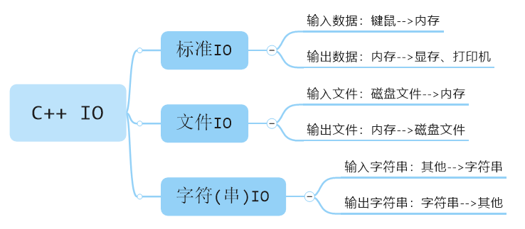
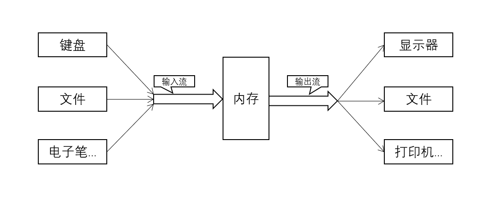
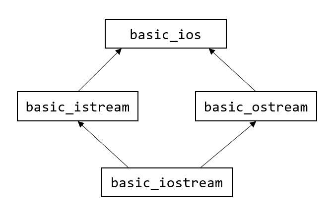
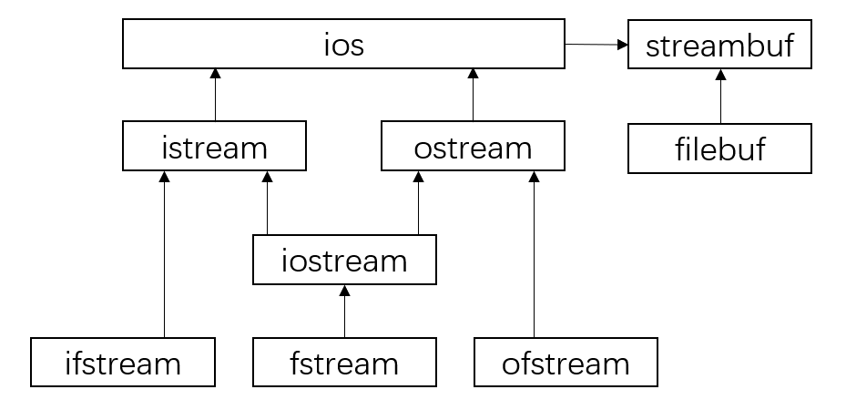
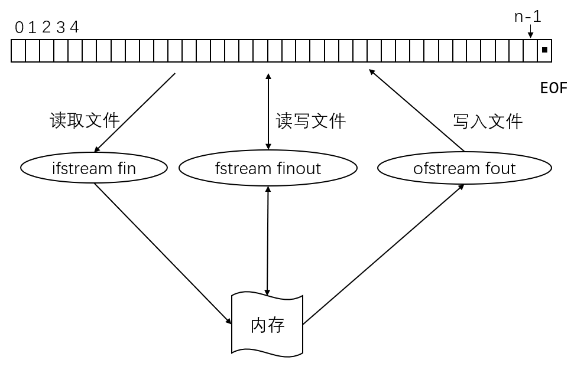

# C++ IO流

## 本章大纲

- 输出流和输入流的常用成员函数

- 流操纵符

- 流的错误状态

- 文件和流

- 文件操作
  - 打开文件
  - 读 / 写文件
  - 关闭文件

## C++ IO

### IO类型

是什么类型的输入输出，要看输入输出的对象是什么

- 以**标准I/O**设备为对象
  - 从键盘、鼠标得到的数据是进入内存的，该数据是**输入数据**。
  - 将数据从内存送到显示器、打印机等，该数据是**输出数据**。

- 以**外存磁盘文件**为对象
  - 内存中的数据存储到磁盘文件中，叫**输出文件**；
  - 从磁盘文件中的数据装载入内存中，叫**输入文件**。

- 以**内存中指定的空间**作为对象
  - 常指定一个字符数组作为存储空间，这种I/O称为**字符串的输入输出**。



### 数据流

- 数据之间的传输过程称作流(stream)
  - 输入流——表示数据从某个载体或设备传送到内存
  - 输出流——表示数据从内存传送到某个载体或设备

- 在进行I/O操作时
  - 首先进行“打开”操作，使流和文件发生联系
  - 建立联系后的文件才允许数据流入或流出
  - I/O结束后，使用“关闭”操作使文件与流断开联系



### 流对象

- C++将I/O流定义为类，叫做流类，stream类。属于流类的对象是流对象。

- 系统已经以运算符或函数的形式做好了对标准外设（键盘、显示器、打印机、文件）的接口，使用时只需按照要求的格式调用即可
  - `cin`，标准输入流对象
  - `cout`，标准输出流对象

## IO流模板层次



## IO库各种流类

| 类名    | 作用 | 头文件 |
| ------- | ---- | ------ |
| ios     | 抽象基类 | \<iostream\> |
| istream | 通用输入流和其他输入流的基类 | \<iostream\> |
| ostream | 通用输出流和其他输出流的基类 | \<iostream\> |
| iostream | 通用输入输出流和其他输入输出流的基类 | \<iostream\> |
| ifstream | 输入文件流类 | \<fstream\> |
| ofstream | 输出文件流类 | \<fstream\> |
| fstream | 输入输出文件流类 | \<fstream\> |
| istrstream | 输入字符串流类 | \<strstream\> |
| ostrstream | 输出字符串流类 | \<strstream\> |
| strstream | 输入输出字符串流类 | \<strstream\> |

## 输入和输出流对象

- `cout`，标准输出
- `cerr`，标准错误输出，无缓冲，发送给`cerr`的内容立即被输出
- `clog`，类似`cerr`，有缓冲，缓冲区满时被输出
- `cin`，标准输入

## 标准输出流

数据流向：从**内存**流向**标准输出设备**(显示器)。

### cout

在控制台(显示器)输出，用流插入运算符`"<<"`向`cout`输出数据

```cpp
cout << "a="<< a << endl;
cout << 数据1 <<数据2 << 数据3;
```

### cerr

在控制台(显示器)输出错误信息，用流插入运算符`"<<`向`cerr`输出数据

```cpp
cerr << "除数为0, 出错!" << endl;
```

`cerr`的用法与`cout`类似。

- `cout`流对象与`cerr`流对象的不同之
  - `cout`的输出默认是显示器，但可以被重定向为输出到磁盘文件
  - `cerr`只能定向输出到显示器

### clog

在控制台(显示器)输出错误信息，用流插入运算符`"<<"`向`clog`输出数据

```cpp
clog << "除数为0, 出错!" << endl;
```

`clog`的用法与`cerr`类似。

- `clog`流对象与`cerr`流对象的不同之处
  - `cerr`是不经过缓冲区，直接向显示器输出有关信息。
  - `clog`的输出先存储在缓冲区，遇到缓冲区满或遇到`endl`时才向显示器输出。

```cpp
void main() {
  float a, b, c, disc;
  cout << "输入a,b,c: ";
  cin >> a >> b >> c;
  if (a == 0)
    cerr << " a=0,  不是二次方程，出错！" << endl;
  else {
    disc = b * b - 4 * a * c;
    if (disc < 0)
      cerr << "二次方程无实根。" << endl;
    else {
      cout << "x1=" << (-b + sqrt(disc)) / (2 * a) << endl;
      cout << "x2=" << (-b - sqrt(disc)) / (2 * a) << endl;
    }
  }
}
```

### 用于控制输出格式的流成员函数

| 流成员函数   | 与之作用相同的控制符 | 作用                                         |
| ------------ | -------------------- | -------------------------------------------- |
| precision(n) | setprecision(n)      | 设置实数的精度为n位                          |
| width(n)     | setw(n)              | 设置字符的宽度为n位                          |
| fill(c)      | setfill(c)           | 设置填充字符c                                |
| setf()       | setioflags()         | 设置输出格式状态，括号中应给出格式状态       |
| unsetf()     | resetioflags()       | 终止已设置的输出格式状态，在括号中应指定内容 |

### 设置格式状态的格式标志

| 格式标志        | 作用                                                       |
| --------------- | ---------------------------------------------------------- |
| ios::left       | 输出数据在本域宽范围内向左对齐                             |
| ios::right      | 输出数据在本域宽范围内向右对齐                             |
| ios::internal   | 数值的符号位在域宽内左对齐，数值右对齐，中间由填充字符填充 |
| ios::dec        | 设置整数的基数为10                                         |
| ios::oct        | 设置整数的基数为8                                          |
| ios::hex        | 设置整数的基数为16                                         |
| ios::showbase   | 强制输出整数的基数(八进制数以0打头，十六进制数以0x打头)    |
| ios::showpoint  | 强制输出浮点数的小点和尾数0                                |
| ios::uppercase  | 在以科学记数法格式E和以十六进制输出字母时以大写表示        |
| ios::showpos    | 对正数显示“+”号                                            |
| ios::scientific | 浮点数以科学记数法格式输出                                 |
| ios::fixed      | 浮点数以定点格式(小数形式)输出                             |
| ios::unitbuf    | 每次输出之后刷新所有的流                                   |
| ios::stdio      | 每次输出之后清除stdout, stderr                             |

说明

- `cout.width(n)`与格式控制符`setw(n)`相似
- `cout.fill(c)`与格式控制符`setfill(c)`相似

```cpp
#include <iostream>
using namespace std;
int main() {
  int a = 21;
  cout.setf(ios::showbase);
  cout << "dec:" << a << endl;
  cout.unsetf(ios::dec);
  cout.setf(ios::hex);
  cout << "hex:" << a << endl;
  cout.unsetf(ios::hex);
  cout.setf(ios::oct);
  cout << "oct:" << a << endl;
  char *pt = "China";
  cout.width(10);
  cout << pt << endl;
  cout.width(10);
  cout.fill('*');
  cout << pt << endl;
  double pi = 22.0 / 7.0;
  cout.setf(ios::scientific);
  cout << "pi=";
  cout.width(14);
  cout << pi << endl;
  cout.unsetf(ios::scientific);
  cout.setf(ios::fixed);
  cout.width(12);
  cout.setf(ios::showpos);
  cout.setf(ios::internal);
  cout.precision(6);
  cout << pi << endl;
  return 0;
}
```

## 标准输入流

从标准输入设备(键鼠等)流向程序的数据流。

### cin

```cpp
int a, b;
cin >> a >> b;  // 从键盘输入2个整数
```

当输入时遇到无效的字符或遇到文件结束符 ctrl+z 时，cin处于出错状态,无法正常提取数据(cin=false)

```cpp
if (!cin)
   cout<<“输入出错”;
```

```cpp
#include <iostream>
using namespace std;
int main() {
  float grade;
  cout << "enter grade:";
  while (cin >> grade) {  // 能从cin流读取数据
    if (grade >= 85) cout << grade << "GOOD!" << endl;
    if (grade < 60) cout << grade << "fail!" << endl;
    cout << "enter grade:";
  }
  cout << "The end." << endl;
  return 0;
}
```

### istream和ostream

#### istream的公有成员函数

| 函数     | 功能                               |
| -------- | ---------------------------------- |
| read     | 无格式输入指定字符数               |
| get      | 从流中提取字符，包括空格           |
| getline  | 从流中提取一行字符                 |
| ignore   | 提取并丢弃流中指定字符数           |
| peek     | 返回流中下一个字符，但不从流中删除 |
| gcount   | 统计最后输入的字符个数             |
| eatwhite | 忽略前导空格                       |
| seekg    | 移动输入流指针                     |
| tellg    | 返回输入流中指定位置的指针值       |

示例：

```cpp
  istream& read(char* pch, int nCount);
  int get();  // 读取一个字符, 不跳过空白字符
  istream& get(char& rch); //  读取一行字符，不提取'\n'
  istream& get(char* pch, int nCount, char delim = '\n');
```

#### ostream的公有成员函数

| 函数  | 功能                                                         |
| ----- | ------------------------------------------------------------ |
| put   | 无格式，插入一个字节（`ostream& put(char ch);`）             |
| write | 无格式，插入一字节序列(`ostream& write(const char* pch, int nCount)`;) |
| flush | 刷新输出流                                                   |
| seekp | 移动输出流指针                                               |
| tellp | 返回输出流中指定位置的指针                                   |

## 用于字符输入的流成员函数

### cin.get()

功能：从输入流提取1个字符
返回值：

- 提取到的字符

- 若遇到文件结束符，则返回值为EOF,即 -1

```cpp
  char ch;
  while ( (ch=cin.get())!=EOF)
  cout.put(ch); //字符输出的流成员函数，功能——在显示器上显示一个字符
```

### cin.get(ch)

功能：从输入流提取1个字符放入ch; 

返回值：

- 函数返回值就是非0值
- 若遇到文件结束符,则返回值为0

```cpp
 char ch;
 while ( cin.get(ch)!=0)
 cout.put(ch);
```

### cin.get(char*,n,ch)

cin.get(字符数组, 字符个数n, 终止字符)

cin.get(字符指针, 字符个数n, 终止字符)

功能：从输入流提取n-1个字符放入数组; 

返回值：

- 函数返回值就是非0值
- 若遇到文件结束符,则返回值为0

```cpp
 char str[20];
 cin.get(str, 10,“\n”);
 cout<<str;
```

### cin.get()对比cin.getline()

cin.get(字符数组, 字符个数n, 终止字符)  

cin.getline(字符指针, 字符个数n, 终止字符)

相同之处：

- 从输入流提取n-1个字符放入数组
- 函数返回值是非0值
- 若遇到文件结束符,则返回值为0

不同之处：

- 当读到终止字符时，
  - cin.getline()将指针移到终止字符之后；
  - cin.get()将指针移到终止字符处；
- 则下次继续读取时的位置就不同

```cpp
#include <iostream>
using namespace std;
int main() {
  char c1, c2, c3;
  char str1[80], str2[100];
  cout << "输入三个字符:";
  c1 = cin.get();
  cin.get(c2);
  cin.get(c3);
  cin.get();
  cout << "输入第一行字符串:";
  cin.get(str1, 80);
  cin.get();
  cout << "输入第二行字符串:";
  cin.getline(str2, 80);
  cout.put(c1).put(c2).put(c3).put('\n');
  cout.write(str1, 3);
  cout.write(str2, strlen(str2));
  cout.put('\n');
  return 0;
}
/*输入形式如下：
W
E
Abcdef
Abcdefg
输出结果？
*/
```

## 流错误状态

所有流都把流的状态存储在状态字中；不同标志位中存储不同的错误状态位；包含在类ios的enum成员中

### 流错误常量

| 标识常量     | 值   | 意义                               |
| ------------ | ---- | ---------------------------------- |
| ios::goodbit | 0x00 | 状态正常                           |
| ios::eofbit  | 0x01 | 文件结束符，当文件尾时设置该标志   |
| ios::failbit | 0x02 | `IO`操作失败，数据未丢失，可以恢复 |
| ios::badbit  | 0x04 | 非法操作，数据丢失，不可恢复       |

### 流错误处理函数

| 函数                      | 功能                                           |
| ------------------------- | ---------------------------------------------- |
| int eof() const;          | 返回eofbit状态值。文件结束符时返回1，否则返回0 |
| int fail() const;         | 返回failbit状态值                              |
| int good() const;         | eofbit、failbit、badbit都没有被设置，则返回1   |
| int bad() const;          | badbit被设置，则返回1                          |
| int rdstate() const;      | 返回状态字                                     |
| void clear(int nState=0); | 恢复或设置状态字                               |

```cpp
#include <iostream>
using namespace std;
int integerValue;
// display results of cin functions
cout << "Before a bad input operation:"
     << "\ncin.rdstate(): " << cin.rdstate() << "\n    cin.eof(): " << cin.eof()
     << "\n   cin.fail(): " << cin.fail() << "\n    cin.bad(): " << cin.bad()
     << "\n   cin.good(): " << cin.good()
     << "\n\nExpects an integer, but enter a character: ";
cin >> integerValue;  // enter character value
cout << endl;
// display results of cin functions after bad input
cout << "After a bad input operation:"
     << "\ncin.rdstate(): " << cin.rdstate() << "\n    cin.eof(): " << cin.eof()
     << "\n   cin.fail(): " << cin.fail() << "\n    cin.bad(): " << cin.bad()
     << "\n   cin.good(): " << cin.good() << endl
     << endl;
cin.clear();  // clear stream
// display results of cin functions after clearing cin
cout << "After cin.clear()"
     << "\ncin.fail(): " << cin.fail() << "\ncin.good(): " << cin.good()
     << endl;
return 0;
```

## 文件操作与文件流

文件：存储在存储设备（磁带、光盘、软盘、硬盘等）上的数据的集合。

根据用途分类：程序文件、数据文件

根据内容分类：文本文件、二进制文件

- 文本文件：每个字节存储一个ASCII码，代表一个字符，每一行以'\n'结尾，文本结束符`0x1A`
  - 存储量大，速度慢，字符操作
- 二进制文件：数据以二进制形式存储。
  - 存储量小，速度快，存放中间结果
- 文本文件(ASCII文件)：
  - 文件中的内容都是字符, 以ASCII码形式存在文件内。如: 12345在文本文件中是以 ‘1’,’2’,’3’,’4’,’5’共 5个字符形式存储的
  - 每一个字节存放一个ASCII码，代表一个字符。其输出与字符一一对应，一个字节代表一个字符，因此便于对字符进行逐个处理。
  - 文本文件由文本行组成，每行中可以有0个或多个字符，并以换行符‘\n’结尾。
  - 文本结束标志是0x1A。
- 二进制文件：文件中的内容是以数据的二进制形式存储的。如: 12345在二进制文件中按1个整数类型以二进制形式存储,占4个字节空间
  - 把数据按其在内存中的存储形式原样存放在磁盘上，一个字节并不对应一个字符，不能直接输出字符形式。

### 流类图



### 文件流

- 用标准流进行I/O时，系统自动地完成数据类型的转换。
- 对于输入流，要将输入的字符序列形式的数据变换成计算机内部形式的数据（二进制或ASCII）后，再赋给变量，变换后的格式由变量的类型确定。
- 对于输出流，将要输出的数据变换成字符串形式后，送到输出流（文件）中。

### 文件操作与标准输入设备对比


在涉及文本文件的操作时，将输入文件看成键盘，将输出文件看成显示器，格式不变。只需在程序中增加打开与关闭文件的语句。

### 文件和流



n为文件长度，黑色方块■为文件结束符

### 文件操作

头文件`#include <fstream>`

1. 定义文件流对象
2. 打开文件
3. 读写文件
4. 关闭文件

1、定义文件流对象

```cpp
//用于与一个输入文件建立联系
ifstream  infile;
//用于与一个输出文件建立联系
ofstream  outfile;
//用于与一个输入输出文件建立联
fstream  iofile;
```

2、打开文件

- 与外部文件关联；
- 指定文件的打开方式；
- 方法一：调用流类带参数的**构造函数**，建立流对象时连接外部文件
- 方法二：先建立流对象，后调用fstream::open()函数

方法一：

**流类 对象名（文件名，打开方式）**

```cpp
ifstream infile ( "datafile.dat" , ios::in );
ofstream outfile ( "d:\\newfile.dat" , ios::out );
fstream rwfile ( "myfile.dat" , ios::in | ios::out );//用 “|”（或运算符）连接两个表示打开方式的标识常量
ofstream  ofile ("a:\\binary", ios::binary | ios::app );//打开一个二进制文件进行追加操作
```

打开方式常量表：

| 标识常量      | 意义 |
| ------------- | ---- |
| `ios::in`     | 只读打开     |
| `ios::out`    | 只写打开     |
| `ios::ate`    | 文件指针指向尾部 |
| `ios::app`    | 追加写 |
| `ios::trunc`  | 删除文件原有内容 |
| `ios::binary` | 二进制打开 |
| `ios::in|ios::out`     | 读写打开 |
| `ios::out|ios::binary`或`ios::in|ios::binary`      | 只读或只写打开二进制文件 |

方法二：

```cpp
流类  对象名 ;
对象名.open ( 文件名 , 方式 ) ;

//打开一个已有文件datafile.dat，准备读：
ifstream infile ;  // 建立输入文件流对象
infile.open( "datafile.dat" , ios::in ) ;  // 连接文件，指定打开方式

//打开（创建）一个文件newfile.dat，准备写：
ofstream outfile ;  // 建立输出文件流对象
outfile.open( "d:\\newfile.dat" , ios::out ) ;  // 连接文件，指定打开方式
```

#### 文件读写操作

```cpp
infile >> x;
outfile << y;
```


#### 文件关闭操作

- 关闭文件操作包括把缓冲区数据完整地写入文件，添加文件结束标志，切断流对象和外部文件的连接

- 当一个流对象的生存期结束，系统也会自动关闭文件；

- 若流对象的生存期没有结束，用close()关闭文件后，该流对象可以重用．

- 文件读写完毕，必须关闭
  - void ifstream::close( );
  - void ofstream::close( );
  - void fstream::close( );

```cpp
infile.close( );   //切断与输入文件 myfile1.txt 的联系
outfile.close( ); //切断与输出文件 myfile2.txt 的联系
iofile.close( ); //切断与输入输出文件 myfile3.txt 的联系
```

#### 打开与关闭错误

检测文件是否成功打开，可在条件表达式中使用取反操作符（！）测试流状态 (一般是读文件的时候用）

```cpp
if( !outfile)    //  之前outfile.open(“myfile2.dat”)
{    cerr<<” error: unable to open file2！”;   }
```

为了测试成功关闭文件，可以调用fail()函数

```cpp
myfile2.close();
if(myfile2.fail())
   cerr<<”Error to close myfile2! ;”
```

#### 从文件读取数据

将文件类对象看成键盘和显示器即可

```cpp
ifstream  infile;  //定义输入文件类对象
infile.open("myfile1.txt"); //利用函数打开某一文件
float  x , y;
infile>>x>>y;//用infile代替myfile1.txt进行操作。
```

#### 把数据写到文件

```cpp
ofstream  outfile;  //定义输出文件类对象
outfile.open("myfile2.txt"); //利用函数打开某一文件
  float x＝3 , y＝4;
outfile<<x<<'\t'<<y<<endl;//用outfile代替myfile2.txt 进行操作。
```

#### 关闭文件

```cpp
ifstream  infile;
ofstream outfile；
infile.open("myfile1.txt");
outfile.open("myfile2.txt");
float x,y;
infile>>x>>y;
outfile<<x<<'\t'<<y<<endl;
infile.close();
outfile.close();
```

## 本章总结

