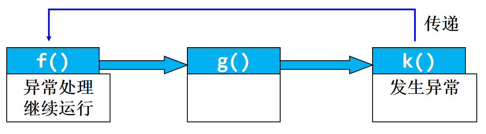
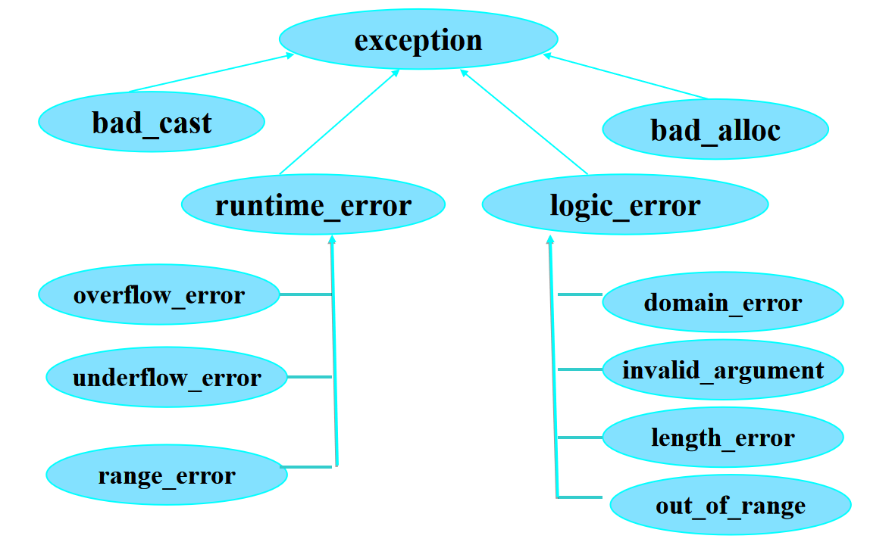
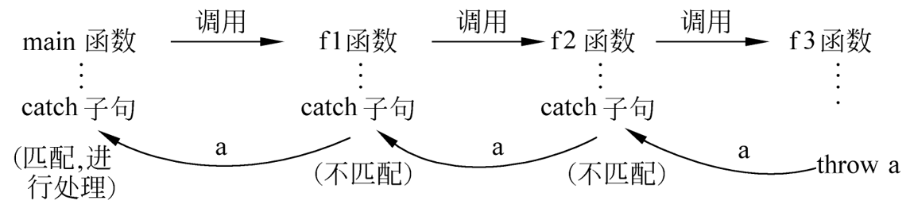

# C++ 异常

- 什么是异常处理？[是什么]
- 什么时候使用异常处理？[什么时候]
- 异常处理的语法结构是什么？[怎么用]
- 怎样重新抛出异常[怎么用]

## 什么是异常处理？

异常(exception)是程序控制中的偶发事件。

异常的来源分两种：一种是**硬件异常**如CPU触发的异常，一种是**软件异常**。软件异常是程序设计不周操作次序不当引发的意外。     

异常处理就是关于不期望的事件发生后进行妥当应付的方法。C++异常处理机制提供了捕获各种数据类型不测消息的能力。

程序设计中**首先是确保代码正常运行**，尽量避免错误。因此在异常处理之前设置一套防范措施是更重要的编程工作。C++异常处理并不着眼于错误的事先禁止，也无力应付硬件的莫测操作导致的软件的崩溃。

C++异常处理仅是各种异常处理方法中的一种而已。好的容错性强的程序设计是通过简单的**if~else**语句、层次分明的**短路逻辑判断表达式**和方向直接的**goto语句**一起组合实现的。

### 短路逻辑表达式

负责轻重缓急的消息过滤

### if~else语句

掌管消息的分流，将正常情况的代码置于 if 分支下，异常的状况置于 else 分支下。

### Goto 语句

擅长将多层嵌套的内层犯规直接弹出到一个统一的外层出口。

### return

带表达式直接返回更是被调函数运作成功与否的鲜明标志，程序员可以指定返回数值的实际语义。

## 异常处理风格

异常处理的共同焦点是错误发生后如何应对，有两种主要的风格：

一种风格是在错误发生的**现场进行清理[直接处理]**工作，资源的分配和释放在同一个程序块中进行；另一种作风是在低层检查到的错误**反馈到高层统一处理[间接处理]**，低层对应被调函数的程序段，高层对应主控函数。总的原则是错误**及时的捕获**，尽量有效地进行错误的排除，程序的损失减至最少。 

## 什么时候使用异常处理？

程序异常

- 编译异常：
  - 语法错误
- 逻辑异常
  - 运行时错误
    - 不可预料的逻辑错误
    - 可预料的逻辑异常

new无法取得所需内存、

数组下标超界、

运算溢出、

除数为0

无效函数参数。

## 运行时错误的处理方法

- 出错时终止程序

- 用函数返回值作为错误标志

- 异常处理机制
  - 导致出错的代码与处理错误的代码完全隔离   

## 异常的发生、传递与处理

### 基本思想

如果在执行一个函数过程中出现异常，可以不在本函数中立即处理，而是发出一个信息，传给它的上一级(即调用它的函数)，它的上级捕捉到这个信息后进行处理。如果上一级的函数也不能处理，就再传给其上一级，由其上一级处理。如此逐级上送，如果到最高一级还无法处理，最后只好异常终止程序的执行。



## 异常处理的语法结构是什么

异常处理机制实际上是一种**运行时通知**机制。

异常处理是一种程序控制结构: 检测异常、抛出异常、捕获异常  

三个关键字：

```c++
throw, try{},catch{}
```

### throw

一个throw只能抛出一个异常，使用格式：

```cpp
throw expression;
```

当某段程序发现了自己不能处理的异常，就可以使用throw语句将这个**异常抛掷给调用者**。

throw语句的使用与return语句相似，<u>如果程序中有多处要抛掷异常，应该用不同的表达式类型来互相区别</u>，表达式的值不能用来区别不同的异常。

### try

```cpp
try{
    //可能会有异常抛出的代码段
}
```

try语句后的复合语句是代码的保护段。如果预料某段程序代码(或对某个函数的调用)有可能发生异常，就将它放在try语句之后。如果这段代码(或被调函数)运行时真的遇到异常情况，其中的throw表达式就会抛掷这个异常。

### catch

每个catch块只能捕获一种异常，包含一个异常处理器: 

```cpp
try {
   //定义异常(try语句块)
   //将那些有可能产生错误的语句框定在try块中
   throw Type;
    //抛掷异常(throw语句),检测是否产生异常，若是，则抛掷异常。
}

//定义异常处理, 将异常处理的语句放在catch块中，以便异常被传递过来时就处理它；
catch(类型1 [参数1]){
    //针对类型1的异常处理
}
catch(类型n [参数n]){
    //针对类型n的异常处理
}
catch(){
}

```

catch语句后的复合语句是异常处理程序，捕获由throw表达式抛掷的异常。异常类型声明部分指明语句所处理的异常类型，它与函数的形参相类似，可以是某个类型的值，也可以是引用。这里的类型**可以是任何有效的数据类型，包括C++的类**。当异常被抛掷以后，catch语句便依次被检查。

```cpp
#include <iostream>
using namespace std;
void main(){
	int i; 	cin>>i;	
	try	{//检测异常
		if ( i < 0 )    throw i; // 抛出异常
		if ( i > 0 )    throw "hello";
		cout<<"can't print "<<endl;    
	} 	
 	catch( int ){ // 捕获异常
 		cout<<"the type of exception is integer"<<endl;
	}
	catch(char *){// 捕获异常
	     cout<<"the type of execption is char array"<<endl;
	}
}

```

说明：

1. 被检测的函数必须放在try块中，否则不起作用。
2. try块和catch块作为一个整体出现，**catch块必须紧跟在try块之后，不能单独使用，在二者之间也不能插入其他语句**。但是在一个try-catch结构中，**可以只有try块而无catch块**。即在本函数中只检查而不处理，把catch处理块放在其他函数中。
3. try和catch块中必须有用花括号括起来的复合语句，即使花括号内只有一个语句，也不能省略花括号。
4. catch后面的圆括号中，**一般只写异常信息的类型名**， catch只检查所捕获异常信息的类型，而不检查它们的值。因此如果需要检测多个不同的异常信息，应当由throw抛出不同类型的异常信息。
5. catch除了指定类型名外，**还指定变量名**，如当抛出的是类对象时，有时需要向catch块传递某些信息。这时就需要在catch的参数中写出变量名(类对象名)。
6. 一个try-catch结构中只能有一个try块，但却**可以有多个catch块**，以便与不同的异常信息匹配。
7. try－catch结构可以与throw出现在同一个函数中，也可以不在同一函数中。当throw抛出异常信息后，先在本函数中寻找与之匹配的catch，若找不到与之匹配的catch，就转到离开出现异常最近的try－catch结构去处理。

## 异常处理顺序

- 如果try块中的代码没有抛出异常: 
  - 则立即跳过try块后面的所有catch异常处理器,执行catch异常处理器后面的第一条语句。
- 如果try块中抛出异常，控制转移到 try块后面的catch块，
  - 如果有相应的异常处理器，则执行；
  - 如果没有相应的异常处理器，则将此异常向上抛出
- 如果执行了相应的异常处理器，则控制将转移到catch后面的第一条语句。

- 如果程序中没有定义相应的异常处理器，则企图启动**terminate**函数，该函数调用**abort**函数，程序非正常地退出，这种退出可引发运行错误。

```cpp
double Div(double, double );
double Div(double a, double b){
	if(b==0.0)
	       throw b;	
	return a/b;
}
void main(){
	double a = 0;
	try	{
	  throw a;
	}
	catch(double){
	    cout << a << endl;
	}
	try	{		
       cout <<"7.3/2.0=" <<Div(7.3, 2.0) <<endl;
       cout <<"7.3/0.0=" <<Div(7.3, 0.0) <<endl;  //屏蔽这一句，程序正常运行
       cout <<"7.3/1.0=" <<Div(7.3, 1.0) <<endl;
	}
	catch(double){	//能将catch()放置到try block 之前？	       
	    cout <<"except of deviding zero.\n";
	}
	cout <<"That is ok. \n“;  }
```

假设一个程序抛出一个异常，处理异常的代码有抛出了一个相同的异常，不会形成循环。

```cpp
#include <iostream> 
using namespace std;
int main(){
   // throw same exception from catch handler
   try {
      throw exception( "This is a test" );
   } // end try
   catch ( exception &t ) {
      cerr << t.what() << endl;
      throw exception( "This is another test" );
   } // end catch

   return 0;
} 
```

## 异常分类



```cpp
#include <iostream>
#include <new> 
using namespace std;
int main(){
   double *ptr[ 50 ];
   try {      
      for ( int i = 0; i < 50; i++ ) {
         ptr[ i ] = new double[ 50000000 ]; 
         cout << "Allocated 50000000 doubles in ptr[ " << i << " ]\n";
	  } 
   } 
   catch ( bad_alloc &m ) {
      cerr << "Exception occurred: " 
         << m.what() << endl;
   } 
   return 0;
}
```

## 异常的重新抛出

C++异常处理的嵌套结构中，其规则是**外层的throw语句投出的异常流入外层的catch捕获器**，而**内部catch块接受的是同级try块throw语句抛来的信息**。

如果程序员期望内层触发的错误源输送到高层专门的程序段予以处理，而不是当前层的catch块中解决，需要使用异常的层层转递手段，这就是**throw语句不带表达式**的默认形式。

不带表达式的throw语句内嵌在catch内，意味着当前catch块在入口中捕获的类型信息，throw接力地将此类型信息抛出到上层的相应类型入口的catch处理器。特定异常流就**从内层中向外传到需要的地方**。

```cpp
#include <iostream>
#include <exception>
using namespace std;
void throwException() {
   try {
      cout << "  throws an exception\n";
      throw exception(); 
   } 
   catch ( exception & ) {
      cout << "  Exception handled ";
      throw; 
   }
   cout << "print?\n";
} 

int main(){
   try {
      throwException();
      cout << "error";
   } 
   catch ( exception & ) {
      cout << "\n\nException handled in main\n";
   } 
   cout << "in main\n";
   return 0;
}

```

## 异常指定

指定由函数抛出的异常

```cpp
int f( int ) throw (int,float);
int f(int i) throw (int , float ) {
	if (i > 0)  throw i ;
    if ( i < 0)  throw 0.0;
}

```

- 使用函数异常说明的基本原因：
  - 清楚地告诉函数的调用者，该函数可能会抛出哪些类型的异常，以便用户能够编写合适的异常处理器。
  - 用户一般无法看到函数的实现（例如库函数），因此用户只能浏览函数原型才知道一个函数可能会抛出哪些类型的异常。
- 异常指定的好处
  - 约束函数实现者，防止抛出异常说明列表中没有说明的异常.
  - 指导函数的调用者编写正确的异常处理程序。

函数异常说明的几种情况 :

- 只能抛出一种异常

   `double  Devide(double x, double y)   throw (DevidedByZero);`

- 可能抛出多种异常
       ` bool func(const char *)  throw (T1, T2, T3);`

- 不抛出任何异常
         `void g() throw ()`

- 可能抛出任何异常，也可能不抛出任何异常
         ` void k();`

```cpp
#include <iostream>
using namespace std;
int main() {
  void f1();
  try {
    f1();
  }  // 调用f1( )
  catch (double) {
    cout <<"OK0 !"<< endl;
  }
  cout <<"end0" << endl;
  return 0;
}
void f1() {
  void f2();
  try {
    f2();
  }  // 调用f2( )
  catch (char) {
    cout <<"OK1 !";
  }
  cout <<"end1" << endl;
}
void f2() {
  void f3();
  try {
    f3();
  }  // 调用f3( )
  catch (int) {
    cout <<"Ok2 !"<< endl;
  }
  cout <<"end2" << endl;
}
void f3() {
  double a = 0;
  try {
    throw a;
  }  // 抛出double类型异常信息
  catch (float) {
    cout <<"OK3 !"<< endl;
  }
  cout <<"end3" << endl;
}
```



## 异常与继承

基类的异常处理器可以捕获子类的异常。反过来不行。

```cpp
#include <iostream>
#include <stdexcept>
using namespace std;
class A : public runtime_error {
 public:
  A() : runtime_error("A") {}
};

int main() {
  try {
    throw A();
    // throw runtime_error(“error”);
  } catch (A &a) {
    cerr << a.what() << endl;
  }
  try {
    throw A();
  } catch (runtime_error &a) {
    cerr << a.what();
  }
  return 0;
}
```

异常处理器的顺序很重要，只执行第一个匹配的处理器。

## 异常处理与构造函数、析构函数

- 对象构造和析构期间的异常

- 异常抛出时局部对象的释放 

  当异常抛出的时候，所有从try到throw 语句之间构造的局部对象的析构函数将被自动调用。(换句话说：在抛出错误之前创建的对象的析构函数才会被调用）

- 用类管理资源分配  当用指针分配内存，在执行delete之前发生异常，不会释放该内存。可通过定义一个类来封装资源的分配和释放。

```cpp
#include <iostream>
#include <stdexcept>
using namespace std;
class Item {
 public:
  Item(int val) : value(val) {
    cout << "Item " << value << " constructor called\n";
    if (value == 3) throw runtime_error("An exception was thrown");
  }
  ~Item() { cout << "Item " << value << " destructor called\n"; }

 private:
  int value;
};
class ItemGroup {
 public:
  ItemGroup() : item1(1), item2(2), item3(3), item4(4), item5(5) {
    cout << "ItemGroup constructor called\n";
  }
  ~ItemGroup() { cout << "ItemGroup destructor called\n"; }

 private:
  Item item1;
  Item item2;
  Item item3;
  Item item4;
  Item item5;
};

int main() {
  try {
    ItemGroup itemGroup;
  } catch (runtime_error &exception) {
    cout << exception.what() << '\n';
  }
  return 0;
}  // end main

```


