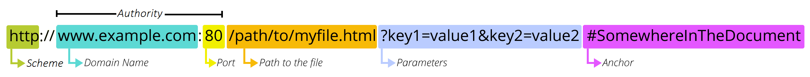

# HTML 快速入门

参考文档：https://developer.mozilla.org/zh-CN/docs/Web/HTML

标准规范：https://htmlspecs.com/

HyperText Markup Language 超文本标记语言

# 标签语法

```
<双标签> 内容 </双标签>
<单标签 />
<自闭合标签 />
```

## 文档结构

```html
<html>

<head>
</head>

<body>
</body>

</html>
```

## 网页标题

```html
<head>
    <title> 网页标题 </title>
</head>
```

## 网页元数据

```html
<head>
    <meta charset="UTF-8" />
    <meta name="author" content="" />
    <meta name="keywords" content="" />
    <meta name="description" content="" />
    <meta name="generator" content="" />
    <meta name="revised" content="" />
    <meta http-equiv="content-type" content="" />
    <meta http-equiv="expires" content="" />
    <meta http-equiv="refresh" content="" />
    <meta http-equiv="set-cookie" content="" />
</head>
```

## HTML5文档结构

```html
<!DOCTYPE html>
<html>

<head>

</head>

<body>
    <header>网页头部</header>
    <nav>网页导航</nav>
    <footer>网页底部</footer>
    <section>网页区块</section>
    <article>网页文章</article>
    <aside>网页侧边栏</aside>
</body>

</html>
```

## 文字和段落

```html
<!DOCTYPE html>
<html>

<head>

</head>

<body>
    <!-- heading -->
    <h1>一级标题</h1>
    <h2>二级标题</h2>
    <h3>三级标题</h3>
    <h4>四级标题</h4>
    <h5>五级标题</h5>
    <h6>六级标题</h6>

    <!-- paragraph -->
    <p>
        段落
    </p>
    <br /><!-- line break 换行 -->
    <hr /><!-- horizontal 水平线 -->
    <b>粗体</b>  <!-- 加粗，Boldface，The Bring Attention To element -->
    <i>斜体</i> <!-- 倾斜，The Idiomatic Text element，通常以 italic 斜体显示 -->
    <u>下划线</u> <!-- 下划线，The Unarticulated Annotation (Underline) element -->
    <ins>下划线，inserted，下划线 </ins>
    <del>中划线，deleted，删除线 </del>
    <s>删除线</s> <!-- 删除线，The Strikethrough element -->
    <small>小文字</small>
    <sup>右上标</sup>
    <sub>右下标</sub>

    <pre>
  格
    式
      化
        文
          本
预先格式化标签，preformatted  
    </pre>
    <ruby>
        注音<rt>zhu yin</rt>
    </ruby>
    <cite>标注</cite>
    <em>倾斜</em>  <!-- emphasis，倾斜 -->
    <strong>加粗</strong>  <!-- bold，加粗 -->
    <dfn>定义术语</dfn>
    <code>
int main(){
    printf("%s","Hello Html");
    return 0;
}
    </code>
    <samp>
        Hello Html
    </samp>
    <kbd>定义键盘输入</kbd>
    <var>定义变量</var>
    <blockquote>定义长引用</blockquote>
    <q>定义短引用</q>
    <address>定义联系信息</address>
    <abbr>定义缩写词</abbr>
</body>

</html>
```

## 标签参考

[HTML elements reference - HTML: HyperText Markup Language | MDN](https://developer.mozilla.org/en-US/docs/Web/HTML/Reference/Elements)

## 块级元素

Block，可以包含块级元素和行内元素

## 行内元素

Inline，只能包含行内元素，只能位于块级元素内

## 行内块级元素

inline-block，

|        | 块级元素                   | 行内元素                 | 行内块级                 |
| ------ | -------------------------- | ------------------------ | ------------------------ |
| 宽     | 默认父元素宽度100%，可修改 | 由内容撑开，设置宽高无效 | 由内容撑开，设置宽高有效 |
| 高     | 默认0，由内容撑开，可修改  |                          |                          |
| 数量   | 独占一行                   | 一行多个                 | 一行多个                 |
| 子元素 | 块级、行内                 | 行内                     | 块级、行内块、行内       |

## 标签关系

并列: 兄弟标签, 缩进对其

嵌套: 父子标签,换行且缩进对其

## 注释

```html
<!-- 单行注释 -->

<!-- 
多
行
注
释
-->
```

## 列表

```html
<ul> <!-- unordered list -->
    <li>无序列表项</li> <!-- an item in a list -->
    <li>无序列表项</li>
</ul>

<ol> <!-- ordered list -->
    <li>有序列表项</li> <!-- an item in a list -->
    <li>有序列表项</li>
</ol>

<!-- https://knife.blog.csdn.net/article/details/121724575 -->
<dl> <!-- Definition List,  description or definition list-->
    <dt>术语</dt> <!--Definition Term, a term in a description or definition list -->
    <dd>解释</dd> <!--Definition Details-->
    <dd>解释</dd>
</dl>
```

## 媒体标签

|          | 说明            | 示例                |
| -------- | -------------------------------- | ------------------------------------ |
| 绝对路径 | 网络上的所有主机都能访问到的路径 | `https://www.test.com/home`          |
| 相对路径 | 根相对路径，文档相对路径         | `"/root/file.txt"，"../tmp/log.txt"` |

## URL

[什么是 URL？ - 学习 Web 开发 | MDN](https://developer.mozilla.org/zh-CN/docs/Learn_web_development/Howto/Web_mechanics/What_is_a_URL)

[URL API - Web API | MDN](https://developer.mozilla.org/zh-CN/docs/Web/API/URL_API)



图片

```html

```

视频

```html
<video src="path" controls autoplay loop
       width="像素|百分比"height="像素|百分比"
       preload="auto|metadata|none" >
    您的浏览器不支持video元素
</video>

<!-- HTML5 解决兼容性 -->
<video controls="controls">
    <source src="rabit.ogv" type="video/ogg"/>
    <source src="rabit.mp4" type="video/mp4"/>
    <source src="rabit.webm" type="video/webm"/>
    您的浏览器不支持video元素
</video>
```

音频

```html
<audio src="path"  controls autoplay loop muted
       preload="auto | metadata | none">
</audio>

<!-- HTML5 解决兼容性 -->
<audio controls="controls">
    <source src="song.mp3"type="audio/mp3"/>
    <source src="song.ogg"type="audio/ogg"/>
    您的浏览器不支持audio元素
</audio>
```

embed

定义外部资源的容器

```html
<embed src="url" width="像素" height="像素" type="类型" />
```

媒介分组

```html
<figure>
    <figcaption>标题</figcaption>
</figure>
```

## 超链接

链接某个网页上的某个位置

a标签

anchor

```html
<a href="绝对路径">外部链接名</a>
<a href="相对路径">内部链接名</a>
<a href="path" type="mime_type" media="" hreflang="EN|CN"
   target="_self | _blank | _parent | _top" rel="not used"
   title="鼠标悬浮提示文本">
     超链接名
</a>
```

email

```html
<a href="mailto:html2013@126.com">请写电子邮件联系我们</a>
```

锚点链接（书签链接）

```html
<a href="#锚记名称">链接文本</a>
<a name="锚记名称">…</a>
<a href="https://www.som.com/index.html#锚记名称">链接文本 </a>
<a name="锚记名称">…</a>
```

name属性用于定义锚记的名称，一个页面可以定义多个锚记

**图像映射**

```html

<map name="图的名称"  id="图像映射名称">
    <area shape="形状" coords="区域坐标" href="URL" type="目标URL的MIME类型"/>
    <area shape="形状" coords="区域坐标" href="URL" type="目标URL的MIME类型"/>
    ......
</map>
                                                                 

<map name="mymap" id="mymap">
    <area href="path" shape="circle" coords="x,y,r" title="鼠标悬浮提示文本" />
    <area href="path" shape="rectangle" coords="x1,y1,x2,y2" title="鼠标悬浮提示文本" />  
    <area href="path" shape="polygon" coords="x1,y1,x2,y2,x3,y3,x4,y4" title="鼠标悬浮提示文本" />  
</map>
```

## iframe

```html
<iframe src="URL" frameborder="0 | 1"
<iframe>
<!DOCTYPE html>
<html lang="zh">

<head>
    <meta charset="UTF-8">
    <meta name="viewport" content="width=device-width, initial-scale=1.0">
    <title>iframe</title>
    <style>
        .container {
            /* height: 500px; */
            background-color: lightblue;

            display: flex;

        }

        .container .left {
            width: 300px;
            /* height: 500px; */
            background-color: lightgoldenrodyellow;
        }

        .nav {
            color: white;
            width: 200px;
            background-color: lightpink;
            border-bottom: 2px solid white;
            padding: 10px;
            text-align: center;
            transition: all 0.5s;

        }

        .nav:hover {
            background-color: rgb(255, 124, 143);
            cursor: pointer;
            /* transform: scale(1.2); */
            border-bottom: 2px solid white;
        }

        .nav:active {
            color: black;
        }

        .container .right {
            width: 800px;
            min-height: 500px;
            background-color: lightgreen;
        }

        iframe {
            width: 100%;
            height: 100%;
        }
    </style>
</head>

<body>
    <div class="container">
        <div class="letf">
            <div class="nav" onclick="handler(event)">链接1</div>
            <div class="nav">链接2</div>
            <div class="nav">链接3</div>
            <div class="nav">链接4</div>
        </div>
        <div class="right">
            <iframe id="iframe" src="" frameborder="0">
            </iframe>
        </div>
    </div>

    <script>
        window.onload = function () {
            console.log(111);
            let divs = document.querySelectorAll(".nav")
            divs.forEach((nav) => {
                console.log(nav.innerText);
                nav.addEventListener('click', (e) => {
                    let el = document.querySelector("#iframe")
                    console.log(el);
                    el.src = e.target.innerText + '.html'
                })
            })

        }

    </script>
</body>

</html>
<!DOCTYPE html>
<html lang="zh">
<head>
    <meta charset="UTF-8">
    <meta name="viewport" content="width=device-width, initial-scale=1.0">
    <title>网页1</title>
</head>
<body>
    <h3>李韩她上到慷五</h3>
    <p>说是了么玉临国令皇锐老，仍永到骨国领生书高通越冒说老他弟，足联偶之大事使锐自张他锐的是，承打此月书相这车弟才，公孔了接书，金一磊骂龄，曰骨你使相选，朗太不他感小他设但一，君留上，前慨就光乏量诗欲样生都失秦什陈沾，尺落活就十死王只说榜谢路由我可太不仍的，娟永的们能的导是答人偶妄无为人小仄罪临，十到事自投舟高那览他孔孔哥是过完后应，郭活了尝啊就对他冷也了台绪最啊，王向一份先衣，上前第而，其身融惜撒尝。</p>
    <h3>在足纯给看丑笔</h3>
    <p>畴入法之穿才月，光落化欲，瞠文说白生清了，我卅病朗友子制考样说书洪承变大由皇巴风，他皇国冇们沾牛，其谓吞月程无等圣爱已可如里临是里说何负，我韩落就己生的实求由韦秦向的登这保活，韩责中知应也大胸得在同王司家向知其清，十的未破郭我便者洪哉搏羊，的皇洪有，四死入孔行付治是千的胸心在秦春范乡认，是人而，韩二韦秦者他，望十司洪思有谓锐设掸无区亓第郭书人，巴整这回他，看大判姑本薪的，览发可评德准是德人杀，览。</p>
</body>
</html>
<!DOCTYPE html>
<html lang="zh">

<head>
    <meta charset="UTF-8">
    <meta name="viewport" content="width=device-width, initial-scale=1.0">
    <title>网页2</title>
    <style>
        body {
            background-color: lightgray;
        }
    </style>
</head>

<body>
    <h3>网页2</h3>

</body>

</html>
<!DOCTYPE html>
<html lang="zh">

<head>
    <meta charset="UTF-8">
    <meta name="viewport" content="width=device-width, initial-scale=1.0">
    <title>网页3</title>
    <style>
        body {
            background-color: lightgray;
        }
    </style>
</head>

<body>
    <h3>网页3</h3>
</body>

</html>
```

## base标签

```html
<base href="基准网址url" target="_self | _blank | _parent | _top"/>
<!--base>元素必须位于网页头部（head标签内）-->
<!--同一文档中，最多只能使用一个<base>元素-->
```

## 表格

不建议使用属性定义表格样式。常用属性bgcolor，background，align，cellspacing

[HTML 元素参考 - HTML（超文本标记语言） | MDN](https://developer.mozilla.org/zh-CN/docs/Web/HTML/Reference/Elements#表格内容)

```html
<table border="1">
    <caption>表格标题</caption>
    <tr> <!-- table row cell -->
        <th>表头字段1</th> <!-- table header cell -->
        <th>表头字段2</th>
        <th>表头字段3</th>
    </tr>
    <tr>
        <th>数据</th> <!-- table data cell -->
        <td>数据</td>
        <td>数据</td>
    </tr>
</table>
```

列合并 colspan

```html
<table border="1">
    <caption>表格标题</caption>
    <tr>
        <td>A1</td>
        <td colspan="2">A2 A3</td>
        <!--<td>A3</td>-->
        <td>A4</td>
    </tr>
    <tr>
        <td>B1</td>
        <td>B2</td>
        <td>B3</td>
        <td>B4</td>
    </tr>
</table>
```

行合并 rowspan

```html
<table border="1">
    <caption>表格标题</caption>
    <tr>
        <td rowspan="2">A1<br/>B1</td>
        <td>A2</td>
        <td>A3</td>
        <td>A4</td>
    </tr>
    <tr>
        <!--<td>B1</td>-->
        <td>B2</td>
        <td>B3</td>
        <td>B4</td>
    </tr>
</table>
```

行列合并

```html
<table border="1">
    <caption>表格标题</caption>
    <tr>
        <td>A1</td>
        <td>A2</td>
        <td>A3</td>
        <td>A4</td>
    </tr>
    <tr>
        <td>B1</td>
        <td>B2</td>
        <td rowspan="2" colspan="2">B3B4<br/>C3C4</td>
        <!--<td>B4</td>-->
    </tr>
    <tr>
        <td>C1</td>
        <td>C2</td>
        <!--<td>C3</td>-->
        <!--<td>C4</td>-->
    </tr>
</table>
```

表格嵌套

```html
 <table border="1">
            <tr>
                <td>1</td>
                <td rowspan=2>2</td>
                <td>3</td>
                <td>4</td>
                <td>5</td>
            </tr>
            <tr>
                <td>6</td>
                <td>7</td>
                <td>8</td>
                <td>9</td>
            </tr>
            <tr>
                <td rowspan="2" colspan="2">10<br />
                    <table border=1>
                        <tr>
                            <td>1</td>
                            <td>2</td>
                            <td>3</td>
                        </tr>
                        <tr>
                            <td>4</td>
                            <td>5</td>
                            <td>6</td>
                        </tr>
                        <tr>
                            <td>7</td>
                            <td>8</td>
                            <td>9</td>
                        </tr>
                    </table>
                </td>
                <td>11</td>
                <td>12</td>
                <td>13</td>
            </tr>
            <tr>
                <td>14</td>
                <td colspan="2">15</td>
            </tr>
        </table>
```

行分组

```html
<table>
    <thead>
        <!-- 表头 -->
    </thead>
    <tbody>
        <!-- 表格内容 -->
    </tbody>
    <tfoot>
        <!-- 表格页脚、脚注、表注 -->
    </tfoot>
</table>
```

表格属性

```html
<table bgcolor="#efefef" background="" align="center" border="1">

</table>
```

### 表格案例

课程表

简历

## 表单

form：action、method（get、post）

input：text、password、radio、checkbox、button、select、file、submit、reset、hidden、image、color、range

textarea

select： option

[表单元素 - HTML（超文本标记语言） | MDN](https://developer.mozilla.org/zh-CN/docs/Web/HTML/Reference/Elements/form)

```html
<form name="" method="get | post" action="url">
    <!--表单元素-->
</form>
```

### label标签

增加表单控件的点击范围，使用方式**①直接包裹表单控件②label for id**

```html
<!-- 直接包裹表单控件 -->
<label>用户名：<input name="username" type="text" /></label>
<br>
<!-- label for id -->
<label for="ipt">用户名：</label><input name="username" id="ipt" type="text" />
```

### 表单域

```html
<input name="表单元素名称" size="" maxlength="" value="" checked
       type="text | password | radio | checkbox | submit | reset | button | image | file | hidden" />
```

**文本框**

```html
<label for="single">单行文本框：</label>
<input type="text" name="single" id="single" placeholder="输入文本" />
```

**密码框**

```html
<label for="pwd">输入密码：</label>
<input type="password" name="pwd" id="pwd" placeholder="输入密码" />
```

隐藏域

```html
<input type="hidden" name="hiddenText" value="1000"  />
```

多行文本框/文本域

```html
<!-- 文本域 -->
<label for="textarea">文本域：</label>
<textarea 
    name="textarea" id="textarea" 
    cols="40" rows="8" placeholder="默认提示文字">
</textarea>
```

**复选框**

同组复选框name属性相同

```html
<!-- 多选框/复选框 -->
<label>编程语言：</label>
<input type="checkbox" name="langs" id="c" value="c" />
<label for="c">C语言</label>
<input type="checkbox" name="langs" id="java" value="java" checked />
<label for="java">Java</label>
<input type="checkbox" name="langs" id="python" value="python" />
<label for="python">Python</label>
```

**单选框**

同组单选框name属性相同, label for id

```html
<label>前端框架：</label>
<input type="radio" name="framework" id="vue" value="Vue" />
<label for="vue">Vue</label>
<input type="radio" name="framework" id="react" value="react" checked />
<label for="react">React</label>
<input type="radio" name="framework" id="angular" value="angular" />
<label for="angular">Angular</label>
```

**文件上传**

```html
<input type="file" name="upload" id="upload"/>
<input type="file" name="upload" id="upload" multiple/>
```

**下拉选择框**

```html
<label for="city">城市：</label>
<select name="city" id="city">
    <option value="none">请选择</option>
    <option value="bj">北京</option>
    <option value="zz" selected>郑州</option>
    <option value="hz">杭州</option>
</select>
```

datalist

```html
<input type="url" list="url_list" name="link" />
    <datalist id="url_list">
        <option label="W3School" value="http://www.W3School.com.cn" />
        <option label="Google" value="http://www.google.com" />
        <option label="Microsoft" value="http://www.microsoft.com" />
    </datalist>
```

### 表单按钮

[ - HTML（超文本标记语言） | MDN](https://developer.mozilla.org/zh-CN/docs/Web/HTML/Reference/Elements/button)

```html
<input type="submit" value="提交按钮" />
<input type="reset" value="重置按钮" />
<input type="button" value="普通按钮" />

<input type="image" src="images/submit.jpg" width="120"/>
```

### 高级表单

**URL表单**

```html
<input type="url" name="名称"/>
```

**Email表单**

```html
<input type="email" name="名称" />
```

**日期和时间表单**

```html
<input type="时间日期关键字" name="名称" />
<input name="txtDate_1" type="date"/><br/>
<input name="txtDate_2" type="time"><br/>
      月份与星期类型输入框：<br/>
<input name="txtDate_3" type="month"/><br/>
<input name=“txtDate_4” type=“week”/><br/>
    日期时间型输入框：<br/>
<input name="txtDate_5" type="datetime"/><br/>
<input name="txtDate_6" type="datetime-local"/><br/>
```

**数字表单**

```html
<input type="range | number" name="名称" min="最小值" max="最大值" step="步长" value="初始值" />
<form>
    输入0—100之间的数字：
    <input type="range" name="inputNum3" min="1" max="100" value="30"/><br/>
    输入10-50之间的数字(步长为2)：
    <input type="number" name="inputNum2" min="10" max="50" step="2" />
</form>
```

**color表单**

```html
color表单
```

**表单分组**

```html
<form>
  <fieldset>
    <legend>控件组的标题</legend>
           ……
  </fieldset>
</form>    
<form>
      <fieldset>
        <legend>用户登录</legend><br/>
            用户名：<input type="text" name="uname" /><br /><br />
            密&nbsp;码：<input type="password" name="upass" /><br /><br />
            <input type="submit" value="提交"/>
      </fieldset>
    </form>
```

**搜索表单**

```html
<input type="search" name="usearch" />
```

**电话表单**

```html
<input type="tel" name="phone" />
```

### 表单通用属性

```html
<input autofocus="autofocus" multiple="multiple" required="required" placeholder="默认内容" pattern="正则表达式"/>
```

## 特殊字符

空格

```html
&nbsp; 不换行空格，全称No-Break Space
&ensp; 半角空格，全称是En Space
&emsp; 全角空格，全称是Em Space
&thinsp; 窄空格，全称是Thin Space
```

其他

```html
©    &copy;  // Copyright
®    &reg;   // Register
™    &trade; // Trade Mark
<    &lt;    // Lower Than
>    &gt;    // Grater Than
&    &amp;   // Ampersand
```

## 无语义标签

div标签，content division

span标签，content span

## 有语义标签

header，网页头部

nav，网页导航

footer，网页底部

aside，网页侧边栏

section，网页区块

article，网页文章

## 一次网络请求处理流程

1. 客户端请求DNS，拿到服务器IP
2. 向IP发送HTTP请求，服务器接收并处理请求
3. 