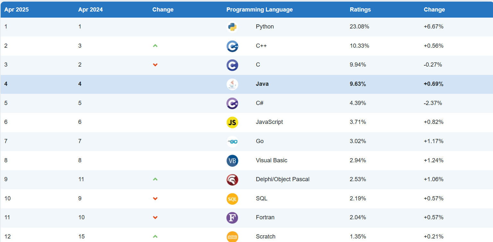
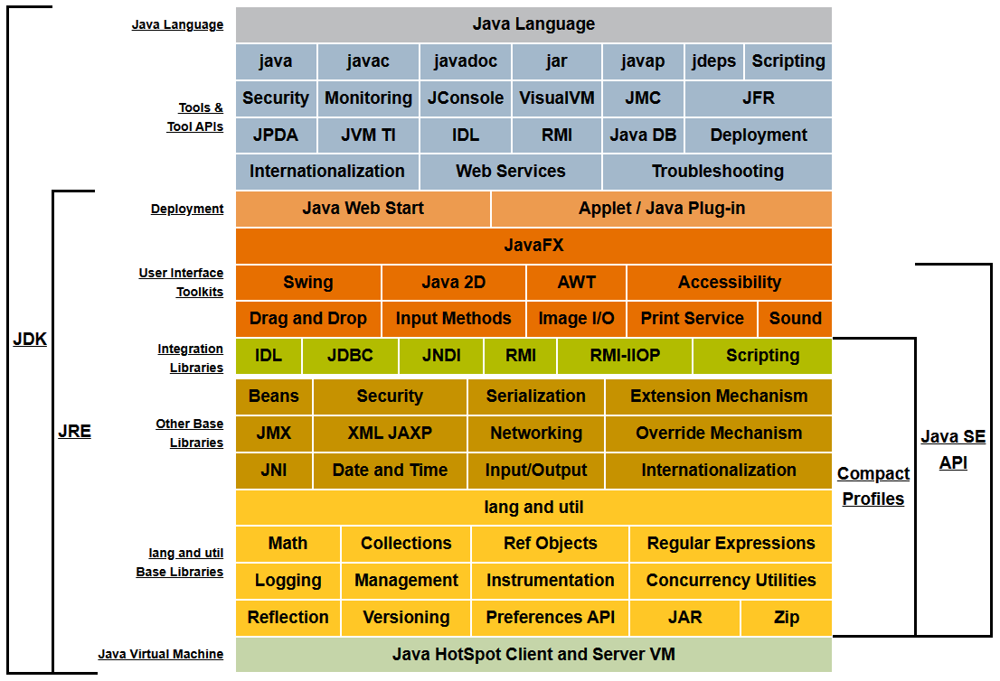

# 概述与基础

## Java起源与发展


美国 · James Gosling，Java之父

Java语言于1995.5.23 由SUN公司正式发布

编程语言排行：https://www.tiobe.com/tiobe-index/



### Java5的新功能

-  枚举类型
-  静态导入
-  增强的for循环
-  自动装箱/自动拆箱
-  可变参数的方法
-  泛型
-  注解

### Java7的新功能

-  二进制整数表示
-  在数值字面量中使用下划线
-  用String控制switch语句
-  菱形运算符
-  用一个catch捕获多个异常
-  使用try-with-resources实现自动资源管理

### Java8的新功能

-  Lambda表达式
-  接口的默认方法和静态方法 
-  新的日期/时间API
-  集合的聚集操作
-  类型注解

### Java语言优点

- 语法简单
- 面向对象
- 平台独立性、可移植性
- 健壮性、安全性
- 分布式、高性能
- 多线程、动态性

## 应用领域

- 企业服务端软件开发，90%以上
- 科学计算
- 大数据、云计算
- 移动开发
- 桌面应用开发
- 游戏开发

## Java平台与开发环境

### 三大版本

Java标准版（Java Standard Edition，Java SE）

Java企业版（Java Enterprise Edition，Java EE）

Java微型版（Java Micro Edition，Java ME）

### JVM

Java Virtual Machine，Java虚拟机。运行字节码。

### JRE

Java Runtime Enviroment，Java运行时环境。 JVM和Java类库一起构成。

### JDK

Java Development Toolkit，Java开发工具包。包括JRE，外加一个编译器和其他工具。

https://docs.oracle.com/javase/8/docs/



Java是平台独立的，是跨平台的。传统的编程中，源代码要编译成可执行代码。

Java中，**源代码**被编译成**字节码**（bytecode），字节码需要在Java虚拟机（**JVM**）上运行。 

Java成为一种跨平台的语言，进而实现“编写一次，到处运行”。


### JDK下载与安装

https://www.oracle.com/java/technologies/downloads/


### Java IDE

#### Eclipse

https://www.eclipse.org/downloads/packages/


#### Intellij IDEA

https://www.jetbrains.com/zh-cn/idea/download/?section=windows


***\*IDEA开发步骤：\****

①new Empty Project

②new Module

③new Package

④new Class

⑤编写代码并运行

IDEA常用设置：字体、背景色、快捷键

## Java程序基本结构

***\*开发步骤：\****

1. ***\*编辑\****源程序
2. ***\*编译\****源程序  `javac HelloWorld.java`
3. ***\*执行\****程序  `java HelloWorld`

HelloWorld

```
public class HelloWorld {
    public static void main(String[] args){
        System.out.println("Hello world");
    }
}
```

***\*项目结构：\****工程 Project、模块 Mudule、包 Package、类 Class

### 编程要点

- 大小写敏感
- 类名，首字母大写
- 方法名，首字母小写
- 源文件名，和类名相同
- 程序入口：`***\*public static void main(String[] args)\****`

## 代码风格与注释

### 代码风格

#### 缩进和空白

代码缩进可清晰描述程序中各部分或语句之间的结构关系。

保持一致的缩进会使程序更加清晰、易读、易于调试和维护。

#### 代码块风格

代码块是由大括号围起来的一组语句，如类体、方法体、初始化块等。

ANSI/Allman/BSD风格

Kernighan_Ritchie风格

### Java注释

注释是对程序功能的解释或说明，是为阅读和理解程序的功能提供方便。所有注释的内容都被编译器忽略。

#### 单行注释

以双斜杠（//）开头，在该行的末尾结束

#### 多行注释

以`/*`开始，以`*/`结束的一行或多行文字

#### 文档注释

以/**开始，以*/结束的多行

```
// 单行注释
/*
多
行
注
释
*/
 
/**
文
档
注
释
*/
```

文档注释生成：`javadoc -d 文件夹 -encoding UTF-8 Hellwold.java`

## 简单程序的开发

### 变量与赋值

变量（variable）用于在程序中临时存放数据。

Java有两大类型的变量：

1. 基本类型的变量：数值型（整数型和浮点型）、布尔型和字符型。
2. 引用类型的变量：类、接口、枚举、数组等。

变量在使用前必须①先声明，然后②初始化：

①声明变量：***\*类型名  变量名;\****

```
int number;
```

②变量的初始化就是给变量赋初值：

```
number = 100;
```

③可以在声明的同时初始化变量：

```
int number = 100;
```

***\*变量作用域\****

***\*常量\****

## 关键字与标识符

#### 标识符

identifier，为***\*变量\****、***\*方法\****和***\*类\****进行命名

命名规则：

- 以`A-Za-z`、`_` 或 `$` 开头，后可接`A-Za-z`、`_` 或 `$` 或`0-9`，长度无限制，例：`intTest, Manager_Name, _var, $Var, STATUS`
- 区分大小写
- 关键字排除、保留字排除

命名规范：

- 见名知意，状态名词、动宾短语
- 驼峰模式：大驼峰、小驼峰

命名风格（多单词）：

- PascalCase，每个单词的首字母大写。***\*类\****、***\*接口\****用该方法命名
- camelCase，第一个单词的首字母小写，其余单词的首字母大写，***\*变量\****、***\*方法\****用该方法命名

#### 关键字

```
abstract    continue    for            new            switch
assert        default        goto*        package        synchronized
boolean        do            if            private        this
break        double        implements    protected    throw
byte        else        import        public        throws
case        enum        instanceof    return        transient
catch        extends        int            short        try
char        final        interface    static        void
class        finally        long        strictfp    volatile
const*        float        native        super        while
// 访问控制
private    私有的
protected  受保护的
public     公共的

// 类、方法和变量修饰符        
abstract        声明抽象
class           类
extends         扩充、继承
final           最终值、不可改变的
implements      实现（接口）
interface       接口
default         默认方法
native          本地、原生方法（非 Java 实现）
new             创建
static          静态
strictfp        严格浮点、精准浮点
synchronized    线程、同步
transient       短暂
volatile        易失

// 程序控制语句        
break         跳出循环
case          定义一个值以供
switch        选择
continue      继续
do            运行
else          否则
for           循环
if            如果
instanceof    实例
return        返回
switch        根据值选择执行
while        循环

// 错误处理        
assert     断言表达式是否为真
catch      捕捉异常
finally    有没有异常都执行
throw      抛出一个异常对象
throws     声明一个异常可能被抛出
try        捕获异常

// 包相关        
import     引入
package    包

// 基本数据类型(8种)
boolean    布尔型
byte       字节型
char       字符型
double     双精度浮点
float      单精度浮点
int        整型
long       长整型
short      短整型

// 变量引用        
super      父类、超类、基类
this       本类、子类、派生类
void       无返回值

// 保留关键字        
goto       是关键字，但不能使用
const      是关键字，但不能使用

// null 不是关键字，是字面值常量，类似 true 和 false
```

## 数据类型


#### 字面值

字面值（literals）是某种类型值的表示形式，比如，100是int型字面值。

| 字面值类型     | 解释                   | 示例                         |
| -------------- | ---------------------- | ---------------------------- |
| 基本类型字面值 | 基本类型的值的表示     | 123，3.456，true，false，'g' |
| 字符串字面值   | 用双引号定界的字符序列 | "Hello World"                |
| null字面值     | 引用类型的空字面值     | null                         |
| 转义字面量     |                        | `\t \n`                      |

char类型字面值必须用单引号引一个字符，不能为空

String类型字面值用双引号，内容可有可无

#### 整数类型

存储原理、进制转换、反码存储、进制转换、

| 数据类型 | 所占字节数 | 所占位数 | 取值范围                                                     |
| -------- | ---------- | -------- | ------------------------------------------------------------ |
| byte     | 1          | 8        | -27~27-1（-128~127）                                         |
| short    | 2          | 16       | -215~215-1（-32768~32767）                                   |
| int      | 4          | 32       | -231~231-1（-2147483648~2147483647) 21亿                     |
| long     | 8          | 64       | -263~263-1（-9223372036854775808~9223372036854775807）19位数 |

整型字面值类型：

1. 十进制数，
2. 二进制数，以`0b`或`0B`开头
3. 八进制数，以`0`开头
4. 十六进制数，以`0x`或`0X`开头

#### 浮点数类型

| 数据类型 | 所占字节数 | 所占位数 | 取值范围                |
| -------- | ---------- | -------- | ----------------------- |
| float    | 4          | 32       | -3.40E+38 ~ +3.40E+38   |
| double   | 8          | 64       | -1.79E+308 ~ +1.79E+308 |

浮点型字面值表示方法：

1. 十进制数形式，例：3.14
2. 科学计数法形式，例：4.5e+3

***\**\*注意\*\**\***：浮点数的运算是不精确的，不适合做***\**\*财务金融\*\**\***计算，若需要精确无误的浮点计算，可以使用***\**\*BigDecimal\*\**\***类。

***\**\*下划线\*\**\***可以用在浮点型数和整型数（包括二进制、八进制、十六进制和十进制）的表示中，以增强代码可读性。

```
long a = 1237_519_803L;
double d = 12.37_519_803d;
```

#### 字符类型

***\*字符\****是程序中可以出现的任何单个符号。

Java使用Unicode为字符编码，Unicode字符集使用***\*两个字节（16位）\****为字符编码，可表示65 536个字符。

字面值用***\*单引号\****将字符括起来，大多数可见的字符都可用这种方式表示，如***\*'a'、'@'、'我'\****等。

有些特殊字符用***\*转义序列\****来表示。用反斜杠（\）表示转义，如'\n'表示换行。

| 转义字符 | 说明                  | 转义字符 | 说明                    |
| -------- | --------------------- | -------- | ----------------------- |
| `\'`     | 单引号字符            | `\b`     | 退格                    |
| `\"`     | 双引号字符            | `\r`     | 回车                    |
| `\\`     | 反斜杠字符            | `\n`     | 换行                    |
| `\f`     | 换页                  | `\t`     | 水平制表符              |
| `\ddd`   | 3位八进制数表示的字符 | `\uxxx`  | 4位十六进制数表示的字符 |

#### 布尔类型

布尔型字面值很简单，只有两个值true和false，分别用来表示逻辑真和逻辑假。

布尔型值使用boolean关键字声明。

#### 字符串类型

Java程序中经常要使用字符串。字符串是字符序列，不属于基本数据类型，是一种引用类型。

字符串是通过String类实现的。可用String声明和创建一个字符串。可以通过双引号定界符创建一个字符串字面值。

## 运算符

顾名思义，表示运算的符号就是运算符。参与运算的数据称为操作数。

### 按操作数个数分类

| 运算符     | 所需运算符个数 | 示例              |
| ---------- | -------------- | ----------------- |
| 一元运算符 | 1              | `++a`             |
| 二元运算符 | 2              | `a > b`           |
| 三元运算符 | 3              | `a > b ? c1 : c2` |

### 按功能分类

| 运算符                |                                                         |                                  |
| --------------------- | ------------------------------------------------------- | -------------------------------- |
| 算数运算符（9个）     | 一元运算符（4个）                                       | 正,负,自增,自减，`+ - ++ --`     |
| 二元运算符（5个）     | 求和/拼接,求差,求积,求商,求余，`+ - * / %`              |                                  |
| 赋值运算符            | 简单赋值运算符                                          | 赋值，`=`                        |
| 复合赋值运算符        | `+=，-=，*=，/=，%=，&=，|=`，自带***\**\*强转\*\**\*** |                                  |
| 关系运算符/比较运算符 | 比较结果为true/false                                    | `>，>=，<，<=，==，!=`           |
| 三元运算符            | `? :`                                                   |                                  |
| 逻辑运算符            | 逻辑与、逻辑或、逻辑非、逻辑异或                        | `&   |   !  ^`，异或：不同为true |
| 短路与、短路或        | `&&  ||`                                                |                                  |
| 位运算符              | 位逻辑运算                                              | `&  |  ~(取反) ^(异或)`          |
| 位移位运算            | `<<  >>  >>>(无符号右移)`                               |                                  |

`+` : 优先进行数学运算，进行不了，则进行拼接运算

```
int a = 10;
a = a++;
System.out.println(a)

int c = 10;
int d = 5;
int rs3 = c++ + ++c - --d - ++d + 1 + c--; //26

int a = 10;
int b = ++a + a++;
int c = b-- / ++a - a++ * ++b;
System.out.println(a + ":" + b + ":" + c);

int a = 10;
int b = ++a + a;
int c = a++ - a++ / b-- + a++;
System.out.println(a + ":" + b + ":" + c);
```

***\*逻辑运算符表格\****

| ***\**\*A\*\**\*** | ***\**\*B\*\**\*** | ***\**\*A&B\*\**\*** | ***\**\*A\|B\*\**\*** | ***\**\*!A\*\**\*** | ***\**\*A^B\*\**\*** | ***\**\*A&&B\*\**\*** | ***\**\*A\|\|B\*\**\*** |
| ------------------ | ------------------ | -------------------- | --------------------- | ------------------- | -------------------- | --------------------- | ----------------------- |
| false              | false              | false                | false                 | true                | false                | false                 | false                   |
| false              | true               | false                | true                  | true                | true                 | false                 | true                    |
| true               | false              | false                | true                  | false               | true                 | false                 | true                    |
| true               | true               | true                 | true                  | false               | false                | true                  | true                    |

短路：在运算时先根据第一个操作数进行判断，如果从第一个操作数推退出结果，那么就不回去计算第二个操作数

短路与：A为true时才计算B

短路或：A为false时才计算B

***\**\*是否使用短路运算，取决于是否想让两边的表达式都执行\*\**\***

***\*位运算符表格\****

| A    | B    | ~A   | A&B  | A\|B | A^B  |
| ---- | ---- | ---- | ---- | ---- | ---- |
| 0    | 0    | 1    | 0    | 0    | 0    |
| 0    | 1    | 1    | 0    | 1    | 1    |
| 1    | 0    | 0    | 0    | 1    | 1    |
| 1    | 1    | 0    | 1    | 1    | 0    |

### 运算符优先级

表达式中***\*出现多个运算符\****而又***\*没有用括号\****分隔时，先运算哪个后运算哪个。

### 运算符结合性

对于同一优先级的运算符，在表达式中与操作数的结合顺序。

左结合：运算符优先结合左边的操作数。例：a+b+c，加号优先结合操作数a

右结合：运算符优先结合右边的操作数。例：a+=b+=c，+=优先结合操作数c

```
double a = 10;
double b = 1, c = 2, d = 0.5;
System.out.println(a /= b /= c /= 0.5); // 40
```

## 表达式

由运算符和操作数组成。

表达式经过运算会产生确定的值。

## 数据类型转换

背景：不同数据类型直接的混合运算。 

要点：计算机中数值的存储方式是补码。

### 自动类型转换

又称加宽转换，指将具有较少位数的数据类型转换为具有较多位数的数据类型。


表达式的最终结果类型由表达式中的***\*最高类型\****决定。

在表达式中，***\*byte、short、char\**** 是直接转换成***\*int\****类型参与运算的。

byte、short、char参数学运算自动提升为int，

### 强制类型转换

与自动类型转换相反，指将具有较多位数的数据类型转换为具有较少位数的数据类型。

***\*赋值运算符（+=、-=、...）\****、***\*自增自减运算符(++、--)\****，自带强制类型转换

```
double d = 200.5;
byte b = (byte)d;    // 强制类型转换
System.out.println(b);     // 输出-56
// 00000000 00000000 00000000 110001000
// 11001000
```

### 表达式类型提升

```
byte aa = 40;
byte bb = 50;
byte cc = a + b;             // 编译错误：不兼容的类型: 从int转换到byte可能会有损失
cc = (byte) (a + b);          // 正确
int ii = a + b;                // 正确
```

## 输入输出

输出： `System.out.println()`

输入：`new Scanner(source).nextXXX()`

## 小试牛刀

1. 使用Java语言打印你的姓名和年龄。
2. 一辆汽车的平均油耗8L/100km，每升汽油8.47元，开车自家从北京到上海大约需要多少钱？
3. 编写程序，要求用户从键盘输入一个double型数，输出该数的整数部分和小数部分。
4. 表达式25/4的结果是多少？如果希望得到浮点数结果，如何重写表达式？
5. 如何用最有效的方法计算22乘以8等于多少？
6. 编写程序，从键盘上输入一个double型的华氏温度，然后将其转换为摄氏温度输出。转换公式如下：摄氏度 = (5/9)×（华氏度-32）
7. 编写程序，从键盘上输入你的体重（单位：公斤）和身高（单位：米），计算你的身体质量指数（Body Mass Index，BMI），该值是衡量一个人是否超重的指标。计算公式为：BMI = 体重 / 身高的平方 