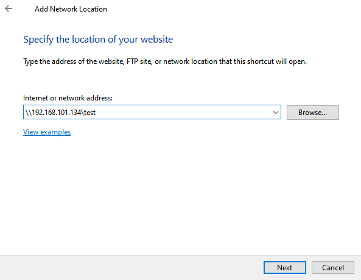

# samba 快速入门

## 安装
```bash
yum install samba
```

## 配置
修改 smb.cnf

```bash
[global]
 workgroup = SAMBA
 security = user

 passdb backend = tdbsam

 printing = cups
 printcap name = cups
 load printers = yes
 cups options = raw

[test] # 共享名称
    path = /data/aaa # 共享路径
    browseable = yes
    writable = yes
    create mask = 0644
    directory mask = 0755
    valid users=user1,user2   ##允许user1,user2访问
    write list=user1      ##允许user1写入
```

## 创建用户

```bash
# 添加用户
useradd user1
useradd user2

# 创建smb用户并设置密码
[root@localhost ~]# smbpasswd -a user1
New SMB password:   # 输入密码
Retype new SMB password:     # 再次输入密码
Added user user1.
[root@localhost ~]# smbpasswd -a user2

# 列出smb用户列表
[root@localhost ~]# pdbedit -L
user1:1001:
user2:1002:
```

## 创建共享目录, 设置权限

```bash
mkdir /data/aaa
chown nobody:nobody /data/aaa
chmod 777 /data/aaa
```

## 启动smb服务

```bash
systemctl start smb
```

## 添加网络位置



# 参考链接

[快速搭建文件共享服务Samba](https://zhuanlan.zhihu.com/p/1887434003927237268)